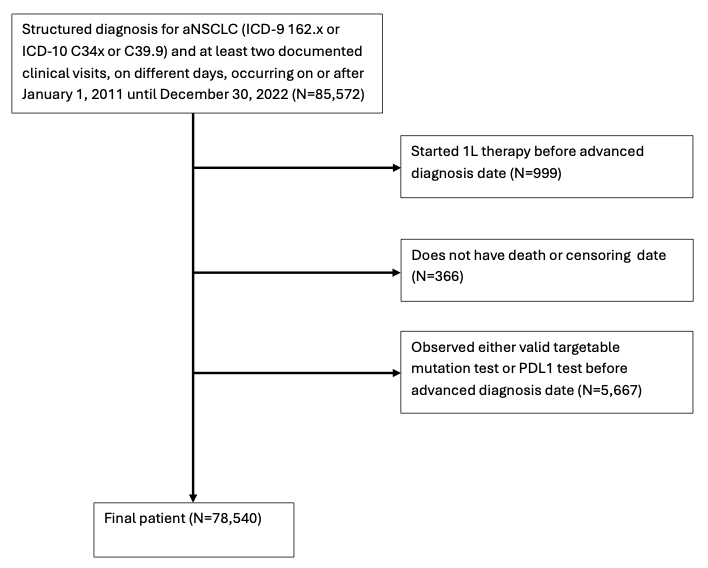

```{r include=FALSE}
#| message: false
#| warning: false

# knitr::opts_knit$set(root.dir = "./SAP")
# remotes::install_github('yihui/knitr')
# library(knitr)
library(ggplot2)
library(officer)
library(officedown)
library(flextable)
library(data.table)
library(parallel)
library(kableExtra)
library(knitr)
library(lubridate)
library(tictoc)
library(gt)

library(DiagrammeR)
library(DiagrammeRsvg)
library(rsvg)


knitr::opts_chunk$set(echo = FALSE)


ncores<-strtoi(Sys.getenv("SLURM_NTASKS")) #Pick up -ntasks or --n from the environment


```


\


# Hypothesis


Advanced non-small cell lung cancer (aNSCLC) patients' recommended course of treatments are identified in National Comprehensive Cancer Network (NCCN) guideline. The guideline suggests each patient to perform biopsy to identify presence of targetable mutations of certain biomarkers and PDL1 expression to make a informed decision on 1L therapy choice. This recommendation is made because targeted therapy is better for patient's survival than a standard, generic therapy such as chemotherapy or immunotherapy.

However, the standard guideline may not always be followed due to reasons such as clinician's expert knowledge and ethics. For example, patients with heavy smoking habits mostly develop NSCLC by smoking without any targetable mutation. In this case, chemotherapy alone can be used or if PDL1 expression level is available, any combination of chemotherapy and immunotherapy may be applied. The choice to proceeding to 1L without checking for targetable mutation or PDL1 expression arises due to the fact that a complete panel of tests for biomarkers and PDL1 expression takes 2 to 3 weeks on average. It may take longer if the biopsy samples were not good and the test results are indeterminate, requiring another round of biopsy and waiting for the result. This period of waiting without doing any treatment may be detrimental to patient's health and thus becomes an ethical issue. Therefore, the ultimate choice of whether waiting for the test result or not relies heavily on the clinician's decision. 

Just like the example of heavy smokers, there are some patient characteristics that are highly indicative of patient's likelihood of targetable mutation status. However, there has not yet been a quantitative evaluation of effect of proceeding to 1L therapy prior to knowing targetable mutation status in patients. In this study, we evaluate causal effect of proceeding right 1L therapy in all aNSCLC patients, as well as in some subgroups that have previously been identified as associated with the mutation status. 


\

# Data

This study used the nationwide Flatiron Health electronic health record (EHR)-derived de-identified database. The Flatiron Health database is a longitudinal database, comprising de-identified patient-level structured and unstructured data, curated via technology-enabled abstraction [@ma2020comparison; @birnbaum2020model]. The de-identified data originated from 280 cancer clinics (~800 sites of care) . The study included 85,572 unique patients diagnosed with aNSCLC (ICD-9 162.x or ICD-10 C34x or C39.9) from 01 January 2011, to 30 December 2022. Patients with a BirthYear of 1937 or earlier may have an adjusted BirthYear in Flatiron datasets due to patient de-identification requirements. For more information, please refer to their webpage [@zhang2025].

We restricted our cohort to patients who did not start 1L therapy before official diagnosis advanced stage and did not receive any valid test result for PDL1 expression and 

Patient attrition diagram is shown below. It shows all exclusion criteria. We excluded all patients who don't have valid survival end time and who start either the 1L therapy or valid test before advanced diagnosis date. We will explain what valid test means in the next section. 


```{r pt_attrition, echo=FALSE, out.width='70%', fig.cap='Figure XX: Patient attrition diagram'}




```


\

## Valid targetable mutation test or PDL1 test

The point of conducting this analysis is whether proceeding to provide 1L therapy before knowledge of PDL1 expression level or targetable mutation status would impact the survival. Thus, valid PDL1 test refers to test results with non-missing PDL1 expression level in the dataset.[ PDL1 expression levels indicate patient's susceptibility to immumotherapy, with higher percentage indicating immunotherapy will work well on the patient.]{style="color:red;"}

On the other hand for the targetable mutation, we have 8 different biomarkers for which we can test for mutation. They are:ALK, EGFR, BRAF, KRAS, MET, RET, ROS1, and NTRK. Clinicians typically find it useful to have at least 1 positive mutation or 2 negative mutations to make informed 1L therapy decision. Thus, any patient who have either 1 positive mutation or 2 negative mutation results are considered to have valid targetable mutation result. We identified a biomarker to be mutation positive if it had any one of the following entries in "BiomarkerStatus" column. :

-   Mutation positive

-   PD-L1 positive

-   Rearrangement present

-   Rearrangement positive

-   Amplification positive

-   Protein expression positive

-   PD-L1 positive

Similarly, we identified a biomarker to be mutation negative if it had any one of the following entries in the same column. :

-   Mutation negative

-   Negative

-   PD-L1 negative/not detected

-   Rearrangement not present


\

## cohort 

In our analysis, we assess impact of proceeding to 1L therapy without either valid PDL result or targetable mutation result. Here, we identify two cohorts. First cohort is those who proceeded to 1L therapy before either valid PDL1 or targetable mutation result were observed. Second cohort is those who received 1L therapy after observing either valid PDL1 or targetable mutation result. Therefore, cohort is a function of time from time zero until either valid PDL1 or targetable mutation result date and 1L therapy start date. 


That is, if a patient has a record of 1L before either valid PDL1 or targetable mutation result, then the patient is identified as a 

