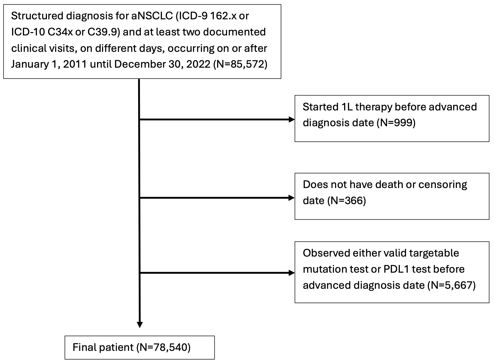

```{r include=FALSE}
#| message: false
#| warning: false

# knitr::opts_knit$set(root.dir = "./SAP")
# remotes::install_github('yihui/knitr')
# library(knitr)
library(ggplot2)
library(officer)
library(officedown)
library(flextable)
library(data.table)
library(parallel)
library(kableExtra)
library(knitr)
library(lubridate)
library(tictoc)
library(gt)

library(DiagrammeR)
library(DiagrammeRsvg)
library(rsvg)


knitr::opts_chunk$set(echo = FALSE)


ncores<-strtoi(Sys.getenv("SLURM_NTASKS")) #Pick up -ntasks or --n from the environment


```

\

# Hypothesis

Advanced non-small cell lung cancer (aNSCLC) patients' recommended course of treatments are identified in National Comprehensive Cancer Network (NCCN) guideline. The guideline suggests each patient to perform biopsy to identify presence of targetable mutations of certain biomarkers and PDL1 expression to make a informed decision on 1L therapy choice. This recommendation is made because targeted therapy is better for patient's survival than a standard, genetic therapy such as chemotherapy or immunotherapy. Usually, at least 1 positive mutation or 2 negative mutation status among all targetable biomarkers should be obtained to make informed decision about targetable therapy. Thus having at least 1 positive mutation or 2 negative mutation status will be referred to as *useful* mutation test result from here onward. Similarly, obtaining PDL1 expression level (from 0-100%) level, as opposed to result such as missing expression level or indeterminate result, will be referred to as *useful* PDL1 test result.

The standard NCCN guideline, however, may not always be followed due to reasons such as clinician's expert knowledge and ethics. For example, heavy smokers who develop lung cancer is most likely due to smoking rather than genetic mutation. Patients who fall into this category then may receive chemotherapy right away, instead of performing and waiting for genetic or PDL1 test results. One reason for not waiting until the useful test comes out is that a complete panel of test results (combined mutation and PDL1 expression tests) usually takes about 2-3 weeks to become available. It may take longer if the biopsy samples were not good and the test results are indeterminate, requiring another round of biopsy and waiting for the result. This period of waiting without doing any treatment may be detrimental to patient's health and thus becomes an ethical issue. Therefore, the ultimate choice of whether waiting for the test result or not relies heavily on the clinician's decision.

Just like the example of heavy smokers, there are some patient characteristics that are highly indicative of patient's likelihood of targetable mutation status. However, there has not yet been a quantitative evaluation of effect of proceeding to 1L therapy prior to knowing targetable mutation status in patients. In this study, we evaluate causal effect of proceeding right 1L therapy in all aNSCLC patients, as well as in some subgroups that have previously been identified as associated with the mutation status.

\

# Objectives

**Primary Objective**: Using marginal structural model, we will develop and evaluate the effect of proceeding to 1L therapy prior to obtaining useful targetable mutation status

-   Limit the number of weeks.
-   For entire observation.

**Secondary Objective**: Test impact of proceeding to 1L before useful tests become available in the following subgroups: male, female, have history of smoking, do not have history of smoking, baseline Eastern Cooperative Oncology Group (ECOG) score 0-2, baseline ECOG score 3-4, baseline albumin \< 35g/L, baseline albumin \>= 35 g/L, and Asian. 

- These are the subgroups identified by Wally as having either higher or lower probability of having targetable mutation, and thus would more or less likely wait for the useful test results to become available prior to initiating 1L therapy. 

\

# Study Design and Population

## Study Design

Retrospective Cohort Study


## Study Population


**Data**: A nationwide Flatiron Health electronic health record (EHR)-derived de-identified database. The Flatiron Health database is a longitudinal database, comprising de-identified patient-level structured and unstructured data, curated via technology-enabled abstraction [@ma2020comparison; @birnbaum2020model]. The de-identified data originated from 280 cancer clinics (\~800 sites of care). Patients with a BirthYear of 1937 or earlier may have an adjusted BirthYear in Flatiron datasets due to patient de-identification requirements. For more information, please refer to their webpage [@zhang2025].


**Inclusion criteria**: People who got diagnosed with aNSLC (ICD-9 162.x or ICD-10 C34x or C39.9) from 01 January 2011, to 30 December 2022 from Flatiron Health network. 

1. Index date is date of aNSCLC diagnosis.


**Exclusion criteria**: 

1. Initiate who receive first-line (1L) therapy on or after the index date. 
2. Receive any useful test result (either PDL1 or targetable mutation) prior to the index date
3. Missing death or censoring date


Patient attrition diagram is shown below. It shows all exclusion criteria. We excluded all patients who don't have valid survival end time and who start either the 1L therapy or valid test before advanced diagnosis date. We will explain what valid test means in the next section.

```{r pt_attrition, out.width='70%', fig.cap='Figure XX: Patient attrition diagram'}




```


# Data Strucutre

There are 9 data sets of wide and long formats. Data sets containing repeated measurements such as visits, PDL1 or targetable mutation test, or lab values will be long format. The unit of observation differs by the dataset. 


1. Create a single date variable where useful PDL1 test results are observed in each patient. 
2. Create a single date variable where useful targetable mutation test results are observed in each patient. 
3. For each consecutive week after the index date, create a binary indicator variable indicating who initiated 1L therapy before receiving any useful test is out. (Cohort identification)
4. Create baseline covariates as listed in \@ref(sec-appA)
  a. report the percent missing of each variable overall by exposure group as in \@ref(tab:baseline-missing-mock)
5. For each consecutive week after the index date, a long dataset is created for each patient's weekly time-varying follow-up variables listed in Appendix B. There will be a variable named $k$ which shows number of weeks since index date. When $k=0$, it refers to baseline. Suppose for an example, albumin measurement at $k=1$ represent measurements taken between $(0,7]$ days, and at $k=2$ will represent measurements taken between $(7,14]$ days.  
6. Impute censoring date using visit and oral medication record

\

```{r}
#| echo: false
#| eval: true
#| message: false
#| label: tbl-long_dat_example
# #| tbl-cap: "Example dataset: An expected sample of the dataset for the baseline and follow-up variables for two patients. Gender and smoking status are baseline covariates that do not change over time. Albumin and Platelet are the tiem-dependent covariates that are measured each week (k). Cohort is the exposure variables that can change over time." 


dat7<-readRDS("../../EDA_V9/dat7_Adv.rds")

long_dat_mock<-dat7[1:2,]
long_dat_mock[,PatientID:=LETTERS[1:2]]

# Vector specifying the number of times to replicate each row
replication_times <- c(3, 6)
replication_times<-rep(row.names(long_dat_mock), times = replication_times) |> as.numeric()

# Replicate rows according to the specified pattern
replicated_df <- long_dat_mock[replication_times, ]
replicated_df<-replicated_df[,.(PatientID,time,Gender,SmokingStatus,Albumin,Platelet)]
setnames(replicated_df,"time","k")
replicated_df[,k:=1:.N, by=PatientID]
replicated_df[,k:=k-1]

set.seed(55)
replicated_df[,Albumin:=Albumin+rnorm(nrow(replicated_df), sd=10)]
replicated_df[,Platelet:=Platelet+round(rnorm(nrow(replicated_df), sd=15))]

replicated_df[,cohort:=0]
replicated_df[PatientID=="A",cohort:=0]
replicated_df[7:9,cohort:=1]

setnames(replicated_df,"PatientID","Patient ID")

knitr::kable(replicated_df,
             caption =  "Table 1. Example dataset: An expected sample of the dataset for the baseline and follow-up variables for two patients. Gender and smoking status are baseline covariates that do not change over time. Albumin and Platelet are the tiem-dependent covariates that are measured each week (k). Cohort is the exposure variables that can change over time." )

# flextable(replicated_df) |> 
#   set_caption("Example dataset: An expected sample of the dataset for the baseline and follow-up variables for two patients. Gender and smoking status are baseline covariates that do not change over time. Albumin and Platelet are the tiem-dependent covariates that are measured each week (k). Cohort is the exposure variables that can change over time.")


```


\

# Cohort


## Directed acyclic graph (DAG)


```{r fig-DAG, out.width='70%',  fig.cap="Figure XX: Directed acyclic graph. Y refers to survival outcome, A's refer to time-dependent cohort status, L's refer to time-dependent measured confounders, and U's refer to time-dependent unmeasured confounders. Index 0 is the baseline measruement. Thus, L0 contains variable such as gender and race/ethnicity. L1 then has a subset of variables of L0, where only time-varying variables are contained. The time index (k) goes from 1 through K_i, where i refers to a patient. Each patient has different number of weeks of follow-up until censored or dead."}

knitr::include_graphics("./image/DAG.jpg")

```


\@ref{fig-DAG}


We define time-varying cohort variable at each $k$ for a patient as follows. For simplicity, we will drop $i$ in $K_i$ without loss of generality. : 

- $k =\{1,2,..., K\}$, number of weeks from time zero, where $K$ is week when death/censoring occurs.
- Define earliest valid test result date as the date when any one of 1) PDL1 expression level, 2)1 positive mutation, or 3) 2 negative mutations was made available to the clinician.
- $C_k = min \{\text{end of week $k$, earliest valid test result date} \}$ 
- $A_k =\begin{cases} 1, & \text{if } A_{k-1}=1 \text{ or if 1L therapy is initiated before }C_k \\  0, & \text{if } A_{k-1} \neq 1 \text{ and if 1L therapy is not initiated before } C_k \end{cases}$


In a plane language, we have two cohorts for each time interval $k$. One cohort is the patient who has $A_k=0$, where 1L was 


\


# Appendices {.appendix}

## Appendix A: List of baseline covariates {#sec-appA}

```{r}
#| echo: false
#| eval: true
#| label: tbl-baseline-cov-dictionary
#| tbl-cap: Baseline covariates defined using the language provided in the Labs.csv file.

baseline_cov<-
data.table(
  "variable"=c(
    "Gender","Age","Race/Ethnicity","Smoking Status","Histology","BMI","ECOG score"
    # ,"Complete metabolic panel (CMP)","Categorical CMP","Complete blood count (CBC)","Categorical CBC "
    )
)

baseline_cov[,Definition:=as.character(NA)]


baseline_cov[variable=="Gender",Definition:="Male or Female (from Demographics.csv file)"]
baseline_cov[variable=="Age",Definition:="Age of patient in years calculated on the index date (from Enhanced_AdvancedNSCLC.csv file) based on their year of birth (from Demographics.csv file). Approximation due to incomplete data(missing month and day) for de-identification purposes."]


baseline_cov[variable=="Race/Ethnicity",Definition:="A single variable derived by pasting Race (Asian, Black or African American, Hispanic or Latino, White, Other Race) and Ethnicity (Not Hispanic or Latino, Hispanic or Latino) variables."]


baseline_cov[variable=="Smoking Status",Definition:="Smoking status of patient (History, no history, unknown) (from Enhanced_AdvancedNSCLC.csv file)."]


baseline_cov[variable=="Histology",Definition:="Squamous cell carcinoma, Non-squamous cell carcinoma, NSCLC histology NOS (from Enhanced_AdvancedNSCLC.csv file)"]


baseline_cov[variable=="ECOG score",Definition:="Eastern Cooperative Oncology Group score, ranging from 0 to 4. (from ECOG.csv file)"]


baseline_cov[variable=="BMI",Definition:="Body mass index (kg/m^2) (from Vitals.csv file)"]

#bind the Complete metabolic panel (CMP)
baseline_cov<-rbind(
  baseline_cov,
  data.table(
    variable="Complete metabolic panel (CMP)",
    Definition="Lab measurement of following analytes: Albumin, Alkaline, ALT, Bilirubin, Calcium, Chloride, Creatinine, eGFR, Potassium, Protein, Sodium. Each of these variables are to be defined below. (from Lab.csv file)"
    )
  )

# generated file containing variables I should use."../labs/variables_for_propensity_v2.R"
baseline_covariates<-readRDS("../../labs/baseline_covariates.rds")

#Bind invdividual definition of CMP.
cmp_data_dict<-unique(baseline_covariates[Category=='CMP',],by="variables")
cmp_data_dict[,Definition:=paste(Test,"measrued in",TestUnitesCleaned)]

baseline_covariates[variables=="eGFR_mdrd",]
cmp_data_dict[variables=="eGFR_mdrd",Definition:="glomerular filtration rate predicted [volume rate/area] in serum, plasma or blood by creatinine-based formula (mdrd), measrued in ml/min/1.73m*2. Some observations specificially state that the values are precited among non-blacks, blacks, or females mutually exclusively."]

baseline_covariates[variables=="eGFR_ckd_epi",]
cmp_data_dict[variables=="eGFR_ckd_epi",Definition:="glomerular filtration rate predicted [volume rate/area] in serum, plasma or blood, measrued in ml/min/1.73m*2. Some observations specify whether the test as creatinine-based formula (ckd-epi), creatinine-based formula (ckd-epi 2021), or cystatin c-based formula. Also, some observations people specificially states whether the values are precited among non-blacks or blacks, mutually exclusively."]
setnames(cmp_data_dict,"variables","variable")

baseline_cov<-rbind(baseline_cov, cmp_data_dict[,.(variable,Definition)])

baseline_cov<-rbind(
  baseline_cov,
  data.table(
    variable="Categorical CMP",
    Definition="Categorical version of the above.... Should we do this? I won't for now."
    )
  )

baseline_cov<-rbind(
  baseline_cov,
  data.table(
    variable="Complete Blood Panel (CBP)",
    Definition="lab measurement of following analytes: RBC, WBC, HCT, HGB, Platelet, Lymphocyte #, Neutrophil #. Each of these variables are to be defined below. (from Lab.csv file)"
    )
  )


#Bind invdividual definition of CBP
cbp_data_dict<-unique(baseline_covariates[Category=='CBP',],by="variables")
cbp_data_dict[,Definition:=paste(Test,"measrued in",TestUnitesCleaned)]
setnames(cbp_data_dict,"variables","variable")

baseline_cov<-rbind(baseline_cov, cbp_data_dict[,.(variable,Definition)])

baseline_cov<-rbind(
  baseline_cov,
  data.table(
    variable="Categorical CBP",
    Definition="Categorical version of the above.... Should we do this? I won't for now."
    )
  )

baseline_cov2<-copy(baseline_cov)
baseline_cov2[,Definition:=stringr::str_replace_all(baseline_cov$Definition,"/","__")]
kable(baseline_cov2)


```


- Gender: Demographics.csv/Gender
- Age at diagnosis:
  - Demographics.csv/BirthYear
  - Enhanced_AdvancedNSCLC.csv/AdvancedDiagnosisDate 
  - difference in the two above dates
- Race/Ethnicity:
  - Demographics.csv/Race
  - Demographics.csv/Ethnicity
  - Append the two variables
- Smoking status: Enhanced_AdvancedNSCLC.csv/SmokingStatus
- Histology: Enhanced_AdvancedNSCLC.csv/Histology
- BMI: 
  - Vitals.csv/Test  : choose the entries equal to "body weight" and "body height". Body weight is in kg, and the body height is in cm. generate BMI (kg/m^2) from these two entries.
- ECOG score: ECOG.csv/EcogValue
- Complete metabolic panel(CMP) (Albumin, Alkaline, ALT, Bilirubin, Calcium, Carbon dioxide, Chloride, Creatinine, eGFR, Potassium, Protein, Sodium, HCT, HGB, Lymphocyte #, Neutrophil #) : 
  - Lab.csv/TestResultCleaned
  - Lab.csv/TestBaseName : filter to the CMP
- Categorical CMP: Take CMP, and discretize into Above, Average, Below using website (https://www.ucsfhealth.org/medical-tests/comprehensive-metabolic-panel)
  - https://www.ncbi.nlm.nih.gov/books/NBK204/#:~:text=The%20normal%20serum%20protein%20level,according%20to%20the%20individual%20laboratory.
- Complete blood count(CBC) (Platelet, RBC, WBC) : 
  - Lab.csv/TestResultCleaned
  - Lab.csv/TestBaseName : filter to the CBC
- Categorical CBC: Take CBC, and discretize into Above, Average, Below using website  
  - https://www.ncbi.nlm.nih.gov/books/NBK2263/table/ch1.T1/


\

# Tables

## Table 1

```{r}
#| echo: false
#| eval: true
#| label: tbl-baseline-missing-mock


# #| tbl-colwidths: []

tab1_missing_mock<-
data.table(
  variable=baseline_cov$variable,
  `Overall (n=)`="",
  `Wait (n=)`="",
  `Do not wait (n=)`=""
)

kable(tab1_missing_mock, caption = "Table1: Mock table demonstrating format of reporting proportion missing.")


```

# Key variables

- time zero: Enhanced_AdvancedNSCLC.csv/AdvancedDiagnosisDate 
- death date: Enhanced_Mortality_V2.csv/DateOfDeath
- censoring date:
  -   Visit.csv/VisitDate
  -   Enhanced_AdvNSCLC_Orals.csv/EndDate
  -   maximum of the two columns
- 1L therapy date: 
  - LineOfTherapy.csv/StartDate
  - LineOfTherapy.csv/LineName  : must be equal to 1
  - LineOfTherapy.csv/IsMaintenanceTherapy : must be FALSE
- useful PDL1 test result:
  - Enhanced_AdvNSCLCBiomarkers.csv/PercentStaining
  - Enhanced_AdvNSCLCBiomarkers.csv/ResultDate  : must have result date
  - Enhanced_AdvNSCLCBiomarkers.csv/PercentStaining  : should not be empty
- useful mutation test result:
  - Enhanced_AdvNSCLCBiomarkers.csv/BiomarkerStatus
  - Enhanced_AdvNSCLCBiomarkers.csv/ResultDate  : must have result date
  - Enhanced_AdvNSCLCBiomarkers.csv/BiomarkerStatus  : must have one of the following entries to be a positive mutation result:    "Mutation positive", "PD-L1 positive", "Rearrangement present", "Rearrangement positive", "Amplification positive", "Protein expression positive", "PD-L1 positive",
  - Enhanced_AdvNSCLCBiomarkers.csv/BiomarkerStatus  : must have one of the following entries to be a negative mutation result:    "Mutation negative", "Negative", "PD-L1 negative/not detected", "Rearrangement not present"
- Gender: Demographics.csv/Gender
- Age at diagnosis:
  - Demographics.csv/BirthYear
  - Enhanced_AdvancedNSCLC.csv/AdvancedDiagnosisDate 
  - difference in the two above dates
- Race/Ethnicity:
  - Demographics.csv/Race
  - Demographics.csv/Ethnicity
  - Append the two variables
- Smoking status: Enhanced_AdvancedNSCLC.csv/SmokingStatus
- Histology: Enhanced_AdvancedNSCLC.csv/Histology
- BMI: 
  - Vitals.csv/Test  : choose the entries equal to "body weight" and "body height". Body weight is in kg, and the body height is in cm. generate BMI (kg/m^2) from these two entries.
- ECOG score: ECOG.csv/EcogValue
- Complete metabolic panel(CMP) (Albumin, Alkaline, ALT, Bilirubin, Calcium, Carbon dioxide, Chloride, Creatinine, eGFR, Potassium, Protein, Sodium, HCT, HGB, Lymphocyte #, Neutrophil #) : 
  - Lab.csv/TestResultCleaned
  - Lab.csv/TestBaseName : filter to the CMP
- Categorical CMP: Take CMP, and discretize into Above, Average, Below using website (https://www.ucsfhealth.org/medical-tests/comprehensive-metabolic-panel)
  - https://www.ncbi.nlm.nih.gov/books/NBK204/#:~:text=The%20normal%20serum%20protein%20level,according%20to%20the%20individual%20laboratory.
- Complete blood count(CBC) (Platelet, RBC, WBC) : 
  - Lab.csv/TestResultCleaned
  - Lab.csv/TestBaseName : filter to the CBC
- Categorical CBC: Take CBC, and discretize into Above, Average, Below using website  
  - https://www.ncbi.nlm.nih.gov/books/NBK2263/table/ch1.T1/


  
  
Albumin: 3.4 to 5.4 g/dL (34 to 54 g/L)
Alkaline phosphatase: 20 to 130 U/L
ALT (alanine aminotransferase): 4 to 36 U/L
AST (aspartate aminotransferase): 8 to 33 U/L
BUN (blood urea nitrogen): 6 to 20 mg/dL (2.14 to 7.14 mmol/L)
Calcium: 8.5 to 10.2 mg/dL (2.13 to 2.55 mmol/L)
Chloride: 96 to 106 mEq/L (96 to 106 mmol/L)
CO2 (carbon dioxide): 23 to 29 mEq/L (23 to 29 mmol/L)
Creatinine: 0.6 to 1.3 mg/dL (53 to 114.9 µmol/L)
Glucose: 70 to 100 mg/dL (3.9 to 5.6 mmol/L)
Potassium: 3.7 to 5.2 mEq/L (3.70 to 5.20 mmol/L)
Sodium: 135 to 145 mEq/L (135 to 145 mmol/L)
Total bilirubin: 0.1 to 1.2 mg/dL (2 to 21 µmol/L)
Total protein: 6.0 to 8.3 g/dL (60 to 83 g/L)


\

## Valid targetable mutation test or PDL1 test

The point of conducting this analysis is whether proceeding to provide 1L therapy before knowledge of PDL1 expression level or targetable mutation status would impact the survival. Thus, valid PDL1 test refers to test results with non-missing PDL1 expression level in the dataset. [PDL1 expression levels indicate patient's susceptibility to immumotherapy, with higher percentage indicating immunotherapy will work well on the patient.]{style="color:red;"}

On the other hand for the targetable mutation, we have 8 different biomarkers for which we can test for mutation. They are: ALK, EGFR, BRAF, KRAS, MET, RET, ROS1, and NTRK. Clinicians typically find it useful to have at least 1 positive mutation or 2 negative mutations to make informed 1L therapy decision. Thus, any patient who have either 1 positive mutation or 2 negative mutation results are considered to have valid targetable mutation result. We identified a biomarker to be mutation positive if it had any one of the following entries in "BiomarkerStatus" column. :

-   Mutation positive

-   PD-L1 positive

-   Rearrangement present

-   Rearrangement positive

-   Amplification positive

-   Protein expression positive

-   PD-L1 positive

Similarly, we identified a biomarker to be mutation negative if it had any one of the following entries in the same column. :

-   Mutation negative

-   Negative

-   PD-L1 negative/not detected

-   Rearrangement not present

\

## Cohort

In our analysis, we assess impact of proceeding to 1L therapy without either valid PDL result or targetable mutation result. Here, we identify two cohorts. First cohort is those who proceeded to 1L therapy before either valid PDL1 or targetable mutation result were observed. Second cohort is those who received 1L therapy after observing either valid PDL1 or targetable mutation result. Therefore, cohort is a function of time from time zero until either valid PDL1 or targetable mutation result date and 1L therapy start date.

That is, if a patient has a record of 1L before either valid PDL1 or targetable mutation result, then the patient is identified as a

