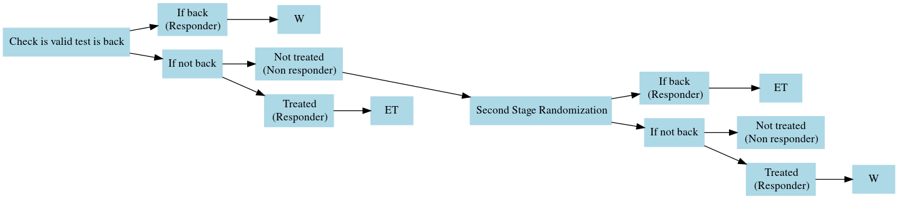

```{r include=FALSE}
#| message: false
#| warning: false

# knitr::opts_knit$set(root.dir = "./SAP")
# remotes::install_github('yihui/knitr')
# library(knitr)
library(ggplot2)
library(officer)
library(officedown)
library(flextable)
library(data.table)
library(parallel)
library(kableExtra)
library(knitr)
library(lubridate)
library(tictoc)
library(gt)
library(gridExtra)
library(DiagrammeR)
library(DiagrammeRsvg)
library(rsvg)
library(ggrepel)


knitr::opts_chunk$set(echo = FALSE)


ncores<-strtoi(Sys.getenv("SLURM_NTASKS")) #Pick up -ntasks or --n from the environment


```

\

# Hypothesis

Advanced non-small cell lung cancer (aNSCLC) patients' recommended
course of treatments are identified in National Comprehensive Cancer
Network (NCCN) guideline. The guideline suggests each patient to perform
biopsy to identify presence of targetable mutations of certain
biomarkers and PDL1 expression to make a informed decision on 1L therapy
choice. This recommendation is made because targeted therapy is better
for patient's survival than a standard, genetic therapy such as
chemotherapy or immunotherapy. Usually, at least 1 positive mutation or
2 negative mutation status among all targetable biomarkers should be
obtained to make informed decision about targetable therapy. Thus having
at least 1 positive mutation or 2 negative mutation status will be
referred to as *useful* mutation test result from here onward.
Similarly, obtaining PDL1 expression level (from 0-100%) level, as
opposed to result such as missing expression level or indeterminate
result, will be referred to as *useful* PDL1 test result.

The standard NCCN guideline, however, may not always be followed due to
reasons such as clinician's expert knowledge and ethics. For example,
heavy smokers who develop lung cancer is most likely due to smoking
rather than genetic mutation. Patients who fall into this category then
may receive chemotherapy right away, instead of performing and waiting
for genetic or PDL1 test results. One reason for not waiting until the
useful test comes out is that a complete panel of test results (combined
mutation and PDL1 expression tests) usually takes about 2-3 weeks to
become available. It may take longer if the biopsy samples were not good
and the test results are indeterminate, requiring another round of
biopsy and waiting for the result. This period of waiting without doing
any treatment may be detrimental to patient's health and thus becomes an
ethical issue. Therefore, the ultimate choice of whether waiting for the
test result or not relies heavily on the clinician's decision.

Just like the example of heavy smokers, there are some patient
characteristics that are highly indicative of patient's likelihood of
targetable mutation status. However, there has not yet been a
quantitative evaluation of effect of proceeding to 1L therapy prior to
knowing targetable mutation status in patients. In this study, we
evaluate causal effect of proceeding right 1L therapy in all aNSCLC
patients, as well as in some subgroups that have previously been
identified as associated with the mutation status.

\

# Objectives

**Primary Objective**: Using marginal structural model, we will develop
and evaluate the effect of proceeding to 1L therapy prior to obtaining
useful targetable mutation status

-   Limit the number of weeks.
-   For entire observation.

**Secondary Objective**: Test impact of proceeding to 1L before useful
tests become available in the following subgroups: male, female, have
history of smoking, do not have history of smoking, baseline Eastern
Cooperative Oncology Group (ECOG) score 0-2, baseline ECOG score 3-4,
baseline albumin \< 35g/L, baseline albumin \>= 35 g/L, and Asian.

-   These are the subgroups identified by Wally as having either higher
    or lower probability of having targetable mutation, and thus would
    more or less likely wait for the useful test results to become
    available prior to initiating 1L therapy.

\

# Study Design and Population

## Study Design

Retrospective Cohort Study...

## Study Population

**Data**: A nationwide Flatiron Health electronic health record
(EHR)-derived de-identified database. The Flatiron Health database is a
longitudinal database, comprising de-identified patient-level structured
and unstructured data, curated via technology-enabled abstraction
[@ma2020comparison; @birnbaum2020model]. The de-identified data
originated from 280 cancer clinics (\~800 sites of care). Patients with
a BirthYear of 1937 or earlier may have an adjusted BirthYear in
Flatiron datasets due to patient de-identification requirements. For
more information, please refer to their webpage [@zhang2025].

**Inclusion criteria**: People who got diagnosed with aNSCLC (ICD-9
162.x or ICD-10 C34x or C39.9) from 01 January 2011, to 30 December 2022
from Flatiron Health network.

1.  Index date is date of aNSCLC diagnosis.

**Exclusion criteria**:

1.  Initiate who receive first-line (1L) therapy before the index date.
2.  Receive valid test result (meaning, receiving either useful PDL1
    test result or useful targetable mutation result) on or before the
    index date. - useful PDL1 test result is when there is PDL1
    expression - useful targetable mutation result is when there is at
    least 2 negative mutation results for any of the biomarkers or at
    least 1 positive mutation result

Patient attrition diagram is shown below (\@ref(fig:pt-attrition)). It
shows all exclusion criteria. We excluded all patients who don't have
valid survival end time and who start either the 1L therapy or valid
test before advanced diagnosis date. We will explain what valid test
means in the next section.

```{r pt-attrition, out.width='80%', fig.cap='Figure XX: Patient attrition diagram'}


```

# Emulate SMART trial

We plan on solving the problem by emulating Sequential Multiple
Assignment Randomized Trial (SMART) design.

SMART design is an adaptive treatment strategy. In adaptive treatment
strategies, the treatment level and type is repeatedly adjusted
according to the individual's need [@murphy2005experimental]. The
treatment assignment at later stages is contingent upon pre‐specified
criteria. We can utilize this.

For our model, we will be making decision rule at each day.

```{r SMART, out.width='100%',  fig.cap="Figure XX: SMART diagram. The target trial I am trying to emulate. On the the first three time points are detailed out but it is supposed to continue indefinitely."}
#| eval: true


knitr::include_graphics("./image/SMART_design_v2.png")
```

At time zero, no one has received valid test result and not one started
1L therapy yet. Thus, everyone can be randomized to either early
treatment initiation (ET) or waiting for test result for another day
(W). That's the first square box `ET` and `W` shown in the
@ref(fig:SMART) within `K=1` interval. Going forward, randomization is
based on the decision rule explained in the next section.:

## Decision rule

Decision rule operationalizes how to use tailoring variable to guide the
tactical decision at the following stages. In our project, the decision
rule are three different tailoring variables:

1.  For those who are assigned to early treatment, there is no further
    randomization
2.  For those who are assigned to wait, **tailoring variable** is a binary
    variable showing whether or not the valid test result was received
    by the end of the time interval.
    -   If test result is received, then the patient is assigned to
        "wait" in all following time interval, without any randomization
    -   If test result is not received, then the patient is randomized
        in the next time interval.

Those who are randomized to ET is no longer randomized. For those who
decided to wait, we observe tailoring variable at the end of the day.
Which is, whether the patient received test result or not. Those who
received test result are automatically assigned W from that time forward
without any randomization. Only those who did not wait for the test
result are going to be randomized the next stage.

So it's important that we balance out any confounding variable for those
who are being randomized at each time point.

## Actual data for first 2 randomization

In my dataset, we have 78,689 patients who quality this entry criteria.

```{r example_code, eval=FALSE, echo=FALSE}


ptData<-readRDS("ptData_time0_diag_clean_v2.rds")
ptData[,time_to_1L:=as.numeric(interval(time0,StartDate),"days")]
ptData[,time_to_valid_PDL1:=as.numeric(interval(time0,earliest_valid_ResultDate__on_after_time0_PDL1),"days")]
ptData[,time_to_valid_gene:=as.numeric(interval(time0,valid_ResultDate__on_after_time0_NoPDL1),"days")]
ptData[,time_to_valid_test:=pmin(time_to_valid_PDL1,time_to_valid_gene,na.rm = T)]

#Everyone is randomized
ptData[,min(time_to_valid_test,na.rm=T)] #1
ptData[,min(time_to_1L,na.rm=T)] #0

#Who is randomized to ET?
ptData[time_to_1L==0,.N] #86
ptData<-ptData[!PatientID %in%ptData[time_to_1L==0,PatientID],]
nrow(ptData) #78603

#Who got the valid test back by the end of day 1?
ptData[time_to_valid_test==1,.N] #156
#remove them
ptData<-ptData[!PatientID %in%ptData[time_to_valid_test==1,PatientID],]


#Second randomization
ptData[time_to_1L==1,.N] #73
ptData<-ptData[!PatientID %in%ptData[time_to_1L==1,PatientID],]
nrow(ptData) #78374

#Who got the valid test back by the end of day 2?
ptData[time_to_valid_test==2,.N] #280
#remove them
ptData<-ptData[!PatientID %in%ptData[time_to_valid_test==2,PatientID],]
nrow(ptData) #78094


```

For k=1 (day 0, day 1], 1st randomization:

-   All 78,689 patients are randomized to either wait or not wait with equal probability. In our target trial emulation, if the 1L therapy date is observed on Day 0, the patient is randomized to “not wait” (A_1=1); if not, they are randomized to “wait” (A_1=0).
-   In the dataset, 86 patients started 1L therapy on the same day, meaning they were randomized to “not wait,” while 78,603 were randomized to “wait.” Due to the decision rule, randomization stops for the 86 patients randomized to not wait.
-   Among the 78,603 patients who were randomized to W on first day, 156 people received the valid test by the end of day 1. This information is our **tailoring variable**. These 156 people will be automatically assigned to "wait" starting day 2, and will not be randomized going forward. Only the remaining 78,447 people will be randomized in day 2.


For k=2 (day 1, day 2], 2nd randomization:

-   The 78,447 patients are randomized to wait or not wait with equal
    probability. In the dataset, 73 patients started 1L therapy on Day
    2, meaning they were randomized to ET, while 78,374 were
    randomized to W.
-   Among the 78,374 randomized to W, 280 got the test result back by the end of day 2. These won't be randomized next day. Only the remaining, 78,094 patients will be randomized in day 3.

## problem with this scheme

We need to adjust for confounding among individuals who are randomized at each time point. Previously, I discussed this with Wally and identified CMP, CBC, ECOG, gender, smoking status, histology, race/ethnicity, and age at baseline as confounders. Most of the time-fixed variables are observed; however, the time-varying variables are typically not observed at the beginning of each randomization period for use in IPW.
This makes sense because our current randomization occurs on a daily basis, and most patients do not have lab values measured every day.
Therefore, we decided to examine the measurement intervals for these time-varying variables. We grouped these intervals into 6-day periods and then identified the most recent week in which a lab value was observed for each person randomized during that week.
For example, consider albumin. We examined all individuals randomized on any day during the first week (i.e., days 0 through 6 from time zero). This should include everyone, since our method requires all participants to be randomized at time zero. Next, we determined the most recent time at which an albumin measurement was taken. If an albumin measurement was taken during that same interval, then the latest observed week is recorded as week 1; if there was no albumin measurement for a person, it is recorded as NA. Similarly, for randomization in week 3, we selected all patients randomized during that week and determined the week in which their most recent albumin measurement was recorded. For some patients, the measurement may have been taken during week 3, week 2, week 1, or not at all.

We display this for all time-varying variables in the figures below. As you can see, there are lots of missing for all of them. The most observed variable is BMI. **Tom thinks now that we need to abandon this project because we hardly ever observe important confounding variables for deciding ET vs. W.**


```{r, fig.width=6, fig.height=4}
#| label: fig-percent_missing
#| echo: false
#| fig-cap: Longitudinal plot of expected value of body composition over time (year). The body compositions where the baseline age was significant are shown. Each subfigure belongs to a body composition, and the panels are provided for a fixed baseline age.
#| layout-ncol: 3

# #| fig-subcap:
# #|   - Albumin
# #|   - Alkaline
# #|   - ALT


#Individually plot them

all_summary_out<-readRDS("../all_time_dep_measure_summary_weekly.rds")

#For each week, plot barchart.
plot_max_week<-8
library(ggplot2)
ggplot_max_week_lab_percent<-
  lapply(all_summary_out, function(lab){
    
    lab_tmp<-lab[1:plot_max_week]
    
    temp<-
      data.table(
        "week"=rep(names(lab_tmp), sapply(lab_tmp,length)),
        "value"=do.call(c,lab_tmp)
      )
    temp[,max_week:=do.call(c,sapply(lab_tmp,names))]
    
    # temp[,max_week:=1:.N,by=week]
    temp[,max_week:=factor(max_week)]
    
    temp[,value_number:= as.numeric(sub(".*\\(([0-9.]+)\\s*%\\).*", "\\1", value))]
    temp[,week:=as.numeric(gsub(".*_","",week))]
    temp[,week:=factor(week)]
    
    ggplot(temp)+
      geom_bar(aes(x=week,y=value_number,fill=max_week),stat="identity")+
      ylab("percent")
    
  })
#Add title
for(i in 1:length(ggplot_max_week_lab_percent)){
  ggplot_max_week_lab_percent[[i]]<- 
    ggplot_max_week_lab_percent[[i]] + 
    ggtitle(names(all_summary_out)[i]) +
    guides(fill=guide_legend(title="latest week observed \n the variable"))+
    xlab("Randomization week")
}

purrr::walk(ggplot_max_week_lab_percent, print)

# keep_morethan_1<-body_cols_pretty[!body_cols_edit %in%names_keep_one_age]
# plt<-lapply(keep_morethan_1,function(x){
#     ggplot(pred_out_merge[`Body composition`==x,], aes(x = times_yr, y = predicted, col=Gender, fill=Gender)) +
#   geom_line()+
#   geom_ribbon(aes(ymin = lower, ymax = upper), alpha = 0.2, linetype=2)+
#   facet_wrap( ~`Age at baseline`, scales="fixed", dir="v", strip.position = "top", ncol=3)+
#   theme(#strip.background = element_blank(),
#     strip.placement = "outside")+
#   ylab("Expected value")+
#   xlab("Time (year)")
# })
# purrr::walk(plt, print)

```


## Chat with Wally 

Chatted with Wally on 2025 April 9th about this problem.

First of all, he approved of my current definition of valid test. But he said that typically test are sent out as a panel. So the lab send out the result to the doctors when they have all of them (both PDL1 and genetic mutation result). That takes about 3-4 weeks. In my dataset, the test result dates are all different. And PDL1 result come out earlier. That's because academic centers are able to send out test result separately even if they were sent as a panel. But in Flatiron, there are only small portion of academic centers. Most of them are small private practices who either don't do test at all or send to commercial lab, which takes about 3-4 weeks for ALL result to come back together.


### Missing lab values 

Missing baseline lab value. Most likely data issue. The patients usually get the lab from their primary physician and the oncologist have the result in hand to make diagnosis. But because these labs are performed outside of Flatiorn network at the patient's primary care site, they don't appear in the dataset. 

  - Maybe for our analysis, we can restrict to those who have the lab result only?
  - To see if they are confounder, we can check the distribution of missing lab values in each randomization arm and also compare the median time to death for those who are being randomized. If the proportion missing is similar between the two randomization arms and if the median time to death is similar between those who are missing and not missing the value, then we could possibly restrict our samples to those who have observed the lab values. 
  
  
When the result becomes available, the test results are sent to clinicians via email. And clinicans check email daily.

Ususally lab variables are measured weekly only if the patients are healthy enough that drawing blood out from them won't cause any harm. 


### Inclusion criteria  

Each patient can be groupped into one of the three caess:

1. PatientID does not even appear in the dataset
    - previosly, I've considered them to be those who didn't even send out the biopsy. **Maybe we can take them out.**
2. PatientID appears in the dataset but valid test result is not observed
    - Consider these patients to have performed biopsy and sent out for the result
3. Patient ID appers in the dataset and have valid test result. 


### Randomization interval

There can be 4 different possibilities:

1. Never even send out for test 
    - patients are too seek and need to be treated immediately.
    - we are not interested in these patients.
2. Send out for test, but don't wait and just treat
    - **Maybe wait for a week and start. (daily time interval I have now may be too granular. change to weekly)**
3. Send the biopsy, wait, and start the therapy the week after (informed 1L decision)


\

# EDA for those who have baseline Albumin, ECOG, and BMI


- Number patients after exclusion criteria (+ excluding people with missing censoring time): 78398
- Baseline measurement interval: (-60 ,15] days
- Number who have baseline Albumin: 32067
- Number who have baseline ECOG: 29282
- Number who have baseline BMI: 48289
- Number who have all Albumin, ECOG, BMI: 18654


Below are the same plots as above \@ref(fig:fig-percent_missing_2) & \@ref(fig:fig-number_missing_2).

```{r, fig.width=13, fig.height=3,out.width='100%'}
#| label: fig-percent_missing_2
#| echo: false
#| fig-cap: Figure XX Proportion of randomized patients observing their latest observation in each week.


#Individually plot them

all_summary_out<-readRDS("../all_time_dep_measure_summary_weekly.rds")
all_summary_out<-all_summary_out[c("Albumin","ECOG","BMI")]
#For each week, plot barchart.
plot_max_week<-8
library(ggplot2)
ggplot_max_week_lab_percent<-
  lapply(all_summary_out, function(lab){
    
    lab_tmp<-lab[1:plot_max_week]
    
    temp<-
      data.table(
        "week"=rep(names(lab_tmp), sapply(lab_tmp,length)),
        "value"=do.call(c,lab_tmp)
      )
    temp[,max_week:=do.call(c,sapply(lab_tmp,names))]
    
    # temp[,max_week:=1:.N,by=week]
    temp[,max_week:=factor(max_week)]
    
    temp[,value_number:= as.numeric(sub(".*\\(([0-9.]+)\\s*%\\).*", "\\1", value))]
    temp[,week:=as.numeric(gsub(".*_","",week))]
    temp[,week:=factor(week)]
    
    ggplot(temp)+
      geom_bar(aes(x=week,y=value_number,fill=max_week),stat="identity")+
      ylab("percent")
    
  })
#Add title
for(i in 1:length(ggplot_max_week_lab_percent)){
  ggplot_max_week_lab_percent[[i]]<- 
    ggplot_max_week_lab_percent[[i]] + 
    ggtitle(names(all_summary_out)[i]) +
    guides(fill=guide_legend(title="latest week observed \n the variable"))+
    xlab("Randomization week")
}

# purrr::walk(ggplot_max_week_lab_percent, print)

grid.arrange(ggplot_max_week_lab_percent[[1]], ggplot_max_week_lab_percent[[2]],ggplot_max_week_lab_percent[[3]], ncol=3)


```


```{r, fig.width=13, fig.height=3,out.width='100%'}
#| label: fig-number_missing_2
#| echo: false
#| fig-cap: Figure XX Number of randomized patients observing their latest observation in each week.


#Individually plot them

all_summary_out<-readRDS("../all_time_dep_measure_summary_weekly.rds")
all_summary_out<-all_summary_out[c("Albumin","ECOG","BMI")]
#For each week, plot barchart.
plot_max_week<-8
library(ggplot2)

ggplot_max_week_lab<-
  lapply(all_summary_out, function(lab){
    
    lab_tmp<-lab[1:plot_max_week]
    
    temp<-
      data.table(
        "week"=rep(names(lab_tmp), sapply(lab_tmp,length)),
        "value"=do.call(c,lab_tmp)
      )
    temp[,max_week:=do.call(c,sapply(lab_tmp,names))]
    
    
    # temp[,max_week:=1:.N,by=week]
    temp[,max_week:=factor(max_week)]
    temp[,value_number:=as.numeric(sub(" .*","",value))]
    temp[,week:=as.numeric(gsub(".*_","",week))]
    temp[,week:=factor(week)]
    
    ggplot(temp)+
      geom_bar(aes(x=week,y=value_number,fill=max_week),stat="identity")+
      ylab("count")
    
  })
#Add title
for(i in 1:length(ggplot_max_week_lab)){
  ggplot_max_week_lab[[i]]<- 
    ggplot_max_week_lab[[i]] + 
    ggtitle(names(all_summary_out)[i]) +
    guides(fill=guide_legend(title="latest week observed \n the variable"))+
    xlab("Randomization week")
}

# purrr::walk(ggplot_max_week_lab_percent, print)

grid.arrange(ggplot_max_week_lab[[1]], ggplot_max_week_lab[[2]],ggplot_max_week_lab[[3]], ncol=3)


```


Below, we present the graph for those who have all baseline Albumin, ECOG, and BMI.


```{r, fig.width=13, fig.height=3,out.width='100%'}
#| label: fig-percent_missing_2_subset
#| echo: false
#| fig-cap: Figure XX Proportion of randomized patients observing their latest observation in each week.


#Individually plot them

all_summary_out<-readRDS("../summary_out2.rds")
all_summary_out<-all_summary_out[c("Albumin","ECOG","BMI")]
#For each week, plot barchart.
plot_max_week<-8
library(ggplot2)
ggplot_max_week_lab_percent<-
  lapply(all_summary_out, function(lab){
    
    lab_tmp<-lab[1:plot_max_week]
    
    temp<-
      data.table(
        "week"=rep(names(lab_tmp), sapply(lab_tmp,length)),
        "value"=do.call(c,lab_tmp)
      )
    temp[,max_week:=do.call(c,sapply(lab_tmp,names))]
    
    # temp[,max_week:=1:.N,by=week]
    temp[,max_week:=factor(max_week)]
    
    temp[,value_number:= as.numeric(sub(".*\\(([0-9.]+)\\s*%\\).*", "\\1", value))]
    temp[,week:=as.numeric(gsub(".*_","",week))]
    temp[,week:=factor(week)]
    
    ggplot(temp)+
      geom_bar(aes(x=week,y=value_number,fill=max_week),stat="identity")+
      ylab("percent")
    
  })
#Add title
for(i in 1:length(ggplot_max_week_lab_percent)){
  ggplot_max_week_lab_percent[[i]]<- 
    ggplot_max_week_lab_percent[[i]] + 
    ggtitle(names(all_summary_out)[i]) +
    guides(fill=guide_legend(title="latest week observed \n the variable"))+
    xlab("Randomization week")
}

# purrr::walk(ggplot_max_week_lab_percent, print)

grid.arrange(ggplot_max_week_lab_percent[[1]], ggplot_max_week_lab_percent[[2]],ggplot_max_week_lab_percent[[3]], ncol=3)


```


```{r, fig.width=13, fig.height=3,out.width='100%'}
#| label: fig-number_missing_2_subset
#| echo: false
#| fig-cap: Figure XX Number of randomized patients observing their latest observation in each week.


#Individually plot them

all_summary_out<-readRDS("../summary_out2.rds")
all_summary_out<-all_summary_out[c("Albumin","ECOG","BMI")]
#For each week, plot barchart.
plot_max_week<-8
library(ggplot2)

ggplot_max_week_lab<-
  lapply(all_summary_out, function(lab){
    
    lab_tmp<-lab[1:plot_max_week]
    
    temp<-
      data.table(
        "week"=rep(names(lab_tmp), sapply(lab_tmp,length)),
        "value"=do.call(c,lab_tmp)
      )
    temp[,max_week:=do.call(c,sapply(lab_tmp,names))]
    
    
    # temp[,max_week:=1:.N,by=week]
    temp[,max_week:=factor(max_week)]
    temp[,value_number:=as.numeric(sub(" .*","",value))]
    temp[,week:=as.numeric(gsub(".*_","",week))]
    temp[,week:=factor(week)]
    
    ggplot(temp)+
      geom_bar(aes(x=week,y=value_number,fill=max_week),stat="identity")+
      ylab("count")
    
  })
#Add title
for(i in 1:length(ggplot_max_week_lab)){
  ggplot_max_week_lab[[i]]<- 
    ggplot_max_week_lab[[i]] + 
    ggtitle(names(all_summary_out)[i]) +
    guides(fill=guide_legend(title="latest week observed \n the variable"))+
    xlab("Randomization week")
}

# purrr::walk(ggplot_max_week_lab_percent, print)

grid.arrange(ggplot_max_week_lab[[1]], ggplot_max_week_lab[[2]],ggplot_max_week_lab[[3]], ncol=3)


```


## Cumulative proportion of 1L initiation


```{r}
#| echo: false
#| eval: true


#############
#for diagnosis
#read in data

ptData<-readRDS("../ptData_time0_diag_clean_v2.rds")
ptData[,time_to_1L:=as.numeric(interval(time0,StartDate),"days")]
ptData[,time_to_valid_PDL1:=as.numeric(interval(time0,earliest_valid_ResultDate__on_after_time0_PDL1),"days")]
ptData[,time_to_valid_gene:=as.numeric(interval(time0,valid_ResultDate__on_after_time0_NoPDL1),"days")]
ptData[,time_to_valid_test:=pmin(time_to_valid_PDL1,time_to_valid_gene,na.rm = T)]
#time_to_valid_test and time_to_1L are to be used
#Get their time to death and compare with the rest
ptData[,time_to_death:=as.numeric(interval(time0,DateOfDeath),"days")]
# ptData[,sum(is.na(time_to_death))]
# ptData[,(summary(time_to_death))]
# ptData[time_to_death<0,.N] #291 Remove them
# ptData[time_to_death<0,DeathInd] #all censored people
ptData<-ptData[time_to_death>=0,]


#Only include those who have Albumin, ECOG, and BMI!
subset_pt<-readRDS("../subset_pt.rds")

ptData<-ptData[PatientID %in% subset_pt]

n_samp_diag<-nrow(ptData)

#save number and proportion of patients of people who got 1L therapy. print out in text.
num_prop_1L_diag<-sprintf(
  "%i/%i (%.3f)",
  ptData[!is.na(StartDate),.N],
  nrow(ptData),
  mean(!is.na(ptData$StartDate))
  )


#save number and proportion of patients of people who got useful test to print out in text.
num_dead_diag<-sprintf(
  "%i/%i (%.3f)",
  ptData[DeathInd==1 & !is.na(DateOfDeath),.N],
  nrow(ptData),
  ptData[DeathInd==1 & !is.na(DateOfDeath),.N]/nrow(ptData)
  )


#save number and proportion of patients of people who got useful test to print out in text.
num_prop_test_diag<-sprintf(
  "%i/%i (%.3f)",
  ptData[!is.na(time_to_valid_test),.N],
  nrow(ptData),
  mean(!is.na(ptData$time_to_valid_test))
  )

```


```{r}
#| echo: false
#| eval: true


#experience 1L


ptData[,time0_to_1L_weeks:=as.numeric(interval(time0,StartDate),"weeks")]
time0_to_1L_weeks_ceiling<-ptData[,ceiling(time0_to_1L_weeks)]
time0_to_1L_weeks_ceiling[which(time0_to_1L_weeks_ceiling==0)]<-1 # 0 is that 1L happened on the same day as time zero. Consider that as week 1. 
# range(time0_to_1L_weeks_ceiling,na.rm = T) #1 611


#Find maximum number of week when 1L happened
K<-max(time0_to_1L_weeks_ceiling, na.rm = T)
# K #445

#Proportion of people who have experienced first useful test by the end of each week
prop_exp_1L<-
  sapply(1:K,function(this.week){
    sum(time0_to_1L_weeks_ceiling<=this.week, na.rm = T)/length(time0_to_1L_weeks_ceiling)
  })
num_exp_1L<-
  sapply(1:K,function(this.week){
    sum(time0_to_1L_weeks_ceiling<=this.week, na.rm = T)
  })

prop_exp_1L_DT_diag<-
  data.table("k"=1:K,
             "Proportion received 1L"=prop_exp_1L,
             "Number received 1L"=num_exp_1L)


```

\@ref(fig:prop_1L_fig) shows cumulative proportion of receiving 1L therapy on
$k^{th}$ week since time zero. 

```{r prop_1L_fig}
#| echo: false
#| eval: true
#| warning: false
#| message: false
#| fig-cap: !expr paste("Cumulative proportion of 1L therapy initiation on week k. The x-axis has been log transformed to better show the changes in cumulative proportion at earlier k.  Total number of patients (proportion) who received 1L therapy is", num_prop_1L_diag, ".")


#Plot on the left
ggplot(prop_exp_1L_DT_diag,mapping = aes(x=k,y=`Proportion received 1L`))+
  geom_point()+
  ylab("Cumulative proportion of 1L initiation")+
  scale_x_continuous(trans='log', breaks = c(1:5,10,20,50,100,250,500))+
  scale_y_continuous(breaks = c(.2,0.4,0.6,0.65,0.7,0.75))


```


## Cumulative proportion of death

```{r}
#| echo: false
#| eval: true


#Proportion dead

ptData[,time0_to_death_weeks:=as.numeric(interval(time0,DateOfDeath),"weeks")]


#Just use the people who experienced death , DeathInd==1
time0_to_death_weeks_ceiling<-ptData[,ceiling(time0_to_death_weeks)]


#Find maximum number of week until death/censoring
K<-max(time0_to_death_weeks_ceiling, na.rm = T)
# K #608

#Proportion of people who have experienced first useful test by the end of each week
prop_exp_event<-
  sapply(1:K,function(this.week){
    # sum(time0_to_death_weeks_ceiling<=this.week, na.rm = T)/length(time0_to_death_weeks_ceiling) #this one take population (denominator as those who died)
    ptData[time0_to_death_weeks<=this.week & DeathInd==1,.N]/nrow(ptData)
    
  })

num_exp_event<-
  sapply(1:K,function(this.week){
    # sum(time0_to_death_weeks_ceiling<=this.week, na.rm = T)/length(time0_to_death_weeks_ceiling) #this one take population (denominator as those who died)
    ptData[time0_to_death_weeks<=this.week & DeathInd==1,.N]
    
  })

prop_exp_event_DT_diag<-
  data.table("k"=1:K,
             "Proportion dead"=prop_exp_event,
             "Number dead"=num_exp_event)


```

\@ref(fig:prop_dead) shows cumulative proportion of death on $k^{th}$ week
since time zero. 

```{r prop_dead}
#| echo: false
#| eval: true
#| warning: false
#| message: false
#| fig-cap: !expr paste("Cumulative proportion dead. The x-axis has been log transformed to better show the changes in cumulative proportion at earlier k.  Total number of patients (proportion) who died is", num_dead_diag, ".")


#Plot on the left
ggplot(prop_exp_event_DT_diag,mapping = aes(x=k,y=`Proportion dead`))+
  geom_point()+
  ylab("Cumulative proportion dead")+
  # scale_x_continuous( breaks = c(0,10,50,100,200,400,600))+
  scale_x_continuous(trans='log', breaks = c(1:5,10,20,50,100,200,400,600))+
  scale_y_continuous(breaks = c(.2,0.4,0.6,0.65,0.7,0.75))


```


## Valid test


This section shows cumulative proportion of patients who ever get valid test defined as experiencing any one of the followings:

- 1 postivie mutation
- 2 negatvie mutation
- PDL1 expression


```{r}
#| echo: false
#| eval: true


ptData[,time_to_valid_PDL1_week:=as.numeric(interval(time0,earliest_valid_ResultDate__on_after_time0_PDL1),"weeks")]
ptData[,time_to_valid_gene_week:=as.numeric(interval(time0,valid_ResultDate__on_after_time0_NoPDL1),"weeks")]
ptData[,time_to_valid_test_week:=pmin(time_to_valid_PDL1_week,time_to_valid_gene_week,na.rm = T)]


time0_to_valid_gene_weeks_ceiling<-ptData[,ceiling(time_to_valid_test_week)]

time0_to_valid_gene_weeks_ceiling[which(time0_to_valid_gene_weeks_ceiling==0)]<-1

#Find maximum number of week for getting valid test
K<-max(time0_to_valid_gene_weeks_ceiling, na.rm = T) 
# K #515

#Proportion of people who have useful gene mutation result
prop_valid_test<-
  sapply(1:K,function(this.week){
        sum(time0_to_valid_gene_weeks_ceiling<=this.week, na.rm = T)/length(time0_to_valid_gene_weeks_ceiling)

  })

num_valid_test<-
  sapply(1:K,function(this.week){
        sum(time0_to_valid_gene_weeks_ceiling<=this.week, na.rm = T)

  })

prop_valid_test_DT<-
  data.table("k"=1:K,
             "Proportion who got valid test"=prop_valid_test,
             "Number who got valid test"=num_valid_test)


```

The number (proportion) of patients who got valid test is 
`r num_prop_test_diag`, with the maximum $k$ when a patient
proceeded immediately to 1L therapy being `r K`.


```{r prop_gene}
#| echo: false
#| eval: true
#| warning: false
#| message: false
#| fig-cap: !expr paste("Cumulative proportion of patients who receive useful gene test at week k. The x-axis has been log transformed to better show the changes in cumulative proportion at earlier k. Total number of patients (proportion) who received useful gene test is",num_prop_test_diag,". The maximum K at which the valid test was observed was", K, ".")


#Proportion experience death


#Plot on the left
ggplot(prop_valid_test_DT,mapping = aes(x=k, y=`Proportion who got valid test`))+
  geom_point()+
  ylab("Cumulative proportion of receiving useful gene mutation result")+
  # scale_x_continuous( breaks = c(0,10,50,100,200,400,600))+
  scale_x_continuous(trans='log', breaks = c(1:5,10,20,50,100,200,400))+
  scale_y_continuous(breaks = seq(0,0.35,by=0.05))


```


## Initiate 1L before valid test


This section shows cumulative proportion of patients initiate 1L before valid test is observed. 

If the valid test and 1L therapy have same week, then we assume that the valid test result is tailoring variable that is available for determining the 1L therapy of the same week.


```{r}
#| eval: true
#| echo: false


#When was the last observed time initiating 1L therapy before receiving valid tes?
K<-max(time0_to_1L_weeks_ceiling, na.rm = T) 
# K #445


#Save the information
A_K<-matrix(NA,nrow=nrow(ptData), ncol=K)
rownames(A_K)<-ptData$PatientID


#There are four scenarios:
#1. missing valid test result date & missing 1L therapy date 
# ptData[is.na(time_to_valid_test) & is.na(StartDate),.N]#1892
#for these people, a_k=0 for all k. 
this_pt<-ptData[is.na(time_to_valid_test) & is.na(StartDate),PatientID]
A_K[this_pt,]<-0


#2. observe valid test result date & missing 1L therapy date

#Count proportion experienced first valid result on/after time zero 
# ptData[!is.na(time_to_valid_test)  & is.na(StartDate),.N]#1804
#For those who never got 1L therapy were considered that their 1L date is infinity. 
#so... How would A_k look like? 
#It's all zero
this_pt<-ptData[!is.na(time_to_valid_test)  & is.na(StartDate),PatientID]
A_K[this_pt,]<-0


#3. missing valid test result date & observe 1L therapy date
# ptData[is.na(time_to_valid_test)& !is.na(StartDate),.N]#4533
#We assume that missing valid test result is some future date, not included in k.
#So A_k=1 if the treatment is initiated during the week, until the end of the week. 
tmp<-ptData[is.na(time_to_valid_test)&!is.na(StartDate),.(PatientID,time0_to_1L_weeks)]
tmp[,ceiling_time0_to_1L_weeks:=ceiling(time0_to_1L_weeks)]


for(i in 1:nrow(tmp)){
  #Get the first k at which a_k=1
  first_a_k_1<-tmp$ceiling_time0_to_1L[i]
  
  
  #first_a_k_1==0 means 1L therapy start on the same day as time zero. So fill in all with 1
  #first_a_k_1==1 means 1L therapy start during the 1st week. So fill in all with 1
  if(first_a_k_1 %in% 0:1){
    A_K[tmp$PatientID[i], ]<-1
  }else if(first_a_k_1>K){
    #If the therapy is initiated after all observed time of valid test result, just fill in 0.
    A_K[tmp$PatientID[i], ]<-0
    
  }else{
    #for all index before first_a_k_1, fill in 0. 
    A_K[tmp$PatientID[i], 1:(first_a_k_1-1)]<-0
    #From first_a_k_1 and onward, 
    A_K[tmp$PatientID[i], first_a_k_1:ncol(A_K)]<-1
  }
  
}


#4. observe valid test result date & observe 1L therapy date
# ptData[!is.na(time_to_valid_test) & !is.na(StartDate),.N]#10425
ptData[,ceiling_time_to_valid_test_week:=ceiling(time_to_valid_test_week)]
ptData[,ceiling_time0_to_1L_weeks:=ceiling(time0_to_1L_weeks)]

tmp<-ptData[!is.na(time_to_valid_test) & !is.na(StartDate),]

#this is the patient that's complicated
#A_k=1 : if treatment is initiated prior to minimum of end of week k and valid test result
#A_k=0 :if treatment is NOT initiated prior to minimum of end of week k and valid test result.

#So if the earliest test result occurs before 1L therapy, then their A_k=0 for all k.
this_pt<-tmp[ceiling_time_to_valid_test_week<=ceiling_time0_to_1L_weeks,PatientID]
A_K[this_pt,]<-0


#If the 1L is received before test, we need to record it.
tmp[!PatientID %in% this_pt,.(time_to_valid_test_week,time0_to_1L_weeks)]
tmp[!PatientID %in% this_pt,.(ceiling_time_to_valid_test_week,ceiling_time0_to_1L_weeks)]

tmp2<-tmp[!PatientID %in% this_pt,]


for(i in 1:nrow(tmp2)){
  #Get the first k at which a_k=1
  first_a_k_1<-tmp2$ceiling_time0_to_1L[i]
  
  
  #first_a_k_1==0 means 1L therapy start on the same day as time zero. So fill in all with 1
  #first_a_k_1==1 means 1L therapy start during the 1st week. So fill in all with 1
  if(first_a_k_1 %in% 0:1){
    A_K[tmp2$PatientID[i], ]<-1
  }else if(first_a_k_1>K){
    #If the therapy is initiated after all observed time of valid test result, just fill in 0.
    A_K[tm2p$PatientID[i], ]<-0
    
  }else{
    #for all index before first_a_k_1, fill in 0. 
    A_K[tmp2$PatientID[i], 1:(first_a_k_1-1)]<-0
    #From first_a_k_1 and onward, 
    A_K[tmp2$PatientID[i], first_a_k_1:ncol(A_K)]<-1
  }
  
}


#there shouldn't be any NA's. Check.
# any(is.na(A_K)) #FALSE. NO NA's.


# #Calculate Proportion of A_K
# prop_A_K<-apply(A_K,2,mean)
# prop_A_K_dt<-
#   data.table("k"=1:length(prop_A_K),
#              "Proportion of A_k=1"=prop_A_K)
# prop_A_K_dt #Maximum 0.32518232

# 
# source("../k_prop_out.R")
# this.sequence<-seq(0,0.35,by=0.05)
# start_prop<-this.sequence[-length(this.sequence)]
# end_prop<-this.sequence[-1]
# both_prop<-cbind(start_prop,end_prop)
# 
# prop_A_K_dt_list<-
#   apply(both_prop,1,function(x){
#     k_prop_out(prop_A_K_dt,x[1],x[2],"Proportion of A_k=1","k",percent_digits = 3)
#   })
# prop_A_K_dt_list<-do.call(rbind,prop_A_K_dt_list) ####Include this in the report
# prop_A_K_dt_list<-unique(prop_A_K_dt_list)
# prop_A_K_dt_list
# 
# setnames(prop_A_K_dt_list,"k","Week (k)")
# 
# 
# prop_A_K_dt_list<-
#   gt(prop_A_K_dt_list) |> 
#   cols_label(
#     `Week (k)`=md("**Week (k)**"),
#     `Proportion of A_k=1`=md("**Proportion of A_k=1**")
#   ) |>  tab_footnote(
#     
#     #Footnote for A_K=1
#     footnote=paste("Maximum proportion of of A_k=1 is ",sprintf("%.3f",max(prop_A_K)),", with the denominator used to calculate proportion = ", nrow(A_K),". The last k which the earliest test result was observed was ",K,".",sep=""),
#     locations = cells_column_labels(columns ="Proportion of A_k=1")
#   ) |> 
#   # Change footnote alignment to left
#   tab_style(
#     style = cell_text(align = "left"),
#     locations = cells_footnotes()
#   )

#Find out the K at which people receiving 1L before test result among those who received 1L before test result.
first_k_init_1L_rightaway<-
apply(A_K,1,function(x){
  if(any(x==1, na.rm = T)){
    min(which(x==1))
  }else{
    NA
  }
}) 


#Find maximum number of week until proceeding immediately to 1L
K<-max(first_k_init_1L_rightaway, na.rm = T) #388


#save number proportion who ever switched to 1L
num_prop_proceed_immed_diag<-sprintf(
  "%i/%i (%.3f)",
  sum(!is.na(first_k_init_1L_rightaway)),
  length(first_k_init_1L_rightaway),
  mean(!is.na(first_k_init_1L_rightaway))
  )
max_K_proceed_immed_diag<-K

#Proportion of people who have experienced first useful test by the end of each week
prop_proceed_immediately<-
  sapply(1:K,function(this.week){
    sum(first_k_init_1L_rightaway<=this.week, na.rm = T)/nrow(A_K)
  })

num_proceed_immediately<-
  sapply(1:K,function(this.week){
    sum(first_k_init_1L_rightaway<=this.week, na.rm = T)
  })

prop_1L_before_A_K_DT<-
  data.table("k"=1:K,
             "Proportion proceed immediately to 1L"=prop_proceed_immediately,
             "Number proceed immediately to 1L"=num_proceed_immediately)


```


@fig-1L_before_valid_gene shows cumulative proportion of proceeding to 1L therapy before receiving valid test on $k^{th}$ week since time zero. 

```{r 1L_before_valid_gene}
#| echo: false
#| eval: true
#| warning: false
#| message: false
#| fig-cap: !expr paste("Cumulative proportion patients who initiate 1L therapy before observing valid test. The x-axis has been log transformed to better show the changes in cumulative proportion at earlier k.  Total number of patients (proportion) who proceed to 1L therapy before receiving valid test is", num_prop_proceed_immed_diag, ".")


ggplot(prop_1L_before_A_K_DT,mapping = aes(x=k, y=`Proportion proceed immediately to 1L`))+
  geom_point()+
  ylab("Cumulative proportion of proceeding immediately to 1L therapy")+
  # scale_x_continuous( breaks = c(0,10,50,100,200,400,600))+
  scale_x_continuous(trans='log', breaks = c(1:5,10,20,50,100,200,400))+
  scale_y_continuous(breaks = seq(0,0.4,by=0.05))


```


## Combined plots


In this section, we present plots of cumulative proportion of patients
experiencing the following events in each $k$ (week):

1.  Staring 1L therapy
2.  Death
3.  valid test

**NOTE: the proportions are calculated by dividing the event by total
number of population at time zero. It's not an incidence. I'm NOT
removing those people who are dead/censored when calculating
proportion.**


```{r}
#| echo: false
#| eval: true

#Combine all curves except for usefulate test result date one 


#diagnosis
tmp1<-copy(prop_exp_1L_DT_diag)
tmp1[,group:="1L initiation"]
setnames(tmp1,"Proportion received 1L","prop")
setnames(tmp1,"Number received 1L","num")

tmp2<-copy(prop_exp_event_DT_diag)
tmp2[,group:="dead"]
setnames(tmp2,"Proportion dead","prop")
setnames(tmp2,"Number dead","num")


tmp3<-copy(prop_valid_test_DT)
tmp3[,group:="valid test"]
setnames(tmp3,"Proportion who got valid test","prop")
setnames(tmp3,"Number who got valid test","num")


diag_comb_plots<-rbind(tmp1,tmp2,tmp3)


#Generate label for plot


diag_comb_plots[,index:=1:length(prop),by=group]
diag_comb_plots[,last_obs:=max(index),by=group]
diag_comb_plots[,is_last_obs:=(index==last_obs),by=group]

diag_comb_plots[,label:=as.character(NA)]
diag_comb_plots[is_last_obs==TRUE,label:=group]


```


```{r fig.width=10, fig.height=8}
#| echo: false
#| eval: true
#| warning: false
#| message: false
#| label: fig-all-props
#| fig-cap: Cumulative proportion of 1L initiation, dead, useful gene test, useful PDL1 test, useful gene or PDL1 test, and useful gene and PDL1 tests. The proportions were calculated using all patients after exclusion was applied.


ggplot(data=diag_comb_plots, mapping = aes(x=k,y=prop,col=group))+
  geom_line()+ 
  # theme_classic()
  theme_bw()+
  scale_x_continuous(trans='log', breaks = c(1:5,10,20,50,100,200,400,600))+
  scale_y_continuous(limits=c(0,1), breaks = c(seq(0,0.5,by=0.05), seq(0.5,1,by=0.1)))+
  ylab("Cumulative proportion")+
  xlab("Number of weeks since advanced diagnosis")+
  theme(legend.position="bottom")+
  # guides(col = FALSE)   #remove legend
  geom_label_repel(aes(label = label),
                  nudge_x = 0,
                  nudge_y=0.03,
                  na.rm = TRUE,
                    max.overlaps = getOption("ggrepel.max.overlaps", default = 100))


```


```{r fig.width=10, fig.height=8}
#| echo: false
#| eval: true
#| warning: false
#| message: false
#| label: fig-all-numbs
#| fig-cap: Cumulative incidence of 1L initiation, dead, useful gene test, useful PDL1 test, useful gene or PDL1 test, and useful gene and PDL1 tests. The proportions were calculated using all patients after exclusion was applied.


ggplot(data=diag_comb_plots, mapping = aes(x=k,y=num,col=group))+
  geom_line()+ 
  # theme_classic()
  theme_bw()+
  scale_x_continuous(trans='log', breaks = c(1:5,10,20,50,100,200,400,600))+
  # scale_y_continuous(limits=c(0,1), breaks = c(seq(0,0.5,by=0.05), seq(0.5,1,by=0.1)))+
  ylab("Cumulative incidence")+
  xlab("Number of weeks since advanced diagnosis")+
  theme(legend.position="bottom")+
  # guides(col = FALSE)   #remove legend
  geom_label_repel(aes(label = label),
                  nudge_x = 0,
                  nudge_y=0.03,
                  na.rm = TRUE,
                    max.overlaps = getOption("ggrepel.max.overlaps", default = 100))


```


```{r}
#| echo: false
#| eval: true

#Combine all initiating 1L therapy before any combination of A_L and B_K.


#diagnosis
tmp1<-copy(prop_1L_before_A_K_DT)
tmp1[,group:="1L before valid test"]
setnames(tmp1,"Proportion proceed immediately to 1L","prop")
setnames(tmp1,"Number proceed immediately to 1L","num")

tmp5<-copy(prop_exp_1L_DT_diag)
tmp5[,group:="1L initiation"]
setnames(tmp5,"Proportion received 1L","prop")
setnames(tmp5,"Number received 1L","num")

diag_comb_plots2<-rbind(tmp1,tmp5)


#Generate label for plot
diag_comb_plots2[,index:=1:length(prop),by=group]
diag_comb_plots2[,last_obs:=max(index),by=group]
diag_comb_plots2[,is_last_obs:=(index==last_obs),by=group]

diag_comb_plots2[,label:=as.character(NA)]
diag_comb_plots2[is_last_obs==TRUE,label:=group]


```


```{r fig.width=10, fig.height=8}
#| echo: false
#| eval: true
#| warning: false
#| message: false
#| label: fig-all-props_valid_1L
#| fig-cap: Cumulative proportion of total 1L initiation and 1L initiation before valid test result. The proportions were calculated using all patients after exclusion was applied.


ggplot(data=diag_comb_plots2, mapping = aes(x=k,y=prop,col=group))+
  geom_line()+ 
  # theme_classic()
  theme_bw()+
  scale_x_continuous(trans='log', breaks = c(1:5,10,20,50,100,200,400,600))+
  scale_y_continuous(limits=c(0,1), breaks = c(seq(0,0.5,by=0.05), seq(0.5,1,by=0.1)))+
  ylab("Cumulative proportion")+
  xlab("Number of weeks since advanced diagnosis")+
  theme(legend.position="bottom")+
  geom_label_repel(aes(label = label),
                  nudge_x = 0,
                  nudge_y=0.03,
                  na.rm = TRUE,
                    max.overlaps = getOption("ggrepel.max.overlaps", default = 100))


```


```{r fig.width=10, fig.height=8}
#| echo: false
#| eval: true
#| warning: false
#| message: false
#| label: fig-all-num_valid_1L
#| fig-cap: Cumulative incidence of total 1L initiation and 1L initiation before valid test result. The proportions were calculated using all patients after exclusion was applied.


ggplot(data=diag_comb_plots2, mapping = aes(x=k,y=num,col=group))+
  geom_line()+ 
  # theme_classic()
  theme_bw()+
  scale_x_continuous(trans='log', breaks = c(1:5,10,20,50,100,200,400,600))+
  scale_y_continuous( breaks = c(0,2000,4000,6000,8000,10000,12000,15000))+
  ylab("Cumulative incidence")+
  xlab("Number of weeks since advanced diagnosis")+
  theme(legend.position="bottom")+
  # guides(col = FALSE)   #remove legend
  geom_label_repel(aes(label = label),
                  nudge_x = 0,
                  nudge_y=0.03,
                  na.rm = TRUE,
                    max.overlaps = getOption("ggrepel.max.overlaps", default = 100))


```


\


\


# Data Structure

There are 9 data sets of wide and long formats. Data sets containing
repeated measurements such as visits, PDL1 or targetable mutation test,
or lab values will be long format. The unit of observation differs by
the dataset.

1.  Create a single date variable where useful PDL1 test results are
    observed in each patient.
2.  Create a single date variable where useful targetable mutation test
    results are observed in each patient.
3.  For each consecutive week after the index date, create a binary
    indicator variable indicating who initiated 1L therapy before
    receiving any useful test is out. (Cohort identification)
4.  Create baseline covariates as listed in \@ref(appA)
    1.  report the percent missing of each variable overall by exposure
        group as in \@ref(tab:baseline-missing-mock)
5.  For each consecutive week after the index date, a long dataset is
    created for each patient's weekly time-varying follow-up variables
    listed in Appendix B. There will be a variable named $k$ which shows
    number of weeks since index date. When $k=0$, it refers to baseline.
    Suppose for an example, albumin measurement at $k=1$ represent
    measurements taken between $(0,7]$ days, and at $k=2$ will represent
    measurements taken between $(7,14]$ days.\
6.  Impute censoring date using visit and oral medication record

\

```{r long_dat_example}
#| echo: false
#| eval: true
#| message: false


dat7<-readRDS("../../EDA_V9/dat7_Adv.rds")

long_dat_mock<-dat7[1:2,]
long_dat_mock[,PatientID:=LETTERS[1:2]]

# Vector specifying the number of times to replicate each row
replication_times <- c(3, 6)
replication_times<-rep(row.names(long_dat_mock), times = replication_times) |> as.numeric()

# Replicate rows according to the specified pattern
replicated_df <- long_dat_mock[replication_times, ]
replicated_df<-replicated_df[,.(PatientID,time,Gender,SmokingStatus,Albumin,Platelet)]
setnames(replicated_df,"time","k")
replicated_df[,k:=1:.N, by=PatientID]
replicated_df[,k:=k-1]

set.seed(55)
replicated_df[,Albumin:=Albumin+rnorm(nrow(replicated_df), sd=10)]
replicated_df[,Platelet:=Platelet+round(rnorm(nrow(replicated_df), sd=15))]

replicated_df[,cohort:=0]
replicated_df[PatientID=="A",cohort:=0]
replicated_df[7:9,cohort:=1]

setnames(replicated_df,"PatientID","Patient ID")

knitr::kable(replicated_df,
             caption =  "Table 1. Example dataset: An expected sample of the dataset for the baseline and follow-up variables for two patients. Gender and smoking status are baseline covariates that do not change over time. Albumin and Platelet are the time-dependent covariates that are measured each week (k). Cohort is the exposure variables that can change over time." )

# flextable(replicated_df) |> 
#   set_caption("Example dataset: An expected sample of the dataset for the baseline and follow-up variables for two patients. Gender and smoking status are baseline covariates that do not change over time. Albumin and Platelet are the tiem-dependent covariates that are measured each week (k). Cohort is the exposure variables that can change over time.")


```

\

# Cohort

## Directed acyclic graph (DAG)

```{r DAG, out.width='70%',  fig.cap="Figure XX: Directed acyclic graph. Y refers to survival outcome, A's refer to time-dependent cohort status, L's refer to time-dependent measured confounders, and U's refer to time-dependent unmeasured confounders. Index 0 is the baseline measruement. Thus, L0 contains variable such as gender and race/ethnicity. L1 then has a subset of variables of L0, where only time-varying variables are contained. The time index (k) goes from 1 through K_i, where i refers to a patient. Each patient has different number of weeks of follow-up until censored or dead."}

knitr::include_graphics("./image/DAG.jpg")

```

Figure \@ref(fig:DAG) shows directed acyclic graph of the study where:

-   $k =\{1,2,..., K_i\}$, number of weeks from time zero, where $K_i$
    is week when death/censoring occurs for the individual $i$.
-   $Y =$ survival outcome
-   $A_k =$ time dependent intervention status, where the intervention
    in our case is either:
    -   wait for the valid test results before proceeding to 1L therapy
        ($A_k=0$)
    -   proceed to 1L therapy before observing the valid test results
        ($A_k=1$)
    -   where we define the valid test to be any of the below:
        1)  obtaining PDL1 expression level,
        2)  1 positive mutation, or
        3)  2 negative mutations
-   $L_k =$ time-dependent confounder (observed)
-   $U_k =$ time-dependent confounder (unobserved)

Thus, we can fix follow up period for any $k$. Treatment strategies are
visually provided in \@ref(fig:SMART-diag).

<!-- - And once switched to $A_k=1$, all subsequent $A_k$ values are fixed at 1. -->

```{r SMART-diagram-code}
#| echo: false
#| eval: false

#Show the diagram. Once run, change to eval: false 
#because I'm just saving a png file to print the picture in the next line.


library(DiagrammeR)
library(DiagrammeRsvg)
library(rsvg)

# Create your diagram 
grViz_obj <- 
grViz("
digraph SMART {
  graph [rankdir = LR, splines = true, overlap = false]

  # Define nodes (using boxes for steps)
  node [shape = box, style = filled, color = lightblue]

  #Eligible     [label = 'Eligible Participants']
  FirstRandom  [label = 'Check if valid test is back \n (tailoring variable)']
  T1           [label = 'If immediately back']
  T1_w          [label = 'wait']
  T2           [label = 'If not back \ (Randomization)']
  T2_NotTreated       [label = 'Continued \n waiting']
  T2_Treated        [label = 'ET']


  
  SecondRandom [label = 'Check if valid test is back \n (tailoring variable)']
  T3        [label = 'If immediately back']
  T3_w          [label = 'wait']
  T4      [label = 'If not back \n (Randomization)']
  T4_NotTreated     [label = 'Continued \n waiting']
  T4_Treated        [label = 'ET']


  # Connect nodes
  #Eligible    -> FirstRandom
  FirstRandom -> T1
  FirstRandom -> T2

  # Outcomes from first-stage treatments
  T1 -> T1_w
  T2 -> T2_NotTreated
  T2 -> T2_Treated

  # Force SecondRandom to be to the right of Response_ET
  T2_NotTreated -> SecondRandom [style = invis, minlen = 2];
  
  # Second-stage randomization for non-responders:
  # This edge will not force T2_NotTreated to move to the right.
  T2_NotTreated -> SecondRandom [constraint = false];
  
  SecondRandom -> T3
  SecondRandom -> T4
  
  # Outcomes from second-stage treatments
  T3 -> T3_w  
  T4 -> T4_NotTreated
  T4 -> T4_Treated
}
")


# Convert the DiagrammeR object to SVG text
svg_text <- export_svg(grViz_obj)

# # Optionally, write it to a file or embed directly:
# cat(svg_text)
# # or convert to a PNG if needed:
rsvg_png(charToRaw(svg_text), file = "./image/smart_diagram.png")

```

```{r SMART-diag, out.width='100%',  fig.cap="Figure XX: SMART diagram. The target trial I am trying to emulate. On the the first three time points are detailed out but it is supposed to continue indefinitely."}
#| eval: true

#  #This is generated by the code block above. It's hard to include the timeline, so I will not print this.

knitr::include_graphics("./image/SMART_design.png")
```

```{r SMART-diag-zoom, out.width='70%',  fig.cap="Figure XX: A zoomed version of the SMART diagram, just for one time interval."}
#| eval: true

#  #This is generated by the code block above. It's hard to include the timeline, so I will not print this.

knitr::include_graphics("./image/SMART_design_zoom.png")
```

We will provide 4 cases

1.  On the first day of $k$ (for $k=1$, the beginning would be the time
    zero, which is date of advanced diagnosis), the patient received a
    valid test. This patient is assigned to $A_k=0$, meaning, the
    patient waited for the test result prior to doing any therapy.
2.  On the first day of $k$ (for $k=1$, the beginning would be the time
    zero, which is date of advanced diagnosis), the patient did not
    receive a valid test. The patient also did not receive any therapy.
    This patient is assigned to $A_k=0$.
3.  On the first day of $k$ (for $k=1$, the beginning would be the time
    zero, which is date of advanced diagnosis), the patient did not
    receive a valid test. The patient received the 1L therapy during the
    week. also did not receive any therapy. This patient is assigned to
    $A_k=0$.

```{r}
#| eval: false
#| include: false


ptData<-readRDS("ptData_time0_diag_clean_v2.rds")
ptData[,.(time0, earliest_valid_ResultDate__on_after_time0_PDL1, valid_ResultDate__on_after_time0_NoPDL1)]

tmp<-ptData[,any(c(earliest_valid_ResultDate__on_after_time0_PDL1,valid_ResultDate__on_after_time0_NoPDL1)==time0),by=PatientID]
setnames(tmp,"V1","valid_test_on_time0")
tmp[,table(V1, useNA = "ifany")]
tmp2<-ptData[,StartDate==time0,by=PatientID]
setnames(tmp2,"V1","therapy_on_time0")

tmp<-merge(tmp,tmp2,by="PatientID")
tmp
```

We believe that there is no unmeasured confounders that are
substantially affecting the study. Thus, we assume that all $U_k$,
$i=1,...,K$ in Figure \@ref(fig:DAG) can be removed. This is equivalent
to say:

We assume that there is no unmeasured confounding for all $\bar{a}$ and
$t \geq k$[@HernanMiguelA2002Etce]

$$Y_{\bar{a}}(t+1) \perp A(k) | \bar{A}(k-1), \bar{L}(k)$$

This assumption will be true if for all prognostic factors for
${\bar{a}}(t+1)$.

We assume time-varying adaptive intervention

<!-- -   $C_k = min$ {end of week $k$, earliest valid test result date}  -->

<!-- -   $A_k =\begin{cases} 1, & \text{if } A_{k-1}=1 \text{ or if 1L therapy is initiated before }C_k \\  0, & \text{if } A_{k-1} \neq 1 \text{ and if 1L therapy is not initiated before } C_k \end{cases}$ -->

# Outcome

Death.

If date of death is missing, the patient was presumed alive and was
censored at the most recent record of valid vitals or oral medication
dates as advised [@RN408].

Date of death is provided only up to month, for de-identification
purposes. As we required up to days for survival analysis, we imputed
date of death at the 15th of the month of death as recommended by
Flatiron Health. This approach best approximates the results generated
from using the exact date of death in comparative analysis pre and post
de-identification[@RN261].

\

# Covariates

## Baseline (45 variables)

List of baseline covariates and their definitions are listed in
\@ref(appA). Note that most recent measurement prior to index date will
be used.

1.  Socio-demographics (5): gender, age, Race/Ethnicity, Smoking status,
    histology
2.  ECOG (1): Eastern Cooperative Oncology Group score
3.  Vitals/Labs (39): body mass index (BMI), Continuous and categorical
    version of complete metabolic panel (CMP) and complete blood panel
    (CBP) collected by Flatiron. Except carbon dioxide and glucose from
    complete metabolic panel has been excluded due to volatility over
    every seconds.

-   CMP ($12 * 2$): Albumin, Alkaline, Alanine aminotransferase (ALT),
    Aspartate aminotransferase (AST), Bilirubin, Calcium, Chloride,
    Creatinine, Potassium, Protein, Sodium, eGFR
-   CBP ($7 * 2$) : Hematocrit (HCT), Hemoglobin (HGB), Lymphocyte
    count, Neutrophil count, Platelet, Erythrocytes (RBC), Leukocytes
    (WBC)

\

## Time-varying (40 variables)

ECOG PS (ECOG) reflect the patient's overall health. The higher the
score, the severe the health of the patient. Clinicians use ECOG to
decide whether they should wait until valid test can be obtains prior to
administering 1L or not. Therefore, ECOG is both a risk factor for
mortality and also predicts subsequent exposure. Morevoer, waiting/not
waiting for valid test results prior to 1L initiation can also affect
the ECOG score. We decided to use all vitals/labs and ECOG scores to be
time-varying. Since this is the first study of its kind, we decided to
do a variable selection to identify such confounder. ECOG and albumin
are the two time-varying covariates that are chosen by the oncologist
that he uses himself to make the decision. All other values will be
explored for their role as time-varying confounders using variable
selection method.

All time-varying covariates are updated for each time interval (weekly).
If there are more than one observation in the interval, then the first
one observed will be chosen. If no observations are made in the
interval, the last observed value will be carried forward indefinitely
until a new measurement is available or until the patient dies or is
censored. These covariates will be used to generate inverse probability
of weighting.

\

# Statistical analysis

I found in Robins (2000) [@robins2000marginal] that when we can estimate
$W (t)$, the measure of degree to which the treatment process is
statistically non-exogenous through day %t% by the random quantity, with
$L(t)$ capturing all relevant time-dependent prognostic factors (i.e.,
confounders), then, whether or not the treatment process is
statistically exogenous, the weighted logistic regression estimator of
$\gamma_2$ will converge to a quantity $\beta_2$ that can be
appropriately interpreted as the causal effect of treatment history on
the mean of $Y$.

1.  To account for missingness of baseline covariates (quantified in
    Table 1), for the ones we think are missing at random (MAR), perform
    multiple imputation with chained equations in 10 imputed
    datasets[@white2011multiple].
    i.  Weights (below) will be re-computed separately within each
        imputed data set.
    ii. Effect size and standard error estimates will be computed using
        Rubin’s formula across the imputed data sets.
    iii. Due to computation burden, we will nest the bootstrapping
         procedure for calculating confidence intervals within each
         imputed dataset, instead of the other way around.
2.  For the covariates that are missing not at random (MNAR), create a
    categorical variable that includes missing as one level.
3.  Generate propensity score of initiating 1L therapy before observing
    valid test results using a logistic regression model as a function
    of all baseline covariates (Table 2)
    i.  Generate the common support figure, which is a histogram showing
        the distribution of PSs among study-eligible participants by
        Wait vs. Do not wait cohort.
4.  Use the PSs generated from step 3 to calculate the stabilized
    inverse probability weight:
    i.  Wait: $\frac{P(A_0=0)}{1-PS}$
    ii. Do not wait: $\frac{P(A_0=1)}{PS}$
5.  Calculate the baseline characteristics of before and after
    application of IP weights. Differences between cohorts will be
    calculated using absolute standardized mean differences (ASMD),
    where an ASMD \> 0.1 indicates a significant difference between
    groups[@haukoos2015propensity]. Populate Table 2 for patient
    characteristics by pooling all 10 imputed datasets . Generate Figure
    3 (panel A) for each weighting scheme in step 4 to graphically
    depict the pre- and post-weighting ASMD for each characteristic.
6.  Time-varying weights:

\

# Appendices {.appendix}

## Appendix A: List of baseline covariates {#appA}

```{r}
#| echo: false
#| eval: true
#| label: tbl-baseline-cov-dictionary
#| tbl-cap: Baseline covariates defined using the language provided in the Labs.csv file.

baseline_cov<-
data.table(
  "variable"=c(
    "Gender","Age","Race/Ethnicity","Smoking Status","Histology","BMI","ECOG score"
    # ,"Complete metabolic panel (CMP)","Categorical CMP","Complete blood count (CBC)","Categorical CBC "
    )
)

baseline_cov[,Definition:=as.character(NA)]


baseline_cov[variable=="Gender",Definition:="Male or Female (from Demographics.csv file)"]
baseline_cov[variable=="Age",Definition:="Age of patient in years calculated on the index date (from Enhanced_AdvancedNSCLC.csv file) based on their year of birth (from Demographics.csv file). Approximation due to incomplete data(missing month and day) for de-identification purposes."]


baseline_cov[variable=="Race/Ethnicity",Definition:="A single variable derived by pasting Race (Asian, Black or African American, Hispanic or Latino, White, Other Race) and Ethnicity (Not Hispanic or Latino, Hispanic or Latino) variables."]


baseline_cov[variable=="Smoking Status",Definition:="Smoking status of patient (History, no history, unknown) (from Enhanced_AdvancedNSCLC.csv file)."]


baseline_cov[variable=="Histology",Definition:="Squamous cell carcinoma, Non-squamous cell carcinoma, NSCLC histology NOS (from Enhanced_AdvancedNSCLC.csv file)"]


baseline_cov[variable=="ECOG score",Definition:="Eastern Cooperative Oncology Group score, ranging from 0 to 4. (from ECOG.csv file)"]


baseline_cov[variable=="BMI",Definition:="Body mass index (kg/m^2) (from Vitals.csv file)"]

#bind the Complete metabolic panel (CMP)
baseline_cov<-rbind(
  baseline_cov,
  data.table(
    variable="Complete metabolic panel (CMP)",
    Definition="Lab measurement of following analytes: Albumin, Alkaline, ALT, Bilirubin, Calcium, Chloride, Creatinine, eGFR, Potassium, Protein, Sodium. Each of these variables are to be defined below. (from Lab.csv file)"
    )
  )

# generated file containing variables I should use."../labs/variables_for_propensity_v2.R"
baseline_covariates<-readRDS("../../labs/baseline_covariates.rds")

#Bind invdividual definition of CMP.
cmp_data_dict<-unique(baseline_covariates[Category=='CMP',],by="variables")
cmp_data_dict[,Definition:=paste(Test,"measrued in",TestUnitesCleaned)]

baseline_covariates[variables=="eGFR_mdrd",]
cmp_data_dict[variables=="eGFR_mdrd",Definition:="glomerular filtration rate predicted [volume rate/area] in serum, plasma or blood by creatinine-based formula (mdrd), measrued in ml/min/1.73m*2. Some observations specificially state that the values are precited among non-blacks, blacks, or females mutually exclusively."]

baseline_covariates[variables=="eGFR_ckd_epi",]
cmp_data_dict[variables=="eGFR_ckd_epi",Definition:="glomerular filtration rate predicted [volume rate/area] in serum, plasma or blood, measrued in ml/min/1.73m*2. Some observations specify whether the test as creatinine-based formula (ckd-epi), creatinine-based formula (ckd-epi 2021), or cystatin c-based formula. Also, some observations people specificially states whether the values are precited among non-blacks or blacks, mutually exclusively."]
setnames(cmp_data_dict,"variables","variable")

baseline_cov<-rbind(baseline_cov, cmp_data_dict[,.(variable,Definition)])

baseline_cov<-rbind(
  baseline_cov,
  data.table(
    variable="Categorical CMP",
    Definition="Categorical version of the above.... Should we do this? I won't for now."
    )
  )

baseline_cov<-rbind(
  baseline_cov,
  data.table(
    variable="Complete Blood Panel (CBP)",
    Definition="lab measurement of following analytes: RBC, WBC, HCT, HGB, Platelet, Lymphocyte #, Neutrophil #. Each of these variables are to be defined below. (from Lab.csv file)"
    )
  )


#Bind invdividual definition of CBP
cbp_data_dict<-unique(baseline_covariates[Category=='CBP',],by="variables")
cbp_data_dict[,Definition:=paste(Test,"measrued in",TestUnitesCleaned)]
setnames(cbp_data_dict,"variables","variable")

baseline_cov<-rbind(baseline_cov, cbp_data_dict[,.(variable,Definition)])

baseline_cov<-rbind(
  baseline_cov,
  data.table(
    variable="Categorical CBP",
    Definition="Categorical version of the above.... Should we do this? I won't for now."
    )
  )

baseline_cov2<-copy(baseline_cov)
baseline_cov2[,Definition:=stringr::str_replace_all(baseline_cov$Definition,"/","__")]
kable(baseline_cov2)


```

-   Gender: Demographics.csv/Gender
-   Age at diagnosis:
    -   Demographics.csv/BirthYear
    -   Enhanced_AdvancedNSCLC.csv/AdvancedDiagnosisDate
    -   difference in the two above dates
-   Race/Ethnicity:
    -   Demographics.csv/Race
    -   Demographics.csv/Ethnicity
    -   Append the two variables
-   Smoking status: Enhanced_AdvancedNSCLC.csv/SmokingStatus
-   Histology: Enhanced_AdvancedNSCLC.csv/Histology
-   BMI:
    -   Vitals.csv/Test : choose the entries equal to "body weight" and
        "body height". Body weight is in kg, and the body height is
        in cm. generate BMI (kg/m\^2) from these two entries.
-   ECOG score: ECOG.csv/EcogValue
-   Complete metabolic panel(CMP) (Albumin, Alkaline, ALT, Bilirubin,
    Calcium, Carbon dioxide, Chloride, Creatinine, eGFR, Potassium,
    Protein, Sodium, HCT, HGB, Lymphocyte #, Neutrophil \#) :
    -   Lab.csv/TestResultCleaned
    -   Lab.csv/TestBaseName : filter to the CMP
-   Categorical CMP: Take CMP, and discretize into Above, Average, Below
    using website
    (<https://www.ucsfhealth.org/medical-tests/comprehensive-metabolic-panel>)
    -   <https://www.ncbi.nlm.nih.gov/books/NBK204/#>:\~:text=The%20normal%20serum%20protein%20level,according%20to%20the%20individual%20laboratory.
-   Complete blood count(CBC) (Platelet, RBC, WBC) :
    -   Lab.csv/TestResultCleaned
    -   Lab.csv/TestBaseName : filter to the CBC
-   Categorical CBC: Take CBC, and discretize into Above, Average, Below
    using website
    -   <https://www.ncbi.nlm.nih.gov/books/NBK2263/table/ch1.T1/>

\

# Tables

## Table 1

```{r baseline-missing-mock}
#| echo: false
#| eval: true
#| message: false


# #| tbl-colwidths: []

tab1_missing_mock<-
data.table(
  variable=baseline_cov$variable,
  `Overall (n=)`="",
  `Wait (n=)`="",
  `Do not wait (n=)`=""
)

kable(tab1_missing_mock, caption = "Table1: Mock table demonstrating format of reporting proportion missing.")


```

## Table 2

```{r}
#| echo: false
#| eval: true
#| message: false
#| label: tbl-baseline-dist


data.table(
  variable=baseline_cov$variable,
  `Wait (n=) before`="",
  `Do not wait (n=) before`="",
  `ASMD before`="",
  
  `Wait (n=) after`="",
  `Do not wait (n=) after`="",
  `ASMD after`=""
) |>  
  gt(rowname_col = "variable") |>
  tab_spanner(
    label = md("**Before IPW**"),
    columns = c(
      `Wait (n=) before`,`Do not wait (n=) before`,`ASMD before`
    )
  ) |> 
  tab_spanner(
    label = md("**After IPW**"),
    columns = c(
      `Wait (n=) after`,`Do not wait (n=) after`,`ASMD after`
    )
  ) |> 
  cols_label(
    `Wait (n=) before`="Wait (n=)",
    `Do not wait (n=) before`="Do not wait (n=)",
    `ASMD before`="ASMD",
    
    `Wait (n=) after`="Wait (n=)",
    `Do not wait (n=) after`="Do not wait (n=)",
    `ASMD after`="ASMD"
  ) |> 
  #Bold all column names
  tab_style(
    style = cell_text(weight = "bold"),
    locations = cells_column_labels(everything())
  ) |> 
  #Add vertical after `ASMD before` column
  tab_style(
    style = cell_borders(
      sides = c( "right"),
      weight = px(1)),
    locations = cells_body(
      columns = c(`ASMD before`)
      )
    ) |> 
  tab_caption(
    "Table 2: Baseline characteristics of aNSCLC patients included in the current analysis before and after IP weighting"
  ) |> 
  as_raw_html()    #this is required to omit printing html source in github.


```

# Key variables

-   time zero: Enhanced_AdvancedNSCLC.csv/AdvancedDiagnosisDate
-   death date: Enhanced_Mortality_V2.csv/DateOfDeath
-   censoring date:
    -   Visit.csv/VisitDate
    -   Enhanced_AdvNSCLC_Orals.csv/EndDate
    -   maximum of the two columns
-   1L therapy date:
    -   LineOfTherapy.csv/StartDate
    -   LineOfTherapy.csv/LineName : must be equal to 1
    -   LineOfTherapy.csv/IsMaintenanceTherapy : must be FALSE
-   useful PDL1 test result:
    -   Enhanced_AdvNSCLCBiomarkers.csv/PercentStaining
    -   Enhanced_AdvNSCLCBiomarkers.csv/ResultDate : must have result
        date
    -   Enhanced_AdvNSCLCBiomarkers.csv/PercentStaining : should not be
        empty
-   useful mutation test result:
    -   Enhanced_AdvNSCLCBiomarkers.csv/BiomarkerStatus
    -   Enhanced_AdvNSCLCBiomarkers.csv/ResultDate : must have result
        date
    -   Enhanced_AdvNSCLCBiomarkers.csv/BiomarkerStatus : must have one
        of the following entries to be a positive mutation result:
        "Mutation positive", "PD-L1 positive", "Rearrangement present",
        "Rearrangement positive", "Amplification positive", "Protein
        expression positive", "PD-L1 positive",
    -   Enhanced_AdvNSCLCBiomarkers.csv/BiomarkerStatus : must have one
        of the following entries to be a negative mutation result:
        "Mutation negative", "Negative", "PD-L1 negative/not detected",
        "Rearrangement not present"
-   Gender: Demographics.csv/Gender
-   Age at diagnosis:
    -   Demographics.csv/BirthYear
    -   Enhanced_AdvancedNSCLC.csv/AdvancedDiagnosisDate
    -   difference in the two above dates
-   Race/Ethnicity:
    -   Demographics.csv/Race
    -   Demographics.csv/Ethnicity
    -   Append the two variables
-   Smoking status: Enhanced_AdvancedNSCLC.csv/SmokingStatus
-   Histology: Enhanced_AdvancedNSCLC.csv/Histology
-   BMI:
    -   Vitals.csv/Test : choose the entries equal to "body weight" and
        "body height". Body weight is in kg, and the body height is
        in cm. generate BMI (kg/m\^2) from these two entries.
-   ECOG score: ECOG.csv/EcogValue
-   Complete metabolic panel(CMP) (Albumin, Alkaline, ALT, Bilirubin,
    Calcium, Carbon dioxide, Chloride, Creatinine, eGFR, Potassium,
    Protein, Sodium, HCT, HGB, Lymphocyte #, Neutrophil \#) :
    -   Lab.csv/TestResultCleaned
    -   Lab.csv/TestBaseName : filter to the CMP
-   Categorical CMP: Take CMP, and discretize into Above, Average, Below
    using website
    (<https://www.ucsfhealth.org/medical-tests/comprehensive-metabolic-panel>)
    -   <https://www.ncbi.nlm.nih.gov/books/NBK204/#>:\~:text=The%20normal%20serum%20protein%20level,according%20to%20the%20individual%20laboratory.
-   Complete blood count(CBC) (Platelet, RBC, WBC) :
    -   Lab.csv/TestResultCleaned
    -   Lab.csv/TestBaseName : filter to the CBC
-   Categorical CBC: Take CBC, and discretize into Above, Average, Below
    using website
    -   <https://www.ncbi.nlm.nih.gov/books/NBK2263/table/ch1.T1/>

Albumin: 3.4 to 5.4 g/dL (34 to 54 g/L) Alkaline phosphatase: 20 to 130
U/L ALT (alanine aminotransferase): 4 to 36 U/L AST (aspartate
aminotransferase): 8 to 33 U/L BUN (blood urea nitrogen): 6 to 20 mg/dL
(2.14 to 7.14 mmol/L) Calcium: 8.5 to 10.2 mg/dL (2.13 to 2.55 mmol/L)
Chloride: 96 to 106 mEq/L (96 to 106 mmol/L) CO2 (carbon dioxide): 23 to
29 mEq/L (23 to 29 mmol/L) Creatinine: 0.6 to 1.3 mg/dL (53 to 114.9
µmol/L) Glucose: 70 to 100 mg/dL (3.9 to 5.6 mmol/L) Potassium: 3.7 to
5.2 mEq/L (3.70 to 5.20 mmol/L) Sodium: 135 to 145 mEq/L (135 to 145
mmol/L) Total bilirubin: 0.1 to 1.2 mg/dL (2 to 21 µmol/L) Total
protein: 6.0 to 8.3 g/dL (60 to 83 g/L)

\

## Valid targetable mutation test or PDL1 test

The point of conducting this analysis is whether proceeding to provide
1L therapy before knowledge of PDL1 expression level or targetable
mutation status would impact the survival. Thus, valid PDL1 test refers
to test results with non-missing PDL1 expression level in the dataset.
[PDL1 expression levels indicate patient's susceptibility to
immumotherapy, with higher percentage indicating immunotherapy will work
well on the patient.]{style="color:red;"}

On the other hand for the targetable mutation, we have 8 different
biomarkers for which we can test for mutation. They are: ALK, EGFR,
BRAF, KRAS, MET, RET, ROS1, and NTRK. Clinicians typically find it
useful to have at least 1 positive mutation or 2 negative mutations to
make informed 1L therapy decision. Thus, any patient who have either 1
positive mutation or 2 negative mutation results are considered to have
valid targetable mutation result. We identified a biomarker to be
mutation positive if it had any one of the following entries in
"BiomarkerStatus" column. :

-   Mutation positive

-   PD-L1 positive

-   Rearrangement present

-   Rearrangement positive

-   Amplification positive

-   Protein expression positive

-   PD-L1 positive

Similarly, we identified a biomarker to be mutation negative if it had
any one of the following entries in the same column. :

-   Mutation negative

-   Negative

-   PD-L1 negative/not detected

-   Rearrangement not present

\

## Cohort

In our analysis, we assess impact of proceeding to 1L therapy without
either valid PDL result or targetable mutation result. Here, we identify
two cohorts. First cohort is those who proceeded to 1L therapy before
either valid PDL1 or targetable mutation result were observed. Second
cohort is those who received 1L therapy after observing either valid
PDL1 or targetable mutation result. Therefore, cohort is a function of
time from time zero until either valid PDL1 or targetable mutation
result date and 1L therapy start date.

That is, if a patient has a record of 1L before either valid PDL1 or
targetable mutation result, then the patient is identified as a

\

## Protocol (for TTE)

Out initial decision is waiting until valid test is observed. It is
assumed that everyone has ordered test on the date of diagnosis. It's
the matter of waiting. We assume that the data is correctly recorded.

I need help with identifying the randomized clinical trial I want to
emulate.

For delayed MSM, I think I don't know how to use the people who do not
have observed record of valid test result and 1L therapy date.

```{r}
#| echo: false
#| eval: false


ptData<-readRDS("ptData_time0_diag_clean_v2.rds")


ptData$observe_valid__on_after_time0_PDL1 |> table()
ptData$earliest_valid_ResultDate__on_after_time0_PDL1
ptData[,time0_to_valid_gene_weeks:=as.numeric(interval(time0,valid_ResultDate__on_after_time0_NoPDL1),"weeks")]
ptData[,time0_to_valid_PDL1_weeks:=as.numeric(interval(time0,earliest_valid_ResultDate__on_after_time0_PDL1),"weeks")]
 
dim(ptData) #78540
ptData[is.na(time0_to_valid_gene_weeks) &is.na(time0_to_valid_PDL1_weeks),.N] #34684

#34684/78540 =0.442 didn't wait.
ptData[,pmin(time0_to_valid_gene_weeks,time0_to_valid_PDL1_weeks,na.rm = T)] |> 
  hist()
summary(ptData[,pmin(time0_to_valid_gene_weeks,time0_to_valid_PDL1_weeks,na.rm = T)])
```

```{r}
#| echo: false
#| eval: false


#Generate protocol of a target trail for TTE meeting

protocol<-data.table("Protocol Component"=c("Eligibility criteria",
                                            "Treatment strategies",
                                            "Assignment procedures",
                                            "Follow-up period",
                                            "Outcome",
                                            "Causal contrasts of interest",
                                            "Analysis plan"))

protocol[,Description:=as.character(NA)]
protocol[`Protocol Component`=="Eligibility criteria",
         Description:="People who got diagnosed with aNCSLC (ICD-9 162.x or ICD-10 C34x or C39.9) from 01 January 2011, to 30 December 2022 from Flatiron Health network."]

protocol[`Protocol Component`=="Treatment strategies",
         Description:="Initiate first-line (1L) therapy at ..."]


```
