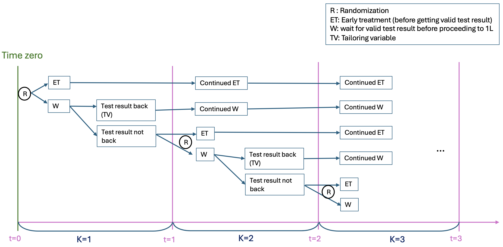

Statistical Analysis Plan
================
Hyejung Lee <hyejung.lee@utah.edu>
Tue Apr 08, 2025 06:17:45 PM

- [Hypothesis](#hypothesis)
- [Objectives](#objectives)
- [Study Design and Population](#study-design-and-population)
  - [Study Design](#study-design)
  - [Study Population](#study-population)
- [Emulate SMART trial](#emulate-smart-trial)
  - [Decision rule](#decision-rule)
- [Data Structure](#data-structure)
- [Cohort](#cohort)
  - [Directed acyclic graph (DAG)](#directed-acyclic-graph-dag)
- [Outcome](#outcome)
- [Covariates](#covariates)
  - [Baseline (45 variables)](#baseline-45-variables)
  - [Time-varying (40 variables)](#time-varying-40-variables)
- [Statistical analysis](#statistical-analysis)
- [Appendices](#appendices)
  - [Appendix A: List of baseline covariates](#appA)
- [Tables](#tables)
  - [Table 1](#table-1)
  - [Table 2](#table-2)
- [Key variables](#key-variables)
  - [Valid targetable mutation test or PDL1
    test](#valid-targetable-mutation-test-or-pdl1-test)
  - [Cohort](#cohort-1)
  - [Protocol (for TTE)](#protocol-for-tte)

  

# Hypothesis

Advanced non-small cell lung cancer (aNSCLC) patients’ recommended
course of treatments are identified in National Comprehensive Cancer
Network (NCCN) guideline. The guideline suggests each patient to perform
biopsy to identify presence of targetable mutations of certain
biomarkers and PDL1 expression to make a informed decision on 1L therapy
choice. This recommendation is made because targeted therapy is better
for patient’s survival than a standard, genetic therapy such as
chemotherapy or immunotherapy. Usually, at least 1 positive mutation or
2 negative mutation status among all targetable biomarkers should be
obtained to make informed decision about targetable therapy. Thus having
at least 1 positive mutation or 2 negative mutation status will be
referred to as *useful* mutation test result from here onward.
Similarly, obtaining PDL1 expression level (from 0-100%) level, as
opposed to result such as missing expression level or indeterminate
result, will be referred to as *useful* PDL1 test result.

The standard NCCN guideline, however, may not always be followed due to
reasons such as clinician’s expert knowledge and ethics. For example,
heavy smokers who develop lung cancer is most likely due to smoking
rather than genetic mutation. Patients who fall into this category then
may receive chemotherapy right away, instead of performing and waiting
for genetic or PDL1 test results. One reason for not waiting until the
useful test comes out is that a complete panel of test results (combined
mutation and PDL1 expression tests) usually takes about 2-3 weeks to
become available. It may take longer if the biopsy samples were not good
and the test results are indeterminate, requiring another round of
biopsy and waiting for the result. This period of waiting without doing
any treatment may be detrimental to patient’s health and thus becomes an
ethical issue. Therefore, the ultimate choice of whether waiting for the
test result or not relies heavily on the clinician’s decision.

Just like the example of heavy smokers, there are some patient
characteristics that are highly indicative of patient’s likelihood of
targetable mutation status. However, there has not yet been a
quantitative evaluation of effect of proceeding to 1L therapy prior to
knowing targetable mutation status in patients. In this study, we
evaluate causal effect of proceeding right 1L therapy in all aNSCLC
patients, as well as in some subgroups that have previously been
identified as associated with the mutation status.

  

# Objectives

**Primary Objective**: Using marginal structural model, we will develop
and evaluate the effect of proceeding to 1L therapy prior to obtaining
useful targetable mutation status

- Limit the number of weeks.
- For entire observation.

**Secondary Objective**: Test impact of proceeding to 1L before useful
tests become available in the following subgroups: male, female, have
history of smoking, do not have history of smoking, baseline Eastern
Cooperative Oncology Group (ECOG) score 0-2, baseline ECOG score 3-4,
baseline albumin \< 35g/L, baseline albumin \>= 35 g/L, and Asian.

- These are the subgroups identified by Wally as having either higher or
  lower probability of having targetable mutation, and thus would more
  or less likely wait for the useful test results to become available
  prior to initiating 1L therapy.

  

# Study Design and Population

## Study Design

Retrospective Cohort Study…

## Study Population

**Data**: A nationwide Flatiron Health electronic health record
(EHR)-derived de-identified database. The Flatiron Health database is a
longitudinal database, comprising de-identified patient-level structured
and unstructured data, curated via technology-enabled
abstraction1,2. The de-identified data originated from 280
cancer clinics (~800 sites of care). Patients with a BirthYear of 1937
or earlier may have an adjusted BirthYear in Flatiron datasets due to
patient de-identification requirements. For more information, please
refer to their webpage3.

**Inclusion criteria**: People who got diagnosed with aNSCLC (ICD-9
162.x or ICD-10 C34x or C39.9) from 01 January 2011, to 30 December 2022
from Flatiron Health network.

1.  Index date is date of aNSCLC diagnosis.

**Exclusion criteria**:

1.  Initiate who receive first-line (1L) therapy before the index date.
2.  Receive valid test result (meaning, receiving either useful PDL1
    test result or useful targetable mutation result) on or before the
    index date. - useful PDL1 test result is when there is PDL1
    expression - useful targetable mutation result is when there is at
    least 2 negative mutation results for any of the biomarkers or at
    least 1 positive mutation result

Patient attrition diagram is shown below (@ref(fig:pt-attrition)). It
shows all exclusion criteria. We excluded all patients who don’t have
valid survival end time and who start either the 1L therapy or valid
test before advanced diagnosis date. We will explain what valid test
means in the next section.

Figure XX: Patient attrition diagram

# Emulate SMART trial

We plan on solving the problem by emulating Sequential Multiple
Assignment Randomized Trial (SMART) design.

SMART design is an adaptive treatment strategy. In adaptive treatment
strategies, the treatment level and type is repeatedly adjusted
according to the individual’s need4. The treatment assignment
at later stages is contingent upon pre‐specified criteria. We can
utilize this.

For our model, we will be making decision rule at each day.

Figure XX: SMART diagram. The target trial I am trying to emulate. On
the the first three time points are detailed out but it is supposed to
continue indefinitely.

At time zero, no one has received valid test result and not one started
1L therapy yet. Thus, everyone can be randomized to either early
treatment initiation (ET) or waiting for test result for another day
(W). That’s the first square box `ET` and `W` shown in
the**ref?**(fig:SMART) within `K=1` interval. Going forward,
randomization is based on the decision rule explained below.:

## Decision rule

Decision rule operationalizes how to use tailoring variable to guide the
tactical decision at the second-stage. In our project, the decision rule
are three different tailoring variables:

1.  For those who are assigned to early treatment, there is no further
    randomization
2.  For those who are assigned to wait, tailoring variable is a binary
    variable showing whether or not the valid test result was received
    by the end of the time interval.
    - If test result is received, then the patient is assigned to “wait”
      in all following time interval, without any randomization
    - If test result is not received, then the patient is randomized in
      the next time interval.

Those who are randomized to ET is no longer randomized. For those who
decided to wait, we observe tailoring variable at the end of the day.
Which is, whether the patient received test result or not. Those who
received test result are automatically assigned W from that time forward
without any randomization. Only those who did not wait for the test
result are going to be randomized the next stage.

So it’s important that we balance out any confounding variable for those
who are being randomized at each time point.

# Data Structure

There are 9 data sets of wide and long formats. Data sets containing
repeated measurements such as visits, PDL1 or targetable mutation test,
or lab values will be long format. The unit of observation differs by
the dataset.

1.  Create a single date variable where useful PDL1 test results are
    observed in each patient.
2.  Create a single date variable where useful targetable mutation test
    results are observed in each patient.
3.  For each consecutive week after the index date, create a binary
    indicator variable indicating who initiated 1L therapy before
    receiving any useful test is out. (Cohort identification)
4.  Create baseline covariates as listed in @ref(appA)
    1.  report the percent missing of each variable overall by exposure
        group as in @ref(tab:baseline-missing-mock)
5.  For each consecutive week after the index date, a long dataset is
    created for each patient’s weekly time-varying follow-up variables
    listed in Appendix B. There will be a variable named $k$ which shows
    number of weeks since index date. When $k=0$, it refers to baseline.
    Suppose for an example, albumin measurement at $k=1$ represent
    measurements taken between $(0,7]$ days, and at $k=2$ will represent
    measurements taken between $(7,14]$ days.  
6.  Impute censoring date using visit and oral medication record

  

| Patient ID |   k | Gender | SmokingStatus      |  Albumin | Platelet | cohort |
|:-----------|----:|:-------|:-------------------|---------:|---------:|-------:|
| A          |   0 | M      | History of smoking | 37.20139 |      214 |      0 |
| A          |   1 | M      | History of smoking | 17.87623 |      210 |      0 |
| A          |   2 | M      | History of smoking | 37.51583 |      198 |      0 |
| B          |   0 | M      | History of smoking | 29.80779 |      236 |      0 |
| B          |   1 | M      | History of smoking | 41.01908 |      262 |      0 |
| B          |   2 | M      | History of smoking | 52.88518 |      257 |      0 |
| B          |   3 | M      | History of smoking | 35.94656 |      262 |      1 |
| B          |   4 | M      | History of smoking | 40.00766 |      302 |      1 |
| B          |   5 | M      | History of smoking | 44.05353 |      283 |      1 |

Table 1. Example dataset: An expected sample of the dataset for the
baseline and follow-up variables for two patients. Gender and smoking
status are baseline covariates that do not change over time. Albumin and
Platelet are the time-dependent covariates that are measured each week
(k). Cohort is the exposure variables that can change over time.

  

# Cohort

## Directed acyclic graph (DAG)

Figure XX: Directed acyclic graph. Y refers to survival outcome, A’s
refer to time-dependent cohort status, L’s refer to time-dependent
measured confounders, and U’s refer to time-dependent unmeasured
confounders. Index 0 is the baseline measruement. Thus, L0 contains
variable such as gender and race/ethnicity. L1 then has a subset of
variables of L0, where only time-varying variables are contained. The
time index (k) goes from 1 through K_i, where i refers to a patient.
Each patient has different number of weeks of follow-up until censored
or dead.

Figure @ref(fig:DAG) shows directed acyclic graph of the study where:

- $k =\{1,2,..., K_i\}$, number of weeks from time zero, where $K_i$ is
  week when death/censoring occurs for the individual $i$.
- $Y =$ survival outcome
- $A_k =$ time dependent intervention status, where the intervention in
  our case is either:
  - wait for the valid test results before proceeding to 1L therapy
    ($A_k=0$)
  - proceed to 1L therapy before observing the valid test results
    ($A_k=1$)
  - where we define the valid test to be any of the below:
    1)  obtaining PDL1 expression level,
    2)  1 positive mutation, or
    3)  2 negative mutations
- $L_k =$ time-dependent confounder (observed)
- $U_k =$ time-dependent confounder (unobserved)

Thus, we can fix follow up period for any $k$. Treatment strategies are
visually provided in @ref(fig:SMART-diag).

<!-- - And once switched to $A_k=1$, all subsequent $A_k$ values are fixed at 1. -->

Figure XX: SMART diagram. The target trial I am trying to emulate. On
the the first three time points are detailed out but it is supposed to
continue indefinitely.

Figure XX: A zoomed version of the SMART diagram, just for one time
interval.

We will provide 4 cases

1.  On the first day of $k$ (for $k=1$, the beginning would be the time
    zero, which is date of advanced diagnosis), the patient received a
    valid test. This patient is assigned to $A_k=0$, meaning, the
    patient waited for the test result prior to doing any therapy.
2.  On the first day of $k$ (for $k=1$, the beginning would be the time
    zero, which is date of advanced diagnosis), the patient did not
    receive a valid test. The patient also did not receive any therapy.
    This patient is assigned to $A_k=0$.
3.  On the first day of $k$ (for $k=1$, the beginning would be the time
    zero, which is date of advanced diagnosis), the patient did not
    receive a valid test. The patient received the 1L therapy during the
    week. also did not receive any therapy. This patient is assigned to
    $A_k=0$.

We believe that there is no unmeasured confounders that are
substantially affecting the study. Thus, we assume that all $U_k$,
$i=1,...,K$ in Figure @ref(fig:DAG) can be removed. This is equivalent
to say:

We assume that there is no unmeasured confounding for all $\bar{a}$ and
$t \geq k$5

$$Y_{\bar{a}}(t+1) \perp A(k) | \bar{A}(k-1), \bar{L}(k)$$

This assumption will be true if for all prognostic factors for
${\bar{a}}(t+1)$.

We assume time-varying adaptive intervention

<!-- -   $C_k = min$ {end of week $k$, earliest valid test result date}  -->
<!-- -   $A_k =\begin{cases} 1, & \text{if } A_{k-1}=1 \text{ or if 1L therapy is initiated before }C_k \\  0, & \text{if } A_{k-1} \neq 1 \text{ and if 1L therapy is not initiated before } C_k \end{cases}$ -->

# Outcome

Death.

If date of death is missing, the patient was presumed alive and was
censored at the most recent record of valid vitals or oral medication
dates as advised6.

Date of death is provided only up to month, for de-identification
purposes. As we required up to days for survival analysis, we imputed
date of death at the 15th of the month of death as recommended by
Flatiron Health. This approach best approximates the results generated
from using the exact date of death in comparative analysis pre and post
de-identification7.

  

# Covariates

## Baseline (45 variables)

List of baseline covariates and their definitions are listed in
@ref(appA). Note that most recent measurement prior to index date will
be used.

1.  Socio-demographics (5): gender, age, Race/Ethnicity, Smoking status,
    histology
2.  ECOG (1): Eastern Cooperative Oncology Group score
3.  Vitals/Labs (39): body mass index (BMI), Continuous and categorical
    version of complete metabolic panel (CMP) and complete blood panel
    (CBP) collected by Flatiron. Except carbon dioxide and glucose from
    complete metabolic panel has been excluded due to volatility over
    every seconds.

- CMP ($12 * 2$): Albumin, Alkaline, Alanine aminotransferase (ALT),
  Aspartate aminotransferase (AST), Bilirubin, Calcium, Chloride,
  Creatinine, Potassium, Protein, Sodium, eGFR
- CBP ($7 * 2$) : Hematocrit (HCT), Hemoglobin (HGB), Lymphocyte count,
  Neutrophil count, Platelet, Erythrocytes (RBC), Leukocytes (WBC)

  

## Time-varying (40 variables)

ECOG PS (ECOG) reflect the patient’s overall health. The higher the
score, the severe the health of the patient. Clinicians use ECOG to
decide whether they should wait until valid test can be obtains prior to
administering 1L or not. Therefore, ECOG is both a risk factor for
mortality and also predicts subsequent exposure. Morevoer, waiting/not
waiting for valid test results prior to 1L initiation can also affect
the ECOG score. We decided to use all vitals/labs and ECOG scores to be
time-varying. Since this is the first study of its kind, we decided to
do a variable selection to identify such confounder. ECOG and albumin
are the two time-varying covariates that are chosen by the oncologist
that he uses himself to make the decision. All other values will be
explored for their role as time-varying confounders using variable
selection method.

All time-varying covariates are updated for each time interval (weekly).
If there are more than one observation in the interval, then the first
one observed will be chosen. If no observations are made in the
interval, the last observed value will be carried forward indefinitely
until a new measurement is available or until the patient dies or is
censored. These covariates will be used to generate inverse probability
of weighting.

  

# Statistical analysis

I found in Robins (2000)8 that when we can estimate $W (t)$,
the measure of degree to which the treatment process is statistically
non-exogenous through day %t% by the random quantity, with $L(t)$
capturing all relevant time-dependent prognostic factors (i.e.,
confounders), then, whether or not the treatment process is
statistically exogenous, the weighted logistic regression estimator of
$\gamma_2$ will converge to a quantity $\beta_2$ that can be
appropriately interpreted as the causal effect of treatment history on
the mean of $Y$.

1.  To account for missingness of baseline covariates (quantified in
    Table 1), for the ones we think are missing at random (MAR), perform
    multiple imputation with chained equations in 10 imputed
    datasets9.
    1.  Weights (below) will be re-computed separately within each
        imputed data set.
    2.  Effect size and standard error estimates will be computed using
        Rubin’s formula across the imputed data sets.
    3.  Due to computation burden, we will nest the bootstrapping
        procedure for calculating confidence intervals within each
        imputed dataset, instead of the other way around.
2.  For the covariates that are missing not at random (MNAR), create a
    categorical variable that includes missing as one level.
3.  Generate propensity score of initiating 1L therapy before observing
    valid test results using a logistic regression model as a function
    of all baseline covariates (Table 2)
    1.  Generate the common support figure, which is a histogram showing
        the distribution of PSs among study-eligible participants by
        Wait vs. Do not wait cohort.
4.  Use the PSs generated from step 3 to calculate the stabilized
    inverse probability weight:
    1.  Wait: $\frac{P(A_0=0)}{1-PS}$
    2.  Do not wait: $\frac{P(A_0=1)}{PS}$
5.  Calculate the baseline characteristics of before and after
    application of IP weights. Differences between cohorts will be
    calculated using absolute standardized mean differences (ASMD),
    where an ASMD \> 0.1 indicates a significant difference between
    groups10. Populate Table 2 for patient characteristics by
    pooling all 10 imputed datasets . Generate Figure 3 (panel A) for
    each weighting scheme in step 4 to graphically depict the pre- and
    post-weighting ASMD for each characteristic.
6.  Time-varying weights:

  

# Appendices

## Appendix A: List of baseline covariates

| variable | Definition |
|:---|:---|
| Gender | Male or Female (from Demographics.csv file) |
| Age | Age of patient in years calculated on the index date (from Enhanced_AdvancedNSCLC.csv file) based on their year of birth (from Demographics.csv file). Approximation due to incomplete data(missing month and day) for de-identification purposes. |
| Race/Ethnicity | A single variable derived by pasting Race (Asian, Black or African American, Hispanic or Latino, White, Other Race) and Ethnicity (Not Hispanic or Latino, Hispanic or Latino) variables. |
| Smoking Status | Smoking status of patient (History, no history, unknown) (from Enhanced_AdvancedNSCLC.csv file). |
| Histology | Squamous cell carcinoma, Non-squamous cell carcinoma, NSCLC histology NOS (from Enhanced_AdvancedNSCLC.csv file) |
| BMI | Body mass index (kg\_\_m^2) (from Vitals.csv file) |
| ECOG score | Eastern Cooperative Oncology Group score, ranging from 0 to 4. (from ECOG.csv file) |
| Complete metabolic panel (CMP) | Lab measurement of following analytes: Albumin, Alkaline, ALT, Bilirubin, Calcium, Chloride, Creatinine, eGFR, Potassium, Protein, Sodium. Each of these variables are to be defined below. (from Lab.csv file) |
| Albumin | albumin \[mass\_\_volume\] in serum or plasma measrued in g\_\_L |
| Alkaline | alkaline phosphatase \[enzymatic activity\_\_volume\] in serum or plasma measrued in U\_\_L |
| ALT | alanine aminotransferase \[enzymatic activity\_\_volume\] in serum or plasma measrued in U\_\_L |
| AST | aspartate aminotransferase \[enzymatic activity\_\_volume\] in serum or plasma measrued in U\_\_L |
| Bilirubin | bilirubin.total \[mass\_\_volume\] in serum or plasma measrued in mg\_\_dL |
| Calcium | calcium \[mass\_\_volume\] in serum or plasma measrued in mg\_\_dL |
| Carbon dioxide | carbon dioxide, total \[moles\_\_volume\] in serum or plasma measrued in mmol\_\_L |
| Chloride | chloride \[moles\_\_volume\] in serum or plasma measrued in mmol\_\_L |
| Creatinine | creatinine \[mass\_\_volume\] in serum or plasma measrued in mg\_\_dL |
| Glucose | glucose \[mass\_\_volume\] in serum or plasma measrued in mg\_\_dL |
| Potassium | potassium \[moles\_\_volume\] in serum or plasma measrued in mmol\_\_L |
| Protein | protein \[mass\_\_volume\] in serum or plasma measrued in g\_\_L |
| Sodium | sodium \[moles\_\_volume\] in serum or plasma measrued in mmol\_\_L |
| eGFR_mdrd | glomerular filtration rate predicted \[volume rate\_\_area\] in serum, plasma or blood by creatinine-based formula (mdrd), measrued in ml\_\_min\_\_1.73m\*2. Some observations specificially state that the values are precited among non-blacks, blacks, or females mutually exclusively. |
| eGFR_ckd_epi | glomerular filtration rate predicted \[volume rate\_\_area\] in serum, plasma or blood, measrued in ml\_\_min\_\_1.73m\*2. Some observations specify whether the test as creatinine-based formula (ckd-epi), creatinine-based formula (ckd-epi 2021), or cystatin c-based formula. Also, some observations people specificially states whether the values are precited among non-blacks or blacks, mutually exclusively. |
| Categorical CMP | Categorical version of the above…. Should we do this? I won’t for now. |
| Complete Blood Panel (CBP) | lab measurement of following analytes: RBC, WBC, HCT, HGB, Platelet, Lymphocyte \#, Neutrophil \#. Each of these variables are to be defined below. (from Lab.csv file) |
| HCT | hematocrit \[volume fraction\] of blood measrued in % |
| HGB | hemoglobin \[mass\_\_volume\] in blood measrued in g\_\_dL |
| Lymphocyte \# | lymphocytes \[#\_\_volume\] in blood measrued in 10\*9\_\_L |
| Neutrophil \# | neutrophils \[#\_\_volume\] in blood measrued in 10\*9\_\_L |
| Platelet | platelets \[#\_\_volume\] in blood measrued in 10\*9\_\_L |
| RBC | erythrocytes \[#\_\_volume\] in blood measrued in 10\*12\_\_L |
| WBC | leukocytes \[#\_\_volume\] in blood measrued in 10\*9\_\_L |
| Categorical CBP | Categorical version of the above…. Should we do this? I won’t for now. |

- Gender: Demographics.csv/Gender
- Age at diagnosis:
  - Demographics.csv/BirthYear
  - Enhanced_AdvancedNSCLC.csv/AdvancedDiagnosisDate
  - difference in the two above dates
- Race/Ethnicity:
  - Demographics.csv/Race
  - Demographics.csv/Ethnicity
  - Append the two variables
- Smoking status: Enhanced_AdvancedNSCLC.csv/SmokingStatus
- Histology: Enhanced_AdvancedNSCLC.csv/Histology
- BMI:
  - Vitals.csv/Test : choose the entries equal to “body weight” and
    “body height”. Body weight is in kg, and the body height is in cm.
    generate BMI (kg/m^2) from these two entries.
- ECOG score: ECOG.csv/EcogValue
- Complete metabolic panel(CMP) (Albumin, Alkaline, ALT, Bilirubin,
  Calcium, Carbon dioxide, Chloride, Creatinine, eGFR, Potassium,
  Protein, Sodium, HCT, HGB, Lymphocyte \#, Neutrophil \#) :
  - Lab.csv/TestResultCleaned
  - Lab.csv/TestBaseName : filter to the CMP
- Categorical CMP: Take CMP, and discretize into Above, Average, Below
  using website
  (<https://www.ucsfhealth.org/medical-tests/comprehensive-metabolic-panel>)
  - <https://www.ncbi.nlm.nih.gov/books/NBK204/#>:~:text=The%20normal%20serum%20protein%20level,according%20to%20the%20individual%20laboratory.
- Complete blood count(CBC) (Platelet, RBC, WBC) :
  - Lab.csv/TestResultCleaned
  - Lab.csv/TestBaseName : filter to the CBC
- Categorical CBC: Take CBC, and discretize into Above, Average, Below
  using website
  - <https://www.ncbi.nlm.nih.gov/books/NBK2263/table/ch1.T1/>

  

# Tables

## Table 1

| variable                       | Overall (n=) | Wait (n=) | Do not wait (n=) |
|:-------------------------------|:-------------|:----------|:-----------------|
| Gender                         |              |           |                  |
| Age                            |              |           |                  |
| Race/Ethnicity                 |              |           |                  |
| Smoking Status                 |              |           |                  |
| Histology                      |              |           |                  |
| BMI                            |              |           |                  |
| ECOG score                     |              |           |                  |
| Complete metabolic panel (CMP) |              |           |                  |
| Albumin                        |              |           |                  |
| Alkaline                       |              |           |                  |
| ALT                            |              |           |                  |
| AST                            |              |           |                  |
| Bilirubin                      |              |           |                  |
| Calcium                        |              |           |                  |
| Carbon dioxide                 |              |           |                  |
| Chloride                       |              |           |                  |
| Creatinine                     |              |           |                  |
| Glucose                        |              |           |                  |
| Potassium                      |              |           |                  |
| Protein                        |              |           |                  |
| Sodium                         |              |           |                  |
| eGFR_mdrd                      |              |           |                  |
| eGFR_ckd_epi                   |              |           |                  |
| Categorical CMP                |              |           |                  |
| Complete Blood Panel (CBP)     |              |           |                  |
| HCT                            |              |           |                  |
| HGB                            |              |           |                  |
| Lymphocyte \#                  |              |           |                  |
| Neutrophil \#                  |              |           |                  |
| Platelet                       |              |           |                  |
| RBC                            |              |           |                  |
| WBC                            |              |           |                  |
| Categorical CBP                |              |           |                  |

Table1: Mock table demonstrating format of reporting proportion missing.

## Table 2

  &#10;  <table class="gt_table" data-quarto-disable-processing="false" data-quarto-bootstrap="false" style="-webkit-font-smoothing: antialiased; -moz-osx-font-smoothing: grayscale; font-family: system-ui, 'Segoe UI', Roboto, Helvetica, Arial, sans-serif, 'Apple Color Emoji', 'Segoe UI Emoji', 'Segoe UI Symbol', 'Noto Color Emoji'; display: table; border-collapse: collapse; line-height: normal; margin-left: auto; margin-right: auto; color: #333333; font-size: 16px; font-weight: normal; font-style: normal; background-color: #FFFFFF; width: auto; border-top-style: solid; border-top-width: 2px; border-top-color: #A8A8A8; border-right-style: none; border-right-width: 2px; border-right-color: #D3D3D3; border-bottom-style: solid; border-bottom-width: 2px; border-bottom-color: #A8A8A8; border-left-style: none; border-left-width: 2px; border-left-color: #D3D3D3;" bgcolor="#FFFFFF">
  <caption>Table 2: Baseline characteristics of aNSCLC patients included in the current analysis before and after IP weighting</caption>
  <thead style="border-style: none;">
    <tr class="gt_col_headings gt_spanner_row" style="border-style: none; border-top-style: solid; border-top-width: 2px; border-top-color: #D3D3D3; border-bottom-width: 2px; border-bottom-color: #D3D3D3; border-left-style: none; border-left-width: 1px; border-left-color: #D3D3D3; border-right-style: none; border-right-width: 1px; border-right-color: #D3D3D3; border-bottom-style: hidden;">
      <th class="gt_col_heading gt_columns_bottom_border gt_left" rowspan="2" colspan="1" scope="col" id="a::stub" style="border-style: none; color: #333333; background-color: #FFFFFF; font-size: 100%; font-weight: normal; text-transform: inherit; border-left-style: none; border-left-width: 1px; border-left-color: #D3D3D3; border-right-style: none; border-right-width: 1px; border-right-color: #D3D3D3; vertical-align: bottom; padding-top: 5px; padding-bottom: 6px; padding-left: 5px; padding-right: 5px; overflow-x: hidden; text-align: left;" bgcolor="#FFFFFF" valign="bottom" align="left"></th>
      <th class="gt_center gt_columns_top_border gt_column_spanner_outer" rowspan="1" colspan="3" scope="colgroup" id="**Before IPW**" style="border-style: none; color: #333333; background-color: #FFFFFF; font-size: 100%; font-weight: normal; text-transform: inherit; padding-top: 0; padding-bottom: 0; padding-left: 4px; padding-right: 4px; text-align: center;" bgcolor="#FFFFFF" align="center">
        
<strong style="margin-top: 0; margin-bottom: 0;">Before IPW</strong>

      </th>
      <th class="gt_center gt_columns_top_border gt_column_spanner_outer" rowspan="1" colspan="3" scope="colgroup" id="**After IPW**" style="border-style: none; color: #333333; background-color: #FFFFFF; font-size: 100%; font-weight: normal; text-transform: inherit; padding-top: 0; padding-bottom: 0; padding-left: 4px; text-align: center; padding-right: 0;" bgcolor="#FFFFFF" align="center">
        
<strong style="margin-top: 0; margin-bottom: 0;">After IPW</strong>

      </th>
    </tr>
    <tr class="gt_col_headings" style="border-style: none; border-top-style: solid; border-top-width: 2px; border-top-color: #D3D3D3; border-bottom-style: solid; border-bottom-width: 2px; border-bottom-color: #D3D3D3; border-left-style: none; border-left-width: 1px; border-left-color: #D3D3D3; border-right-style: none; border-right-width: 1px; border-right-color: #D3D3D3;">
      <th class="gt_col_heading gt_columns_bottom_border gt_right" rowspan="1" colspan="1" style="border-style: none; color: #333333; background-color: #FFFFFF; font-size: 100%; text-transform: inherit; border-left-style: none; border-left-width: 1px; border-left-color: #D3D3D3; border-right-style: none; border-right-width: 1px; border-right-color: #D3D3D3; vertical-align: bottom; padding-top: 5px; padding-bottom: 6px; padding-left: 5px; padding-right: 5px; overflow-x: hidden; text-align: right; font-variant-numeric: tabular-nums; font-weight: bold;" scope="col" id="Wait-(n=)-before" bgcolor="#FFFFFF" valign="bottom" align="right">Wait (n=)</th>
      <th class="gt_col_heading gt_columns_bottom_border gt_right" rowspan="1" colspan="1" style="border-style: none; color: #333333; background-color: #FFFFFF; font-size: 100%; text-transform: inherit; border-left-style: none; border-left-width: 1px; border-left-color: #D3D3D3; border-right-style: none; border-right-width: 1px; border-right-color: #D3D3D3; vertical-align: bottom; padding-top: 5px; padding-bottom: 6px; padding-left: 5px; padding-right: 5px; overflow-x: hidden; text-align: right; font-variant-numeric: tabular-nums; font-weight: bold;" scope="col" id="Do-not-wait-(n=)-before" bgcolor="#FFFFFF" valign="bottom" align="right">Do not wait (n=)</th>
      <th class="gt_col_heading gt_columns_bottom_border gt_right" rowspan="1" colspan="1" style="border-style: none; color: #333333; background-color: #FFFFFF; font-size: 100%; text-transform: inherit; border-left-style: none; border-left-width: 1px; border-left-color: #D3D3D3; border-right-style: none; border-right-width: 1px; border-right-color: #D3D3D3; vertical-align: bottom; padding-top: 5px; padding-bottom: 6px; padding-left: 5px; padding-right: 5px; overflow-x: hidden; text-align: right; font-variant-numeric: tabular-nums; font-weight: bold;" scope="col" id="ASMD-before" bgcolor="#FFFFFF" valign="bottom" align="right">ASMD</th>
      <th class="gt_col_heading gt_columns_bottom_border gt_right" rowspan="1" colspan="1" style="border-style: none; color: #333333; background-color: #FFFFFF; font-size: 100%; text-transform: inherit; border-left-style: none; border-left-width: 1px; border-left-color: #D3D3D3; border-right-style: none; border-right-width: 1px; border-right-color: #D3D3D3; vertical-align: bottom; padding-top: 5px; padding-bottom: 6px; padding-left: 5px; padding-right: 5px; overflow-x: hidden; text-align: right; font-variant-numeric: tabular-nums; font-weight: bold;" scope="col" id="Wait-(n=)-after" bgcolor="#FFFFFF" valign="bottom" align="right">Wait (n=)</th>
      <th class="gt_col_heading gt_columns_bottom_border gt_right" rowspan="1" colspan="1" style="border-style: none; color: #333333; background-color: #FFFFFF; font-size: 100%; text-transform: inherit; border-left-style: none; border-left-width: 1px; border-left-color: #D3D3D3; border-right-style: none; border-right-width: 1px; border-right-color: #D3D3D3; vertical-align: bottom; padding-top: 5px; padding-bottom: 6px; padding-left: 5px; padding-right: 5px; overflow-x: hidden; text-align: right; font-variant-numeric: tabular-nums; font-weight: bold;" scope="col" id="Do-not-wait-(n=)-after" bgcolor="#FFFFFF" valign="bottom" align="right">Do not wait (n=)</th>
      <th class="gt_col_heading gt_columns_bottom_border gt_right" rowspan="1" colspan="1" style="border-style: none; color: #333333; background-color: #FFFFFF; font-size: 100%; text-transform: inherit; border-left-style: none; border-left-width: 1px; border-left-color: #D3D3D3; border-right-style: none; border-right-width: 1px; border-right-color: #D3D3D3; vertical-align: bottom; padding-top: 5px; padding-bottom: 6px; padding-left: 5px; padding-right: 5px; overflow-x: hidden; text-align: right; font-variant-numeric: tabular-nums; font-weight: bold;" scope="col" id="ASMD-after" bgcolor="#FFFFFF" valign="bottom" align="right">ASMD</th>
    </tr>
  </thead>
  <tbody class="gt_table_body" style="border-style: none; border-top-style: solid; border-top-width: 2px; border-top-color: #D3D3D3; border-bottom-style: solid; border-bottom-width: 2px; border-bottom-color: #D3D3D3;">
    <tr style="border-style: none;"><th id="stub_1_1" scope="row" class="gt_row gt_left gt_stub" style="border-style: none; padding-top: 8px; padding-bottom: 8px; margin: 10px; border-top-style: solid; border-top-width: 1px; border-top-color: #D3D3D3; border-left-style: none; border-left-width: 1px; border-left-color: #D3D3D3; vertical-align: middle; overflow-x: hidden; color: #333333; background-color: #FFFFFF; font-size: 100%; font-weight: initial; text-transform: inherit; border-right-style: solid; border-right-width: 2px; border-right-color: #D3D3D3; padding-left: 5px; padding-right: 5px; text-align: left;" valign="middle" bgcolor="#FFFFFF" align="left">Gender</th>
<td headers="stub_1_1 Wait (n=) before" class="gt_row gt_right" style="border-style: none; padding-top: 8px; padding-bottom: 8px; padding-left: 5px; padding-right: 5px; margin: 10px; border-top-style: solid; border-top-width: 1px; border-top-color: #D3D3D3; border-left-style: none; border-left-width: 1px; border-left-color: #D3D3D3; border-right-style: none; border-right-width: 1px; border-right-color: #D3D3D3; vertical-align: middle; overflow-x: hidden; text-align: right; font-variant-numeric: tabular-nums;" valign="middle" align="right"></td>
<td headers="stub_1_1 Do not wait (n=) before" class="gt_row gt_right" style="border-style: none; padding-top: 8px; padding-bottom: 8px; padding-left: 5px; padding-right: 5px; margin: 10px; border-top-style: solid; border-top-width: 1px; border-top-color: #D3D3D3; border-left-style: none; border-left-width: 1px; border-left-color: #D3D3D3; border-right-style: none; border-right-width: 1px; border-right-color: #D3D3D3; vertical-align: middle; overflow-x: hidden; text-align: right; font-variant-numeric: tabular-nums;" valign="middle" align="right"></td>
<td headers="stub_1_1 ASMD before" class="gt_row gt_right" style="border-style: none; padding-top: 8px; padding-bottom: 8px; padding-left: 5px; padding-right: 5px; margin: 10px; border-top-style: solid; border-top-width: 1px; border-top-color: #D3D3D3; border-left-style: none; border-left-width: 1px; border-left-color: #D3D3D3; vertical-align: middle; overflow-x: hidden; text-align: right; font-variant-numeric: tabular-nums; border-right-width: 1px; border-right-style: solid; border-right-color: #000000;" valign="middle" align="right"></td>
<td headers="stub_1_1 Wait (n=) after" class="gt_row gt_right" style="border-style: none; padding-top: 8px; padding-bottom: 8px; padding-left: 5px; padding-right: 5px; margin: 10px; border-top-style: solid; border-top-width: 1px; border-top-color: #D3D3D3; border-left-style: none; border-left-width: 1px; border-left-color: #D3D3D3; border-right-style: none; border-right-width: 1px; border-right-color: #D3D3D3; vertical-align: middle; overflow-x: hidden; text-align: right; font-variant-numeric: tabular-nums;" valign="middle" align="right"></td>
<td headers="stub_1_1 Do not wait (n=) after" class="gt_row gt_right" style="border-style: none; padding-top: 8px; padding-bottom: 8px; padding-left: 5px; padding-right: 5px; margin: 10px; border-top-style: solid; border-top-width: 1px; border-top-color: #D3D3D3; border-left-style: none; border-left-width: 1px; border-left-color: #D3D3D3; border-right-style: none; border-right-width: 1px; border-right-color: #D3D3D3; vertical-align: middle; overflow-x: hidden; text-align: right; font-variant-numeric: tabular-nums;" valign="middle" align="right"></td>
<td headers="stub_1_1 ASMD after" class="gt_row gt_right" style="border-style: none; padding-top: 8px; padding-bottom: 8px; padding-left: 5px; padding-right: 5px; margin: 10px; border-top-style: solid; border-top-width: 1px; border-top-color: #D3D3D3; border-left-style: none; border-left-width: 1px; border-left-color: #D3D3D3; border-right-style: none; border-right-width: 1px; border-right-color: #D3D3D3; vertical-align: middle; overflow-x: hidden; text-align: right; font-variant-numeric: tabular-nums;" valign="middle" align="right"></td></tr>
    <tr style="border-style: none;"><th id="stub_1_2" scope="row" class="gt_row gt_left gt_stub" style="border-style: none; padding-top: 8px; padding-bottom: 8px; margin: 10px; border-top-style: solid; border-top-width: 1px; border-top-color: #D3D3D3; border-left-style: none; border-left-width: 1px; border-left-color: #D3D3D3; vertical-align: middle; overflow-x: hidden; color: #333333; background-color: #FFFFFF; font-size: 100%; font-weight: initial; text-transform: inherit; border-right-style: solid; border-right-width: 2px; border-right-color: #D3D3D3; padding-left: 5px; padding-right: 5px; text-align: left;" valign="middle" bgcolor="#FFFFFF" align="left">Age</th>
<td headers="stub_1_2 Wait (n=) before" class="gt_row gt_right" style="border-style: none; padding-top: 8px; padding-bottom: 8px; padding-left: 5px; padding-right: 5px; margin: 10px; border-top-style: solid; border-top-width: 1px; border-top-color: #D3D3D3; border-left-style: none; border-left-width: 1px; border-left-color: #D3D3D3; border-right-style: none; border-right-width: 1px; border-right-color: #D3D3D3; vertical-align: middle; overflow-x: hidden; text-align: right; font-variant-numeric: tabular-nums;" valign="middle" align="right"></td>
<td headers="stub_1_2 Do not wait (n=) before" class="gt_row gt_right" style="border-style: none; padding-top: 8px; padding-bottom: 8px; padding-left: 5px; padding-right: 5px; margin: 10px; border-top-style: solid; border-top-width: 1px; border-top-color: #D3D3D3; border-left-style: none; border-left-width: 1px; border-left-color: #D3D3D3; border-right-style: none; border-right-width: 1px; border-right-color: #D3D3D3; vertical-align: middle; overflow-x: hidden; text-align: right; font-variant-numeric: tabular-nums;" valign="middle" align="right"></td>
<td headers="stub_1_2 ASMD before" class="gt_row gt_right" style="border-style: none; padding-top: 8px; padding-bottom: 8px; padding-left: 5px; padding-right: 5px; margin: 10px; border-top-style: solid; border-top-width: 1px; border-top-color: #D3D3D3; border-left-style: none; border-left-width: 1px; border-left-color: #D3D3D3; vertical-align: middle; overflow-x: hidden; text-align: right; font-variant-numeric: tabular-nums; border-right-width: 1px; border-right-style: solid; border-right-color: #000000;" valign="middle" align="right"></td>
<td headers="stub_1_2 Wait (n=) after" class="gt_row gt_right" style="border-style: none; padding-top: 8px; padding-bottom: 8px; padding-left: 5px; padding-right: 5px; margin: 10px; border-top-style: solid; border-top-width: 1px; border-top-color: #D3D3D3; border-left-style: none; border-left-width: 1px; border-left-color: #D3D3D3; border-right-style: none; border-right-width: 1px; border-right-color: #D3D3D3; vertical-align: middle; overflow-x: hidden; text-align: right; font-variant-numeric: tabular-nums;" valign="middle" align="right"></td>
<td headers="stub_1_2 Do not wait (n=) after" class="gt_row gt_right" style="border-style: none; padding-top: 8px; padding-bottom: 8px; padding-left: 5px; padding-right: 5px; margin: 10px; border-top-style: solid; border-top-width: 1px; border-top-color: #D3D3D3; border-left-style: none; border-left-width: 1px; border-left-color: #D3D3D3; border-right-style: none; border-right-width: 1px; border-right-color: #D3D3D3; vertical-align: middle; overflow-x: hidden; text-align: right; font-variant-numeric: tabular-nums;" valign="middle" align="right"></td>
<td headers="stub_1_2 ASMD after" class="gt_row gt_right" style="border-style: none; padding-top: 8px; padding-bottom: 8px; padding-left: 5px; padding-right: 5px; margin: 10px; border-top-style: solid; border-top-width: 1px; border-top-color: #D3D3D3; border-left-style: none; border-left-width: 1px; border-left-color: #D3D3D3; border-right-style: none; border-right-width: 1px; border-right-color: #D3D3D3; vertical-align: middle; overflow-x: hidden; text-align: right; font-variant-numeric: tabular-nums;" valign="middle" align="right"></td></tr>
    <tr style="border-style: none;"><th id="stub_1_3" scope="row" class="gt_row gt_left gt_stub" style="border-style: none; padding-top: 8px; padding-bottom: 8px; margin: 10px; border-top-style: solid; border-top-width: 1px; border-top-color: #D3D3D3; border-left-style: none; border-left-width: 1px; border-left-color: #D3D3D3; vertical-align: middle; overflow-x: hidden; color: #333333; background-color: #FFFFFF; font-size: 100%; font-weight: initial; text-transform: inherit; border-right-style: solid; border-right-width: 2px; border-right-color: #D3D3D3; padding-left: 5px; padding-right: 5px; text-align: left;" valign="middle" bgcolor="#FFFFFF" align="left">Race/Ethnicity</th>
<td headers="stub_1_3 Wait (n=) before" class="gt_row gt_right" style="border-style: none; padding-top: 8px; padding-bottom: 8px; padding-left: 5px; padding-right: 5px; margin: 10px; border-top-style: solid; border-top-width: 1px; border-top-color: #D3D3D3; border-left-style: none; border-left-width: 1px; border-left-color: #D3D3D3; border-right-style: none; border-right-width: 1px; border-right-color: #D3D3D3; vertical-align: middle; overflow-x: hidden; text-align: right; font-variant-numeric: tabular-nums;" valign="middle" align="right"></td>
<td headers="stub_1_3 Do not wait (n=) before" class="gt_row gt_right" style="border-style: none; padding-top: 8px; padding-bottom: 8px; padding-left: 5px; padding-right: 5px; margin: 10px; border-top-style: solid; border-top-width: 1px; border-top-color: #D3D3D3; border-left-style: none; border-left-width: 1px; border-left-color: #D3D3D3; border-right-style: none; border-right-width: 1px; border-right-color: #D3D3D3; vertical-align: middle; overflow-x: hidden; text-align: right; font-variant-numeric: tabular-nums;" valign="middle" align="right"></td>
<td headers="stub_1_3 ASMD before" class="gt_row gt_right" style="border-style: none; padding-top: 8px; padding-bottom: 8px; padding-left: 5px; padding-right: 5px; margin: 10px; border-top-style: solid; border-top-width: 1px; border-top-color: #D3D3D3; border-left-style: none; border-left-width: 1px; border-left-color: #D3D3D3; vertical-align: middle; overflow-x: hidden; text-align: right; font-variant-numeric: tabular-nums; border-right-width: 1px; border-right-style: solid; border-right-color: #000000;" valign="middle" align="right"></td>
<td headers="stub_1_3 Wait (n=) after" class="gt_row gt_right" style="border-style: none; padding-top: 8px; padding-bottom: 8px; padding-left: 5px; padding-right: 5px; margin: 10px; border-top-style: solid; border-top-width: 1px; border-top-color: #D3D3D3; border-left-style: none; border-left-width: 1px; border-left-color: #D3D3D3; border-right-style: none; border-right-width: 1px; border-right-color: #D3D3D3; vertical-align: middle; overflow-x: hidden; text-align: right; font-variant-numeric: tabular-nums;" valign="middle" align="right"></td>
<td headers="stub_1_3 Do not wait (n=) after" class="gt_row gt_right" style="border-style: none; padding-top: 8px; padding-bottom: 8px; padding-left: 5px; padding-right: 5px; margin: 10px; border-top-style: solid; border-top-width: 1px; border-top-color: #D3D3D3; border-left-style: none; border-left-width: 1px; border-left-color: #D3D3D3; border-right-style: none; border-right-width: 1px; border-right-color: #D3D3D3; vertical-align: middle; overflow-x: hidden; text-align: right; font-variant-numeric: tabular-nums;" valign="middle" align="right"></td>
<td headers="stub_1_3 ASMD after" class="gt_row gt_right" style="border-style: none; padding-top: 8px; padding-bottom: 8px; padding-left: 5px; padding-right: 5px; margin: 10px; border-top-style: solid; border-top-width: 1px; border-top-color: #D3D3D3; border-left-style: none; border-left-width: 1px; border-left-color: #D3D3D3; border-right-style: none; border-right-width: 1px; border-right-color: #D3D3D3; vertical-align: middle; overflow-x: hidden; text-align: right; font-variant-numeric: tabular-nums;" valign="middle" align="right"></td></tr>
    <tr style="border-style: none;"><th id="stub_1_4" scope="row" class="gt_row gt_left gt_stub" style="border-style: none; padding-top: 8px; padding-bottom: 8px; margin: 10px; border-top-style: solid; border-top-width: 1px; border-top-color: #D3D3D3; border-left-style: none; border-left-width: 1px; border-left-color: #D3D3D3; vertical-align: middle; overflow-x: hidden; color: #333333; background-color: #FFFFFF; font-size: 100%; font-weight: initial; text-transform: inherit; border-right-style: solid; border-right-width: 2px; border-right-color: #D3D3D3; padding-left: 5px; padding-right: 5px; text-align: left;" valign="middle" bgcolor="#FFFFFF" align="left">Smoking Status</th>
<td headers="stub_1_4 Wait (n=) before" class="gt_row gt_right" style="border-style: none; padding-top: 8px; padding-bottom: 8px; padding-left: 5px; padding-right: 5px; margin: 10px; border-top-style: solid; border-top-width: 1px; border-top-color: #D3D3D3; border-left-style: none; border-left-width: 1px; border-left-color: #D3D3D3; border-right-style: none; border-right-width: 1px; border-right-color: #D3D3D3; vertical-align: middle; overflow-x: hidden; text-align: right; font-variant-numeric: tabular-nums;" valign="middle" align="right"></td>
<td headers="stub_1_4 Do not wait (n=) before" class="gt_row gt_right" style="border-style: none; padding-top: 8px; padding-bottom: 8px; padding-left: 5px; padding-right: 5px; margin: 10px; border-top-style: solid; border-top-width: 1px; border-top-color: #D3D3D3; border-left-style: none; border-left-width: 1px; border-left-color: #D3D3D3; border-right-style: none; border-right-width: 1px; border-right-color: #D3D3D3; vertical-align: middle; overflow-x: hidden; text-align: right; font-variant-numeric: tabular-nums;" valign="middle" align="right"></td>
<td headers="stub_1_4 ASMD before" class="gt_row gt_right" style="border-style: none; padding-top: 8px; padding-bottom: 8px; padding-left: 5px; padding-right: 5px; margin: 10px; border-top-style: solid; border-top-width: 1px; border-top-color: #D3D3D3; border-left-style: none; border-left-width: 1px; border-left-color: #D3D3D3; vertical-align: middle; overflow-x: hidden; text-align: right; font-variant-numeric: tabular-nums; border-right-width: 1px; border-right-style: solid; border-right-color: #000000;" valign="middle" align="right"></td>
<td headers="stub_1_4 Wait (n=) after" class="gt_row gt_right" style="border-style: none; padding-top: 8px; padding-bottom: 8px; padding-left: 5px; padding-right: 5px; margin: 10px; border-top-style: solid; border-top-width: 1px; border-top-color: #D3D3D3; border-left-style: none; border-left-width: 1px; border-left-color: #D3D3D3; border-right-style: none; border-right-width: 1px; border-right-color: #D3D3D3; vertical-align: middle; overflow-x: hidden; text-align: right; font-variant-numeric: tabular-nums;" valign="middle" align="right"></td>
<td headers="stub_1_4 Do not wait (n=) after" class="gt_row gt_right" style="border-style: none; padding-top: 8px; padding-bottom: 8px; padding-left: 5px; padding-right: 5px; margin: 10px; border-top-style: solid; border-top-width: 1px; border-top-color: #D3D3D3; border-left-style: none; border-left-width: 1px; border-left-color: #D3D3D3; border-right-style: none; border-right-width: 1px; border-right-color: #D3D3D3; vertical-align: middle; overflow-x: hidden; text-align: right; font-variant-numeric: tabular-nums;" valign="middle" align="right"></td>
<td headers="stub_1_4 ASMD after" class="gt_row gt_right" style="border-style: none; padding-top: 8px; padding-bottom: 8px; padding-left: 5px; padding-right: 5px; margin: 10px; border-top-style: solid; border-top-width: 1px; border-top-color: #D3D3D3; border-left-style: none; border-left-width: 1px; border-left-color: #D3D3D3; border-right-style: none; border-right-width: 1px; border-right-color: #D3D3D3; vertical-align: middle; overflow-x: hidden; text-align: right; font-variant-numeric: tabular-nums;" valign="middle" align="right"></td></tr>
    <tr style="border-style: none;"><th id="stub_1_5" scope="row" class="gt_row gt_left gt_stub" style="border-style: none; padding-top: 8px; padding-bottom: 8px; margin: 10px; border-top-style: solid; border-top-width: 1px; border-top-color: #D3D3D3; border-left-style: none; border-left-width: 1px; border-left-color: #D3D3D3; vertical-align: middle; overflow-x: hidden; color: #333333; background-color: #FFFFFF; font-size: 100%; font-weight: initial; text-transform: inherit; border-right-style: solid; border-right-width: 2px; border-right-color: #D3D3D3; padding-left: 5px; padding-right: 5px; text-align: left;" valign="middle" bgcolor="#FFFFFF" align="left">Histology</th>
<td headers="stub_1_5 Wait (n=) before" class="gt_row gt_right" style="border-style: none; padding-top: 8px; padding-bottom: 8px; padding-left: 5px; padding-right: 5px; margin: 10px; border-top-style: solid; border-top-width: 1px; border-top-color: #D3D3D3; border-left-style: none; border-left-width: 1px; border-left-color: #D3D3D3; border-right-style: none; border-right-width: 1px; border-right-color: #D3D3D3; vertical-align: middle; overflow-x: hidden; text-align: right; font-variant-numeric: tabular-nums;" valign="middle" align="right"></td>
<td headers="stub_1_5 Do not wait (n=) before" class="gt_row gt_right" style="border-style: none; padding-top: 8px; padding-bottom: 8px; padding-left: 5px; padding-right: 5px; margin: 10px; border-top-style: solid; border-top-width: 1px; border-top-color: #D3D3D3; border-left-style: none; border-left-width: 1px; border-left-color: #D3D3D3; border-right-style: none; border-right-width: 1px; border-right-color: #D3D3D3; vertical-align: middle; overflow-x: hidden; text-align: right; font-variant-numeric: tabular-nums;" valign="middle" align="right"></td>
<td headers="stub_1_5 ASMD before" class="gt_row gt_right" style="border-style: none; padding-top: 8px; padding-bottom: 8px; padding-left: 5px; padding-right: 5px; margin: 10px; border-top-style: solid; border-top-width: 1px; border-top-color: #D3D3D3; border-left-style: none; border-left-width: 1px; border-left-color: #D3D3D3; vertical-align: middle; overflow-x: hidden; text-align: right; font-variant-numeric: tabular-nums; border-right-width: 1px; border-right-style: solid; border-right-color: #000000;" valign="middle" align="right"></td>
<td headers="stub_1_5 Wait (n=) after" class="gt_row gt_right" style="border-style: none; padding-top: 8px; padding-bottom: 8px; padding-left: 5px; padding-right: 5px; margin: 10px; border-top-style: solid; border-top-width: 1px; border-top-color: #D3D3D3; border-left-style: none; border-left-width: 1px; border-left-color: #D3D3D3; border-right-style: none; border-right-width: 1px; border-right-color: #D3D3D3; vertical-align: middle; overflow-x: hidden; text-align: right; font-variant-numeric: tabular-nums;" valign="middle" align="right"></td>
<td headers="stub_1_5 Do not wait (n=) after" class="gt_row gt_right" style="border-style: none; padding-top: 8px; padding-bottom: 8px; padding-left: 5px; padding-right: 5px; margin: 10px; border-top-style: solid; border-top-width: 1px; border-top-color: #D3D3D3; border-left-style: none; border-left-width: 1px; border-left-color: #D3D3D3; border-right-style: none; border-right-width: 1px; border-right-color: #D3D3D3; vertical-align: middle; overflow-x: hidden; text-align: right; font-variant-numeric: tabular-nums;" valign="middle" align="right"></td>
<td headers="stub_1_5 ASMD after" class="gt_row gt_right" style="border-style: none; padding-top: 8px; padding-bottom: 8px; padding-left: 5px; padding-right: 5px; margin: 10px; border-top-style: solid; border-top-width: 1px; border-top-color: #D3D3D3; border-left-style: none; border-left-width: 1px; border-left-color: #D3D3D3; border-right-style: none; border-right-width: 1px; border-right-color: #D3D3D3; vertical-align: middle; overflow-x: hidden; text-align: right; font-variant-numeric: tabular-nums;" valign="middle" align="right"></td></tr>
    <tr style="border-style: none;"><th id="stub_1_6" scope="row" class="gt_row gt_left gt_stub" style="border-style: none; padding-top: 8px; padding-bottom: 8px; margin: 10px; border-top-style: solid; border-top-width: 1px; border-top-color: #D3D3D3; border-left-style: none; border-left-width: 1px; border-left-color: #D3D3D3; vertical-align: middle; overflow-x: hidden; color: #333333; background-color: #FFFFFF; font-size: 100%; font-weight: initial; text-transform: inherit; border-right-style: solid; border-right-width: 2px; border-right-color: #D3D3D3; padding-left: 5px; padding-right: 5px; text-align: left;" valign="middle" bgcolor="#FFFFFF" align="left">BMI</th>
<td headers="stub_1_6 Wait (n=) before" class="gt_row gt_right" style="border-style: none; padding-top: 8px; padding-bottom: 8px; padding-left: 5px; padding-right: 5px; margin: 10px; border-top-style: solid; border-top-width: 1px; border-top-color: #D3D3D3; border-left-style: none; border-left-width: 1px; border-left-color: #D3D3D3; border-right-style: none; border-right-width: 1px; border-right-color: #D3D3D3; vertical-align: middle; overflow-x: hidden; text-align: right; font-variant-numeric: tabular-nums;" valign="middle" align="right"></td>
<td headers="stub_1_6 Do not wait (n=) before" class="gt_row gt_right" style="border-style: none; padding-top: 8px; padding-bottom: 8px; padding-left: 5px; padding-right: 5px; margin: 10px; border-top-style: solid; border-top-width: 1px; border-top-color: #D3D3D3; border-left-style: none; border-left-width: 1px; border-left-color: #D3D3D3; border-right-style: none; border-right-width: 1px; border-right-color: #D3D3D3; vertical-align: middle; overflow-x: hidden; text-align: right; font-variant-numeric: tabular-nums;" valign="middle" align="right"></td>
<td headers="stub_1_6 ASMD before" class="gt_row gt_right" style="border-style: none; padding-top: 8px; padding-bottom: 8px; padding-left: 5px; padding-right: 5px; margin: 10px; border-top-style: solid; border-top-width: 1px; border-top-color: #D3D3D3; border-left-style: none; border-left-width: 1px; border-left-color: #D3D3D3; vertical-align: middle; overflow-x: hidden; text-align: right; font-variant-numeric: tabular-nums; border-right-width: 1px; border-right-style: solid; border-right-color: #000000;" valign="middle" align="right"></td>
<td headers="stub_1_6 Wait (n=) after" class="gt_row gt_right" style="border-style: none; padding-top: 8px; padding-bottom: 8px; padding-left: 5px; padding-right: 5px; margin: 10px; border-top-style: solid; border-top-width: 1px; border-top-color: #D3D3D3; border-left-style: none; border-left-width: 1px; border-left-color: #D3D3D3; border-right-style: none; border-right-width: 1px; border-right-color: #D3D3D3; vertical-align: middle; overflow-x: hidden; text-align: right; font-variant-numeric: tabular-nums;" valign="middle" align="right"></td>
<td headers="stub_1_6 Do not wait (n=) after" class="gt_row gt_right" style="border-style: none; padding-top: 8px; padding-bottom: 8px; padding-left: 5px; padding-right: 5px; margin: 10px; border-top-style: solid; border-top-width: 1px; border-top-color: #D3D3D3; border-left-style: none; border-left-width: 1px; border-left-color: #D3D3D3; border-right-style: none; border-right-width: 1px; border-right-color: #D3D3D3; vertical-align: middle; overflow-x: hidden; text-align: right; font-variant-numeric: tabular-nums;" valign="middle" align="right"></td>
<td headers="stub_1_6 ASMD after" class="gt_row gt_right" style="border-style: none; padding-top: 8px; padding-bottom: 8px; padding-left: 5px; padding-right: 5px; margin: 10px; border-top-style: solid; border-top-width: 1px; border-top-color: #D3D3D3; border-left-style: none; border-left-width: 1px; border-left-color: #D3D3D3; border-right-style: none; border-right-width: 1px; border-right-color: #D3D3D3; vertical-align: middle; overflow-x: hidden; text-align: right; font-variant-numeric: tabular-nums;" valign="middle" align="right"></td></tr>
    <tr style="border-style: none;"><th id="stub_1_7" scope="row" class="gt_row gt_left gt_stub" style="border-style: none; padding-top: 8px; padding-bottom: 8px; margin: 10px; border-top-style: solid; border-top-width: 1px; border-top-color: #D3D3D3; border-left-style: none; border-left-width: 1px; border-left-color: #D3D3D3; vertical-align: middle; overflow-x: hidden; color: #333333; background-color: #FFFFFF; font-size: 100%; font-weight: initial; text-transform: inherit; border-right-style: solid; border-right-width: 2px; border-right-color: #D3D3D3; padding-left: 5px; padding-right: 5px; text-align: left;" valign="middle" bgcolor="#FFFFFF" align="left">ECOG score</th>
<td headers="stub_1_7 Wait (n=) before" class="gt_row gt_right" style="border-style: none; padding-top: 8px; padding-bottom: 8px; padding-left: 5px; padding-right: 5px; margin: 10px; border-top-style: solid; border-top-width: 1px; border-top-color: #D3D3D3; border-left-style: none; border-left-width: 1px; border-left-color: #D3D3D3; border-right-style: none; border-right-width: 1px; border-right-color: #D3D3D3; vertical-align: middle; overflow-x: hidden; text-align: right; font-variant-numeric: tabular-nums;" valign="middle" align="right"></td>
<td headers="stub_1_7 Do not wait (n=) before" class="gt_row gt_right" style="border-style: none; padding-top: 8px; padding-bottom: 8px; padding-left: 5px; padding-right: 5px; margin: 10px; border-top-style: solid; border-top-width: 1px; border-top-color: #D3D3D3; border-left-style: none; border-left-width: 1px; border-left-color: #D3D3D3; border-right-style: none; border-right-width: 1px; border-right-color: #D3D3D3; vertical-align: middle; overflow-x: hidden; text-align: right; font-variant-numeric: tabular-nums;" valign="middle" align="right"></td>
<td headers="stub_1_7 ASMD before" class="gt_row gt_right" style="border-style: none; padding-top: 8px; padding-bottom: 8px; padding-left: 5px; padding-right: 5px; margin: 10px; border-top-style: solid; border-top-width: 1px; border-top-color: #D3D3D3; border-left-style: none; border-left-width: 1px; border-left-color: #D3D3D3; vertical-align: middle; overflow-x: hidden; text-align: right; font-variant-numeric: tabular-nums; border-right-width: 1px; border-right-style: solid; border-right-color: #000000;" valign="middle" align="right"></td>
<td headers="stub_1_7 Wait (n=) after" class="gt_row gt_right" style="border-style: none; padding-top: 8px; padding-bottom: 8px; padding-left: 5px; padding-right: 5px; margin: 10px; border-top-style: solid; border-top-width: 1px; border-top-color: #D3D3D3; border-left-style: none; border-left-width: 1px; border-left-color: #D3D3D3; border-right-style: none; border-right-width: 1px; border-right-color: #D3D3D3; vertical-align: middle; overflow-x: hidden; text-align: right; font-variant-numeric: tabular-nums;" valign="middle" align="right"></td>
<td headers="stub_1_7 Do not wait (n=) after" class="gt_row gt_right" style="border-style: none; padding-top: 8px; padding-bottom: 8px; padding-left: 5px; padding-right: 5px; margin: 10px; border-top-style: solid; border-top-width: 1px; border-top-color: #D3D3D3; border-left-style: none; border-left-width: 1px; border-left-color: #D3D3D3; border-right-style: none; border-right-width: 1px; border-right-color: #D3D3D3; vertical-align: middle; overflow-x: hidden; text-align: right; font-variant-numeric: tabular-nums;" valign="middle" align="right"></td>
<td headers="stub_1_7 ASMD after" class="gt_row gt_right" style="border-style: none; padding-top: 8px; padding-bottom: 8px; padding-left: 5px; padding-right: 5px; margin: 10px; border-top-style: solid; border-top-width: 1px; border-top-color: #D3D3D3; border-left-style: none; border-left-width: 1px; border-left-color: #D3D3D3; border-right-style: none; border-right-width: 1px; border-right-color: #D3D3D3; vertical-align: middle; overflow-x: hidden; text-align: right; font-variant-numeric: tabular-nums;" valign="middle" align="right"></td></tr>
    <tr style="border-style: none;"><th id="stub_1_8" scope="row" class="gt_row gt_left gt_stub" style="border-style: none; padding-top: 8px; padding-bottom: 8px; margin: 10px; border-top-style: solid; border-top-width: 1px; border-top-color: #D3D3D3; border-left-style: none; border-left-width: 1px; border-left-color: #D3D3D3; vertical-align: middle; overflow-x: hidden; color: #333333; background-color: #FFFFFF; font-size: 100%; font-weight: initial; text-transform: inherit; border-right-style: solid; border-right-width: 2px; border-right-color: #D3D3D3; padding-left: 5px; padding-right: 5px; text-align: left;" valign="middle" bgcolor="#FFFFFF" align="left">Complete metabolic panel (CMP)</th>
<td headers="stub_1_8 Wait (n=) before" class="gt_row gt_right" style="border-style: none; padding-top: 8px; padding-bottom: 8px; padding-left: 5px; padding-right: 5px; margin: 10px; border-top-style: solid; border-top-width: 1px; border-top-color: #D3D3D3; border-left-style: none; border-left-width: 1px; border-left-color: #D3D3D3; border-right-style: none; border-right-width: 1px; border-right-color: #D3D3D3; vertical-align: middle; overflow-x: hidden; text-align: right; font-variant-numeric: tabular-nums;" valign="middle" align="right"></td>
<td headers="stub_1_8 Do not wait (n=) before" class="gt_row gt_right" style="border-style: none; padding-top: 8px; padding-bottom: 8px; padding-left: 5px; padding-right: 5px; margin: 10px; border-top-style: solid; border-top-width: 1px; border-top-color: #D3D3D3; border-left-style: none; border-left-width: 1px; border-left-color: #D3D3D3; border-right-style: none; border-right-width: 1px; border-right-color: #D3D3D3; vertical-align: middle; overflow-x: hidden; text-align: right; font-variant-numeric: tabular-nums;" valign="middle" align="right"></td>
<td headers="stub_1_8 ASMD before" class="gt_row gt_right" style="border-style: none; padding-top: 8px; padding-bottom: 8px; padding-left: 5px; padding-right: 5px; margin: 10px; border-top-style: solid; border-top-width: 1px; border-top-color: #D3D3D3; border-left-style: none; border-left-width: 1px; border-left-color: #D3D3D3; vertical-align: middle; overflow-x: hidden; text-align: right; font-variant-numeric: tabular-nums; border-right-width: 1px; border-right-style: solid; border-right-color: #000000;" valign="middle" align="right"></td>
<td headers="stub_1_8 Wait (n=) after" class="gt_row gt_right" style="border-style: none; padding-top: 8px; padding-bottom: 8px; padding-left: 5px; padding-right: 5px; margin: 10px; border-top-style: solid; border-top-width: 1px; border-top-color: #D3D3D3; border-left-style: none; border-left-width: 1px; border-left-color: #D3D3D3; border-right-style: none; border-right-width: 1px; border-right-color: #D3D3D3; vertical-align: middle; overflow-x: hidden; text-align: right; font-variant-numeric: tabular-nums;" valign="middle" align="right"></td>
<td headers="stub_1_8 Do not wait (n=) after" class="gt_row gt_right" style="border-style: none; padding-top: 8px; padding-bottom: 8px; padding-left: 5px; padding-right: 5px; margin: 10px; border-top-style: solid; border-top-width: 1px; border-top-color: #D3D3D3; border-left-style: none; border-left-width: 1px; border-left-color: #D3D3D3; border-right-style: none; border-right-width: 1px; border-right-color: #D3D3D3; vertical-align: middle; overflow-x: hidden; text-align: right; font-variant-numeric: tabular-nums;" valign="middle" align="right"></td>
<td headers="stub_1_8 ASMD after" class="gt_row gt_right" style="border-style: none; padding-top: 8px; padding-bottom: 8px; padding-left: 5px; padding-right: 5px; margin: 10px; border-top-style: solid; border-top-width: 1px; border-top-color: #D3D3D3; border-left-style: none; border-left-width: 1px; border-left-color: #D3D3D3; border-right-style: none; border-right-width: 1px; border-right-color: #D3D3D3; vertical-align: middle; overflow-x: hidden; text-align: right; font-variant-numeric: tabular-nums;" valign="middle" align="right"></td></tr>
    <tr style="border-style: none;"><th id="stub_1_9" scope="row" class="gt_row gt_left gt_stub" style="border-style: none; padding-top: 8px; padding-bottom: 8px; margin: 10px; border-top-style: solid; border-top-width: 1px; border-top-color: #D3D3D3; border-left-style: none; border-left-width: 1px; border-left-color: #D3D3D3; vertical-align: middle; overflow-x: hidden; color: #333333; background-color: #FFFFFF; font-size: 100%; font-weight: initial; text-transform: inherit; border-right-style: solid; border-right-width: 2px; border-right-color: #D3D3D3; padding-left: 5px; padding-right: 5px; text-align: left;" valign="middle" bgcolor="#FFFFFF" align="left">Albumin</th>
<td headers="stub_1_9 Wait (n=) before" class="gt_row gt_right" style="border-style: none; padding-top: 8px; padding-bottom: 8px; padding-left: 5px; padding-right: 5px; margin: 10px; border-top-style: solid; border-top-width: 1px; border-top-color: #D3D3D3; border-left-style: none; border-left-width: 1px; border-left-color: #D3D3D3; border-right-style: none; border-right-width: 1px; border-right-color: #D3D3D3; vertical-align: middle; overflow-x: hidden; text-align: right; font-variant-numeric: tabular-nums;" valign="middle" align="right"></td>
<td headers="stub_1_9 Do not wait (n=) before" class="gt_row gt_right" style="border-style: none; padding-top: 8px; padding-bottom: 8px; padding-left: 5px; padding-right: 5px; margin: 10px; border-top-style: solid; border-top-width: 1px; border-top-color: #D3D3D3; border-left-style: none; border-left-width: 1px; border-left-color: #D3D3D3; border-right-style: none; border-right-width: 1px; border-right-color: #D3D3D3; vertical-align: middle; overflow-x: hidden; text-align: right; font-variant-numeric: tabular-nums;" valign="middle" align="right"></td>
<td headers="stub_1_9 ASMD before" class="gt_row gt_right" style="border-style: none; padding-top: 8px; padding-bottom: 8px; padding-left: 5px; padding-right: 5px; margin: 10px; border-top-style: solid; border-top-width: 1px; border-top-color: #D3D3D3; border-left-style: none; border-left-width: 1px; border-left-color: #D3D3D3; vertical-align: middle; overflow-x: hidden; text-align: right; font-variant-numeric: tabular-nums; border-right-width: 1px; border-right-style: solid; border-right-color: #000000;" valign="middle" align="right"></td>
<td headers="stub_1_9 Wait (n=) after" class="gt_row gt_right" style="border-style: none; padding-top: 8px; padding-bottom: 8px; padding-left: 5px; padding-right: 5px; margin: 10px; border-top-style: solid; border-top-width: 1px; border-top-color: #D3D3D3; border-left-style: none; border-left-width: 1px; border-left-color: #D3D3D3; border-right-style: none; border-right-width: 1px; border-right-color: #D3D3D3; vertical-align: middle; overflow-x: hidden; text-align: right; font-variant-numeric: tabular-nums;" valign="middle" align="right"></td>
<td headers="stub_1_9 Do not wait (n=) after" class="gt_row gt_right" style="border-style: none; padding-top: 8px; padding-bottom: 8px; padding-left: 5px; padding-right: 5px; margin: 10px; border-top-style: solid; border-top-width: 1px; border-top-color: #D3D3D3; border-left-style: none; border-left-width: 1px; border-left-color: #D3D3D3; border-right-style: none; border-right-width: 1px; border-right-color: #D3D3D3; vertical-align: middle; overflow-x: hidden; text-align: right; font-variant-numeric: tabular-nums;" valign="middle" align="right"></td>
<td headers="stub_1_9 ASMD after" class="gt_row gt_right" style="border-style: none; padding-top: 8px; padding-bottom: 8px; padding-left: 5px; padding-right: 5px; margin: 10px; border-top-style: solid; border-top-width: 1px; border-top-color: #D3D3D3; border-left-style: none; border-left-width: 1px; border-left-color: #D3D3D3; border-right-style: none; border-right-width: 1px; border-right-color: #D3D3D3; vertical-align: middle; overflow-x: hidden; text-align: right; font-variant-numeric: tabular-nums;" valign="middle" align="right"></td></tr>
    <tr style="border-style: none;"><th id="stub_1_10" scope="row" class="gt_row gt_left gt_stub" style="border-style: none; padding-top: 8px; padding-bottom: 8px; margin: 10px; border-top-style: solid; border-top-width: 1px; border-top-color: #D3D3D3; border-left-style: none; border-left-width: 1px; border-left-color: #D3D3D3; vertical-align: middle; overflow-x: hidden; color: #333333; background-color: #FFFFFF; font-size: 100%; font-weight: initial; text-transform: inherit; border-right-style: solid; border-right-width: 2px; border-right-color: #D3D3D3; padding-left: 5px; padding-right: 5px; text-align: left;" valign="middle" bgcolor="#FFFFFF" align="left">Alkaline</th>
<td headers="stub_1_10 Wait (n=) before" class="gt_row gt_right" style="border-style: none; padding-top: 8px; padding-bottom: 8px; padding-left: 5px; padding-right: 5px; margin: 10px; border-top-style: solid; border-top-width: 1px; border-top-color: #D3D3D3; border-left-style: none; border-left-width: 1px; border-left-color: #D3D3D3; border-right-style: none; border-right-width: 1px; border-right-color: #D3D3D3; vertical-align: middle; overflow-x: hidden; text-align: right; font-variant-numeric: tabular-nums;" valign="middle" align="right"></td>
<td headers="stub_1_10 Do not wait (n=) before" class="gt_row gt_right" style="border-style: none; padding-top: 8px; padding-bottom: 8px; padding-left: 5px; padding-right: 5px; margin: 10px; border-top-style: solid; border-top-width: 1px; border-top-color: #D3D3D3; border-left-style: none; border-left-width: 1px; border-left-color: #D3D3D3; border-right-style: none; border-right-width: 1px; border-right-color: #D3D3D3; vertical-align: middle; overflow-x: hidden; text-align: right; font-variant-numeric: tabular-nums;" valign="middle" align="right"></td>
<td headers="stub_1_10 ASMD before" class="gt_row gt_right" style="border-style: none; padding-top: 8px; padding-bottom: 8px; padding-left: 5px; padding-right: 5px; margin: 10px; border-top-style: solid; border-top-width: 1px; border-top-color: #D3D3D3; border-left-style: none; border-left-width: 1px; border-left-color: #D3D3D3; vertical-align: middle; overflow-x: hidden; text-align: right; font-variant-numeric: tabular-nums; border-right-width: 1px; border-right-style: solid; border-right-color: #000000;" valign="middle" align="right"></td>
<td headers="stub_1_10 Wait (n=) after" class="gt_row gt_right" style="border-style: none; padding-top: 8px; padding-bottom: 8px; padding-left: 5px; padding-right: 5px; margin: 10px; border-top-style: solid; border-top-width: 1px; border-top-color: #D3D3D3; border-left-style: none; border-left-width: 1px; border-left-color: #D3D3D3; border-right-style: none; border-right-width: 1px; border-right-color: #D3D3D3; vertical-align: middle; overflow-x: hidden; text-align: right; font-variant-numeric: tabular-nums;" valign="middle" align="right"></td>
<td headers="stub_1_10 Do not wait (n=) after" class="gt_row gt_right" style="border-style: none; padding-top: 8px; padding-bottom: 8px; padding-left: 5px; padding-right: 5px; margin: 10px; border-top-style: solid; border-top-width: 1px; border-top-color: #D3D3D3; border-left-style: none; border-left-width: 1px; border-left-color: #D3D3D3; border-right-style: none; border-right-width: 1px; border-right-color: #D3D3D3; vertical-align: middle; overflow-x: hidden; text-align: right; font-variant-numeric: tabular-nums;" valign="middle" align="right"></td>
<td headers="stub_1_10 ASMD after" class="gt_row gt_right" style="border-style: none; padding-top: 8px; padding-bottom: 8px; padding-left: 5px; padding-right: 5px; margin: 10px; border-top-style: solid; border-top-width: 1px; border-top-color: #D3D3D3; border-left-style: none; border-left-width: 1px; border-left-color: #D3D3D3; border-right-style: none; border-right-width: 1px; border-right-color: #D3D3D3; vertical-align: middle; overflow-x: hidden; text-align: right; font-variant-numeric: tabular-nums;" valign="middle" align="right"></td></tr>
    <tr style="border-style: none;"><th id="stub_1_11" scope="row" class="gt_row gt_left gt_stub" style="border-style: none; padding-top: 8px; padding-bottom: 8px; margin: 10px; border-top-style: solid; border-top-width: 1px; border-top-color: #D3D3D3; border-left-style: none; border-left-width: 1px; border-left-color: #D3D3D3; vertical-align: middle; overflow-x: hidden; color: #333333; background-color: #FFFFFF; font-size: 100%; font-weight: initial; text-transform: inherit; border-right-style: solid; border-right-width: 2px; border-right-color: #D3D3D3; padding-left: 5px; padding-right: 5px; text-align: left;" valign="middle" bgcolor="#FFFFFF" align="left">ALT</th>
<td headers="stub_1_11 Wait (n=) before" class="gt_row gt_right" style="border-style: none; padding-top: 8px; padding-bottom: 8px; padding-left: 5px; padding-right: 5px; margin: 10px; border-top-style: solid; border-top-width: 1px; border-top-color: #D3D3D3; border-left-style: none; border-left-width: 1px; border-left-color: #D3D3D3; border-right-style: none; border-right-width: 1px; border-right-color: #D3D3D3; vertical-align: middle; overflow-x: hidden; text-align: right; font-variant-numeric: tabular-nums;" valign="middle" align="right"></td>
<td headers="stub_1_11 Do not wait (n=) before" class="gt_row gt_right" style="border-style: none; padding-top: 8px; padding-bottom: 8px; padding-left: 5px; padding-right: 5px; margin: 10px; border-top-style: solid; border-top-width: 1px; border-top-color: #D3D3D3; border-left-style: none; border-left-width: 1px; border-left-color: #D3D3D3; border-right-style: none; border-right-width: 1px; border-right-color: #D3D3D3; vertical-align: middle; overflow-x: hidden; text-align: right; font-variant-numeric: tabular-nums;" valign="middle" align="right"></td>
<td headers="stub_1_11 ASMD before" class="gt_row gt_right" style="border-style: none; padding-top: 8px; padding-bottom: 8px; padding-left: 5px; padding-right: 5px; margin: 10px; border-top-style: solid; border-top-width: 1px; border-top-color: #D3D3D3; border-left-style: none; border-left-width: 1px; border-left-color: #D3D3D3; vertical-align: middle; overflow-x: hidden; text-align: right; font-variant-numeric: tabular-nums; border-right-width: 1px; border-right-style: solid; border-right-color: #000000;" valign="middle" align="right"></td>
<td headers="stub_1_11 Wait (n=) after" class="gt_row gt_right" style="border-style: none; padding-top: 8px; padding-bottom: 8px; padding-left: 5px; padding-right: 5px; margin: 10px; border-top-style: solid; border-top-width: 1px; border-top-color: #D3D3D3; border-left-style: none; border-left-width: 1px; border-left-color: #D3D3D3; border-right-style: none; border-right-width: 1px; border-right-color: #D3D3D3; vertical-align: middle; overflow-x: hidden; text-align: right; font-variant-numeric: tabular-nums;" valign="middle" align="right"></td>
<td headers="stub_1_11 Do not wait (n=) after" class="gt_row gt_right" style="border-style: none; padding-top: 8px; padding-bottom: 8px; padding-left: 5px; padding-right: 5px; margin: 10px; border-top-style: solid; border-top-width: 1px; border-top-color: #D3D3D3; border-left-style: none; border-left-width: 1px; border-left-color: #D3D3D3; border-right-style: none; border-right-width: 1px; border-right-color: #D3D3D3; vertical-align: middle; overflow-x: hidden; text-align: right; font-variant-numeric: tabular-nums;" valign="middle" align="right"></td>
<td headers="stub_1_11 ASMD after" class="gt_row gt_right" style="border-style: none; padding-top: 8px; padding-bottom: 8px; padding-left: 5px; padding-right: 5px; margin: 10px; border-top-style: solid; border-top-width: 1px; border-top-color: #D3D3D3; border-left-style: none; border-left-width: 1px; border-left-color: #D3D3D3; border-right-style: none; border-right-width: 1px; border-right-color: #D3D3D3; vertical-align: middle; overflow-x: hidden; text-align: right; font-variant-numeric: tabular-nums;" valign="middle" align="right"></td></tr>
    <tr style="border-style: none;"><th id="stub_1_12" scope="row" class="gt_row gt_left gt_stub" style="border-style: none; padding-top: 8px; padding-bottom: 8px; margin: 10px; border-top-style: solid; border-top-width: 1px; border-top-color: #D3D3D3; border-left-style: none; border-left-width: 1px; border-left-color: #D3D3D3; vertical-align: middle; overflow-x: hidden; color: #333333; background-color: #FFFFFF; font-size: 100%; font-weight: initial; text-transform: inherit; border-right-style: solid; border-right-width: 2px; border-right-color: #D3D3D3; padding-left: 5px; padding-right: 5px; text-align: left;" valign="middle" bgcolor="#FFFFFF" align="left">AST</th>
<td headers="stub_1_12 Wait (n=) before" class="gt_row gt_right" style="border-style: none; padding-top: 8px; padding-bottom: 8px; padding-left: 5px; padding-right: 5px; margin: 10px; border-top-style: solid; border-top-width: 1px; border-top-color: #D3D3D3; border-left-style: none; border-left-width: 1px; border-left-color: #D3D3D3; border-right-style: none; border-right-width: 1px; border-right-color: #D3D3D3; vertical-align: middle; overflow-x: hidden; text-align: right; font-variant-numeric: tabular-nums;" valign="middle" align="right"></td>
<td headers="stub_1_12 Do not wait (n=) before" class="gt_row gt_right" style="border-style: none; padding-top: 8px; padding-bottom: 8px; padding-left: 5px; padding-right: 5px; margin: 10px; border-top-style: solid; border-top-width: 1px; border-top-color: #D3D3D3; border-left-style: none; border-left-width: 1px; border-left-color: #D3D3D3; border-right-style: none; border-right-width: 1px; border-right-color: #D3D3D3; vertical-align: middle; overflow-x: hidden; text-align: right; font-variant-numeric: tabular-nums;" valign="middle" align="right"></td>
<td headers="stub_1_12 ASMD before" class="gt_row gt_right" style="border-style: none; padding-top: 8px; padding-bottom: 8px; padding-left: 5px; padding-right: 5px; margin: 10px; border-top-style: solid; border-top-width: 1px; border-top-color: #D3D3D3; border-left-style: none; border-left-width: 1px; border-left-color: #D3D3D3; vertical-align: middle; overflow-x: hidden; text-align: right; font-variant-numeric: tabular-nums; border-right-width: 1px; border-right-style: solid; border-right-color: #000000;" valign="middle" align="right"></td>
<td headers="stub_1_12 Wait (n=) after" class="gt_row gt_right" style="border-style: none; padding-top: 8px; padding-bottom: 8px; padding-left: 5px; padding-right: 5px; margin: 10px; border-top-style: solid; border-top-width: 1px; border-top-color: #D3D3D3; border-left-style: none; border-left-width: 1px; border-left-color: #D3D3D3; border-right-style: none; border-right-width: 1px; border-right-color: #D3D3D3; vertical-align: middle; overflow-x: hidden; text-align: right; font-variant-numeric: tabular-nums;" valign="middle" align="right"></td>
<td headers="stub_1_12 Do not wait (n=) after" class="gt_row gt_right" style="border-style: none; padding-top: 8px; padding-bottom: 8px; padding-left: 5px; padding-right: 5px; margin: 10px; border-top-style: solid; border-top-width: 1px; border-top-color: #D3D3D3; border-left-style: none; border-left-width: 1px; border-left-color: #D3D3D3; border-right-style: none; border-right-width: 1px; border-right-color: #D3D3D3; vertical-align: middle; overflow-x: hidden; text-align: right; font-variant-numeric: tabular-nums;" valign="middle" align="right"></td>
<td headers="stub_1_12 ASMD after" class="gt_row gt_right" style="border-style: none; padding-top: 8px; padding-bottom: 8px; padding-left: 5px; padding-right: 5px; margin: 10px; border-top-style: solid; border-top-width: 1px; border-top-color: #D3D3D3; border-left-style: none; border-left-width: 1px; border-left-color: #D3D3D3; border-right-style: none; border-right-width: 1px; border-right-color: #D3D3D3; vertical-align: middle; overflow-x: hidden; text-align: right; font-variant-numeric: tabular-nums;" valign="middle" align="right"></td></tr>
    <tr style="border-style: none;"><th id="stub_1_13" scope="row" class="gt_row gt_left gt_stub" style="border-style: none; padding-top: 8px; padding-bottom: 8px; margin: 10px; border-top-style: solid; border-top-width: 1px; border-top-color: #D3D3D3; border-left-style: none; border-left-width: 1px; border-left-color: #D3D3D3; vertical-align: middle; overflow-x: hidden; color: #333333; background-color: #FFFFFF; font-size: 100%; font-weight: initial; text-transform: inherit; border-right-style: solid; border-right-width: 2px; border-right-color: #D3D3D3; padding-left: 5px; padding-right: 5px; text-align: left;" valign="middle" bgcolor="#FFFFFF" align="left">Bilirubin</th>
<td headers="stub_1_13 Wait (n=) before" class="gt_row gt_right" style="border-style: none; padding-top: 8px; padding-bottom: 8px; padding-left: 5px; padding-right: 5px; margin: 10px; border-top-style: solid; border-top-width: 1px; border-top-color: #D3D3D3; border-left-style: none; border-left-width: 1px; border-left-color: #D3D3D3; border-right-style: none; border-right-width: 1px; border-right-color: #D3D3D3; vertical-align: middle; overflow-x: hidden; text-align: right; font-variant-numeric: tabular-nums;" valign="middle" align="right"></td>
<td headers="stub_1_13 Do not wait (n=) before" class="gt_row gt_right" style="border-style: none; padding-top: 8px; padding-bottom: 8px; padding-left: 5px; padding-right: 5px; margin: 10px; border-top-style: solid; border-top-width: 1px; border-top-color: #D3D3D3; border-left-style: none; border-left-width: 1px; border-left-color: #D3D3D3; border-right-style: none; border-right-width: 1px; border-right-color: #D3D3D3; vertical-align: middle; overflow-x: hidden; text-align: right; font-variant-numeric: tabular-nums;" valign="middle" align="right"></td>
<td headers="stub_1_13 ASMD before" class="gt_row gt_right" style="border-style: none; padding-top: 8px; padding-bottom: 8px; padding-left: 5px; padding-right: 5px; margin: 10px; border-top-style: solid; border-top-width: 1px; border-top-color: #D3D3D3; border-left-style: none; border-left-width: 1px; border-left-color: #D3D3D3; vertical-align: middle; overflow-x: hidden; text-align: right; font-variant-numeric: tabular-nums; border-right-width: 1px; border-right-style: solid; border-right-color: #000000;" valign="middle" align="right"></td>
<td headers="stub_1_13 Wait (n=) after" class="gt_row gt_right" style="border-style: none; padding-top: 8px; padding-bottom: 8px; padding-left: 5px; padding-right: 5px; margin: 10px; border-top-style: solid; border-top-width: 1px; border-top-color: #D3D3D3; border-left-style: none; border-left-width: 1px; border-left-color: #D3D3D3; border-right-style: none; border-right-width: 1px; border-right-color: #D3D3D3; vertical-align: middle; overflow-x: hidden; text-align: right; font-variant-numeric: tabular-nums;" valign="middle" align="right"></td>
<td headers="stub_1_13 Do not wait (n=) after" class="gt_row gt_right" style="border-style: none; padding-top: 8px; padding-bottom: 8px; padding-left: 5px; padding-right: 5px; margin: 10px; border-top-style: solid; border-top-width: 1px; border-top-color: #D3D3D3; border-left-style: none; border-left-width: 1px; border-left-color: #D3D3D3; border-right-style: none; border-right-width: 1px; border-right-color: #D3D3D3; vertical-align: middle; overflow-x: hidden; text-align: right; font-variant-numeric: tabular-nums;" valign="middle" align="right"></td>
<td headers="stub_1_13 ASMD after" class="gt_row gt_right" style="border-style: none; padding-top: 8px; padding-bottom: 8px; padding-left: 5px; padding-right: 5px; margin: 10px; border-top-style: solid; border-top-width: 1px; border-top-color: #D3D3D3; border-left-style: none; border-left-width: 1px; border-left-color: #D3D3D3; border-right-style: none; border-right-width: 1px; border-right-color: #D3D3D3; vertical-align: middle; overflow-x: hidden; text-align: right; font-variant-numeric: tabular-nums;" valign="middle" align="right"></td></tr>
    <tr style="border-style: none;"><th id="stub_1_14" scope="row" class="gt_row gt_left gt_stub" style="border-style: none; padding-top: 8px; padding-bottom: 8px; margin: 10px; border-top-style: solid; border-top-width: 1px; border-top-color: #D3D3D3; border-left-style: none; border-left-width: 1px; border-left-color: #D3D3D3; vertical-align: middle; overflow-x: hidden; color: #333333; background-color: #FFFFFF; font-size: 100%; font-weight: initial; text-transform: inherit; border-right-style: solid; border-right-width: 2px; border-right-color: #D3D3D3; padding-left: 5px; padding-right: 5px; text-align: left;" valign="middle" bgcolor="#FFFFFF" align="left">Calcium</th>
<td headers="stub_1_14 Wait (n=) before" class="gt_row gt_right" style="border-style: none; padding-top: 8px; padding-bottom: 8px; padding-left: 5px; padding-right: 5px; margin: 10px; border-top-style: solid; border-top-width: 1px; border-top-color: #D3D3D3; border-left-style: none; border-left-width: 1px; border-left-color: #D3D3D3; border-right-style: none; border-right-width: 1px; border-right-color: #D3D3D3; vertical-align: middle; overflow-x: hidden; text-align: right; font-variant-numeric: tabular-nums;" valign="middle" align="right"></td>
<td headers="stub_1_14 Do not wait (n=) before" class="gt_row gt_right" style="border-style: none; padding-top: 8px; padding-bottom: 8px; padding-left: 5px; padding-right: 5px; margin: 10px; border-top-style: solid; border-top-width: 1px; border-top-color: #D3D3D3; border-left-style: none; border-left-width: 1px; border-left-color: #D3D3D3; border-right-style: none; border-right-width: 1px; border-right-color: #D3D3D3; vertical-align: middle; overflow-x: hidden; text-align: right; font-variant-numeric: tabular-nums;" valign="middle" align="right"></td>
<td headers="stub_1_14 ASMD before" class="gt_row gt_right" style="border-style: none; padding-top: 8px; padding-bottom: 8px; padding-left: 5px; padding-right: 5px; margin: 10px; border-top-style: solid; border-top-width: 1px; border-top-color: #D3D3D3; border-left-style: none; border-left-width: 1px; border-left-color: #D3D3D3; vertical-align: middle; overflow-x: hidden; text-align: right; font-variant-numeric: tabular-nums; border-right-width: 1px; border-right-style: solid; border-right-color: #000000;" valign="middle" align="right"></td>
<td headers="stub_1_14 Wait (n=) after" class="gt_row gt_right" style="border-style: none; padding-top: 8px; padding-bottom: 8px; padding-left: 5px; padding-right: 5px; margin: 10px; border-top-style: solid; border-top-width: 1px; border-top-color: #D3D3D3; border-left-style: none; border-left-width: 1px; border-left-color: #D3D3D3; border-right-style: none; border-right-width: 1px; border-right-color: #D3D3D3; vertical-align: middle; overflow-x: hidden; text-align: right; font-variant-numeric: tabular-nums;" valign="middle" align="right"></td>
<td headers="stub_1_14 Do not wait (n=) after" class="gt_row gt_right" style="border-style: none; padding-top: 8px; padding-bottom: 8px; padding-left: 5px; padding-right: 5px; margin: 10px; border-top-style: solid; border-top-width: 1px; border-top-color: #D3D3D3; border-left-style: none; border-left-width: 1px; border-left-color: #D3D3D3; border-right-style: none; border-right-width: 1px; border-right-color: #D3D3D3; vertical-align: middle; overflow-x: hidden; text-align: right; font-variant-numeric: tabular-nums;" valign="middle" align="right"></td>
<td headers="stub_1_14 ASMD after" class="gt_row gt_right" style="border-style: none; padding-top: 8px; padding-bottom: 8px; padding-left: 5px; padding-right: 5px; margin: 10px; border-top-style: solid; border-top-width: 1px; border-top-color: #D3D3D3; border-left-style: none; border-left-width: 1px; border-left-color: #D3D3D3; border-right-style: none; border-right-width: 1px; border-right-color: #D3D3D3; vertical-align: middle; overflow-x: hidden; text-align: right; font-variant-numeric: tabular-nums;" valign="middle" align="right"></td></tr>
    <tr style="border-style: none;"><th id="stub_1_15" scope="row" class="gt_row gt_left gt_stub" style="border-style: none; padding-top: 8px; padding-bottom: 8px; margin: 10px; border-top-style: solid; border-top-width: 1px; border-top-color: #D3D3D3; border-left-style: none; border-left-width: 1px; border-left-color: #D3D3D3; vertical-align: middle; overflow-x: hidden; color: #333333; background-color: #FFFFFF; font-size: 100%; font-weight: initial; text-transform: inherit; border-right-style: solid; border-right-width: 2px; border-right-color: #D3D3D3; padding-left: 5px; padding-right: 5px; text-align: left;" valign="middle" bgcolor="#FFFFFF" align="left">Carbon dioxide</th>
<td headers="stub_1_15 Wait (n=) before" class="gt_row gt_right" style="border-style: none; padding-top: 8px; padding-bottom: 8px; padding-left: 5px; padding-right: 5px; margin: 10px; border-top-style: solid; border-top-width: 1px; border-top-color: #D3D3D3; border-left-style: none; border-left-width: 1px; border-left-color: #D3D3D3; border-right-style: none; border-right-width: 1px; border-right-color: #D3D3D3; vertical-align: middle; overflow-x: hidden; text-align: right; font-variant-numeric: tabular-nums;" valign="middle" align="right"></td>
<td headers="stub_1_15 Do not wait (n=) before" class="gt_row gt_right" style="border-style: none; padding-top: 8px; padding-bottom: 8px; padding-left: 5px; padding-right: 5px; margin: 10px; border-top-style: solid; border-top-width: 1px; border-top-color: #D3D3D3; border-left-style: none; border-left-width: 1px; border-left-color: #D3D3D3; border-right-style: none; border-right-width: 1px; border-right-color: #D3D3D3; vertical-align: middle; overflow-x: hidden; text-align: right; font-variant-numeric: tabular-nums;" valign="middle" align="right"></td>
<td headers="stub_1_15 ASMD before" class="gt_row gt_right" style="border-style: none; padding-top: 8px; padding-bottom: 8px; padding-left: 5px; padding-right: 5px; margin: 10px; border-top-style: solid; border-top-width: 1px; border-top-color: #D3D3D3; border-left-style: none; border-left-width: 1px; border-left-color: #D3D3D3; vertical-align: middle; overflow-x: hidden; text-align: right; font-variant-numeric: tabular-nums; border-right-width: 1px; border-right-style: solid; border-right-color: #000000;" valign="middle" align="right"></td>
<td headers="stub_1_15 Wait (n=) after" class="gt_row gt_right" style="border-style: none; padding-top: 8px; padding-bottom: 8px; padding-left: 5px; padding-right: 5px; margin: 10px; border-top-style: solid; border-top-width: 1px; border-top-color: #D3D3D3; border-left-style: none; border-left-width: 1px; border-left-color: #D3D3D3; border-right-style: none; border-right-width: 1px; border-right-color: #D3D3D3; vertical-align: middle; overflow-x: hidden; text-align: right; font-variant-numeric: tabular-nums;" valign="middle" align="right"></td>
<td headers="stub_1_15 Do not wait (n=) after" class="gt_row gt_right" style="border-style: none; padding-top: 8px; padding-bottom: 8px; padding-left: 5px; padding-right: 5px; margin: 10px; border-top-style: solid; border-top-width: 1px; border-top-color: #D3D3D3; border-left-style: none; border-left-width: 1px; border-left-color: #D3D3D3; border-right-style: none; border-right-width: 1px; border-right-color: #D3D3D3; vertical-align: middle; overflow-x: hidden; text-align: right; font-variant-numeric: tabular-nums;" valign="middle" align="right"></td>
<td headers="stub_1_15 ASMD after" class="gt_row gt_right" style="border-style: none; padding-top: 8px; padding-bottom: 8px; padding-left: 5px; padding-right: 5px; margin: 10px; border-top-style: solid; border-top-width: 1px; border-top-color: #D3D3D3; border-left-style: none; border-left-width: 1px; border-left-color: #D3D3D3; border-right-style: none; border-right-width: 1px; border-right-color: #D3D3D3; vertical-align: middle; overflow-x: hidden; text-align: right; font-variant-numeric: tabular-nums;" valign="middle" align="right"></td></tr>
    <tr style="border-style: none;"><th id="stub_1_16" scope="row" class="gt_row gt_left gt_stub" style="border-style: none; padding-top: 8px; padding-bottom: 8px; margin: 10px; border-top-style: solid; border-top-width: 1px; border-top-color: #D3D3D3; border-left-style: none; border-left-width: 1px; border-left-color: #D3D3D3; vertical-align: middle; overflow-x: hidden; color: #333333; background-color: #FFFFFF; font-size: 100%; font-weight: initial; text-transform: inherit; border-right-style: solid; border-right-width: 2px; border-right-color: #D3D3D3; padding-left: 5px; padding-right: 5px; text-align: left;" valign="middle" bgcolor="#FFFFFF" align="left">Chloride</th>
<td headers="stub_1_16 Wait (n=) before" class="gt_row gt_right" style="border-style: none; padding-top: 8px; padding-bottom: 8px; padding-left: 5px; padding-right: 5px; margin: 10px; border-top-style: solid; border-top-width: 1px; border-top-color: #D3D3D3; border-left-style: none; border-left-width: 1px; border-left-color: #D3D3D3; border-right-style: none; border-right-width: 1px; border-right-color: #D3D3D3; vertical-align: middle; overflow-x: hidden; text-align: right; font-variant-numeric: tabular-nums;" valign="middle" align="right"></td>
<td headers="stub_1_16 Do not wait (n=) before" class="gt_row gt_right" style="border-style: none; padding-top: 8px; padding-bottom: 8px; padding-left: 5px; padding-right: 5px; margin: 10px; border-top-style: solid; border-top-width: 1px; border-top-color: #D3D3D3; border-left-style: none; border-left-width: 1px; border-left-color: #D3D3D3; border-right-style: none; border-right-width: 1px; border-right-color: #D3D3D3; vertical-align: middle; overflow-x: hidden; text-align: right; font-variant-numeric: tabular-nums;" valign="middle" align="right"></td>
<td headers="stub_1_16 ASMD before" class="gt_row gt_right" style="border-style: none; padding-top: 8px; padding-bottom: 8px; padding-left: 5px; padding-right: 5px; margin: 10px; border-top-style: solid; border-top-width: 1px; border-top-color: #D3D3D3; border-left-style: none; border-left-width: 1px; border-left-color: #D3D3D3; vertical-align: middle; overflow-x: hidden; text-align: right; font-variant-numeric: tabular-nums; border-right-width: 1px; border-right-style: solid; border-right-color: #000000;" valign="middle" align="right"></td>
<td headers="stub_1_16 Wait (n=) after" class="gt_row gt_right" style="border-style: none; padding-top: 8px; padding-bottom: 8px; padding-left: 5px; padding-right: 5px; margin: 10px; border-top-style: solid; border-top-width: 1px; border-top-color: #D3D3D3; border-left-style: none; border-left-width: 1px; border-left-color: #D3D3D3; border-right-style: none; border-right-width: 1px; border-right-color: #D3D3D3; vertical-align: middle; overflow-x: hidden; text-align: right; font-variant-numeric: tabular-nums;" valign="middle" align="right"></td>
<td headers="stub_1_16 Do not wait (n=) after" class="gt_row gt_right" style="border-style: none; padding-top: 8px; padding-bottom: 8px; padding-left: 5px; padding-right: 5px; margin: 10px; border-top-style: solid; border-top-width: 1px; border-top-color: #D3D3D3; border-left-style: none; border-left-width: 1px; border-left-color: #D3D3D3; border-right-style: none; border-right-width: 1px; border-right-color: #D3D3D3; vertical-align: middle; overflow-x: hidden; text-align: right; font-variant-numeric: tabular-nums;" valign="middle" align="right"></td>
<td headers="stub_1_16 ASMD after" class="gt_row gt_right" style="border-style: none; padding-top: 8px; padding-bottom: 8px; padding-left: 5px; padding-right: 5px; margin: 10px; border-top-style: solid; border-top-width: 1px; border-top-color: #D3D3D3; border-left-style: none; border-left-width: 1px; border-left-color: #D3D3D3; border-right-style: none; border-right-width: 1px; border-right-color: #D3D3D3; vertical-align: middle; overflow-x: hidden; text-align: right; font-variant-numeric: tabular-nums;" valign="middle" align="right"></td></tr>
    <tr style="border-style: none;"><th id="stub_1_17" scope="row" class="gt_row gt_left gt_stub" style="border-style: none; padding-top: 8px; padding-bottom: 8px; margin: 10px; border-top-style: solid; border-top-width: 1px; border-top-color: #D3D3D3; border-left-style: none; border-left-width: 1px; border-left-color: #D3D3D3; vertical-align: middle; overflow-x: hidden; color: #333333; background-color: #FFFFFF; font-size: 100%; font-weight: initial; text-transform: inherit; border-right-style: solid; border-right-width: 2px; border-right-color: #D3D3D3; padding-left: 5px; padding-right: 5px; text-align: left;" valign="middle" bgcolor="#FFFFFF" align="left">Creatinine</th>
<td headers="stub_1_17 Wait (n=) before" class="gt_row gt_right" style="border-style: none; padding-top: 8px; padding-bottom: 8px; padding-left: 5px; padding-right: 5px; margin: 10px; border-top-style: solid; border-top-width: 1px; border-top-color: #D3D3D3; border-left-style: none; border-left-width: 1px; border-left-color: #D3D3D3; border-right-style: none; border-right-width: 1px; border-right-color: #D3D3D3; vertical-align: middle; overflow-x: hidden; text-align: right; font-variant-numeric: tabular-nums;" valign="middle" align="right"></td>
<td headers="stub_1_17 Do not wait (n=) before" class="gt_row gt_right" style="border-style: none; padding-top: 8px; padding-bottom: 8px; padding-left: 5px; padding-right: 5px; margin: 10px; border-top-style: solid; border-top-width: 1px; border-top-color: #D3D3D3; border-left-style: none; border-left-width: 1px; border-left-color: #D3D3D3; border-right-style: none; border-right-width: 1px; border-right-color: #D3D3D3; vertical-align: middle; overflow-x: hidden; text-align: right; font-variant-numeric: tabular-nums;" valign="middle" align="right"></td>
<td headers="stub_1_17 ASMD before" class="gt_row gt_right" style="border-style: none; padding-top: 8px; padding-bottom: 8px; padding-left: 5px; padding-right: 5px; margin: 10px; border-top-style: solid; border-top-width: 1px; border-top-color: #D3D3D3; border-left-style: none; border-left-width: 1px; border-left-color: #D3D3D3; vertical-align: middle; overflow-x: hidden; text-align: right; font-variant-numeric: tabular-nums; border-right-width: 1px; border-right-style: solid; border-right-color: #000000;" valign="middle" align="right"></td>
<td headers="stub_1_17 Wait (n=) after" class="gt_row gt_right" style="border-style: none; padding-top: 8px; padding-bottom: 8px; padding-left: 5px; padding-right: 5px; margin: 10px; border-top-style: solid; border-top-width: 1px; border-top-color: #D3D3D3; border-left-style: none; border-left-width: 1px; border-left-color: #D3D3D3; border-right-style: none; border-right-width: 1px; border-right-color: #D3D3D3; vertical-align: middle; overflow-x: hidden; text-align: right; font-variant-numeric: tabular-nums;" valign="middle" align="right"></td>
<td headers="stub_1_17 Do not wait (n=) after" class="gt_row gt_right" style="border-style: none; padding-top: 8px; padding-bottom: 8px; padding-left: 5px; padding-right: 5px; margin: 10px; border-top-style: solid; border-top-width: 1px; border-top-color: #D3D3D3; border-left-style: none; border-left-width: 1px; border-left-color: #D3D3D3; border-right-style: none; border-right-width: 1px; border-right-color: #D3D3D3; vertical-align: middle; overflow-x: hidden; text-align: right; font-variant-numeric: tabular-nums;" valign="middle" align="right"></td>
<td headers="stub_1_17 ASMD after" class="gt_row gt_right" style="border-style: none; padding-top: 8px; padding-bottom: 8px; padding-left: 5px; padding-right: 5px; margin: 10px; border-top-style: solid; border-top-width: 1px; border-top-color: #D3D3D3; border-left-style: none; border-left-width: 1px; border-left-color: #D3D3D3; border-right-style: none; border-right-width: 1px; border-right-color: #D3D3D3; vertical-align: middle; overflow-x: hidden; text-align: right; font-variant-numeric: tabular-nums;" valign="middle" align="right"></td></tr>
    <tr style="border-style: none;"><th id="stub_1_18" scope="row" class="gt_row gt_left gt_stub" style="border-style: none; padding-top: 8px; padding-bottom: 8px; margin: 10px; border-top-style: solid; border-top-width: 1px; border-top-color: #D3D3D3; border-left-style: none; border-left-width: 1px; border-left-color: #D3D3D3; vertical-align: middle; overflow-x: hidden; color: #333333; background-color: #FFFFFF; font-size: 100%; font-weight: initial; text-transform: inherit; border-right-style: solid; border-right-width: 2px; border-right-color: #D3D3D3; padding-left: 5px; padding-right: 5px; text-align: left;" valign="middle" bgcolor="#FFFFFF" align="left">Glucose</th>
<td headers="stub_1_18 Wait (n=) before" class="gt_row gt_right" style="border-style: none; padding-top: 8px; padding-bottom: 8px; padding-left: 5px; padding-right: 5px; margin: 10px; border-top-style: solid; border-top-width: 1px; border-top-color: #D3D3D3; border-left-style: none; border-left-width: 1px; border-left-color: #D3D3D3; border-right-style: none; border-right-width: 1px; border-right-color: #D3D3D3; vertical-align: middle; overflow-x: hidden; text-align: right; font-variant-numeric: tabular-nums;" valign="middle" align="right"></td>
<td headers="stub_1_18 Do not wait (n=) before" class="gt_row gt_right" style="border-style: none; padding-top: 8px; padding-bottom: 8px; padding-left: 5px; padding-right: 5px; margin: 10px; border-top-style: solid; border-top-width: 1px; border-top-color: #D3D3D3; border-left-style: none; border-left-width: 1px; border-left-color: #D3D3D3; border-right-style: none; border-right-width: 1px; border-right-color: #D3D3D3; vertical-align: middle; overflow-x: hidden; text-align: right; font-variant-numeric: tabular-nums;" valign="middle" align="right"></td>
<td headers="stub_1_18 ASMD before" class="gt_row gt_right" style="border-style: none; padding-top: 8px; padding-bottom: 8px; padding-left: 5px; padding-right: 5px; margin: 10px; border-top-style: solid; border-top-width: 1px; border-top-color: #D3D3D3; border-left-style: none; border-left-width: 1px; border-left-color: #D3D3D3; vertical-align: middle; overflow-x: hidden; text-align: right; font-variant-numeric: tabular-nums; border-right-width: 1px; border-right-style: solid; border-right-color: #000000;" valign="middle" align="right"></td>
<td headers="stub_1_18 Wait (n=) after" class="gt_row gt_right" style="border-style: none; padding-top: 8px; padding-bottom: 8px; padding-left: 5px; padding-right: 5px; margin: 10px; border-top-style: solid; border-top-width: 1px; border-top-color: #D3D3D3; border-left-style: none; border-left-width: 1px; border-left-color: #D3D3D3; border-right-style: none; border-right-width: 1px; border-right-color: #D3D3D3; vertical-align: middle; overflow-x: hidden; text-align: right; font-variant-numeric: tabular-nums;" valign="middle" align="right"></td>
<td headers="stub_1_18 Do not wait (n=) after" class="gt_row gt_right" style="border-style: none; padding-top: 8px; padding-bottom: 8px; padding-left: 5px; padding-right: 5px; margin: 10px; border-top-style: solid; border-top-width: 1px; border-top-color: #D3D3D3; border-left-style: none; border-left-width: 1px; border-left-color: #D3D3D3; border-right-style: none; border-right-width: 1px; border-right-color: #D3D3D3; vertical-align: middle; overflow-x: hidden; text-align: right; font-variant-numeric: tabular-nums;" valign="middle" align="right"></td>
<td headers="stub_1_18 ASMD after" class="gt_row gt_right" style="border-style: none; padding-top: 8px; padding-bottom: 8px; padding-left: 5px; padding-right: 5px; margin: 10px; border-top-style: solid; border-top-width: 1px; border-top-color: #D3D3D3; border-left-style: none; border-left-width: 1px; border-left-color: #D3D3D3; border-right-style: none; border-right-width: 1px; border-right-color: #D3D3D3; vertical-align: middle; overflow-x: hidden; text-align: right; font-variant-numeric: tabular-nums;" valign="middle" align="right"></td></tr>
    <tr style="border-style: none;"><th id="stub_1_19" scope="row" class="gt_row gt_left gt_stub" style="border-style: none; padding-top: 8px; padding-bottom: 8px; margin: 10px; border-top-style: solid; border-top-width: 1px; border-top-color: #D3D3D3; border-left-style: none; border-left-width: 1px; border-left-color: #D3D3D3; vertical-align: middle; overflow-x: hidden; color: #333333; background-color: #FFFFFF; font-size: 100%; font-weight: initial; text-transform: inherit; border-right-style: solid; border-right-width: 2px; border-right-color: #D3D3D3; padding-left: 5px; padding-right: 5px; text-align: left;" valign="middle" bgcolor="#FFFFFF" align="left">Potassium</th>
<td headers="stub_1_19 Wait (n=) before" class="gt_row gt_right" style="border-style: none; padding-top: 8px; padding-bottom: 8px; padding-left: 5px; padding-right: 5px; margin: 10px; border-top-style: solid; border-top-width: 1px; border-top-color: #D3D3D3; border-left-style: none; border-left-width: 1px; border-left-color: #D3D3D3; border-right-style: none; border-right-width: 1px; border-right-color: #D3D3D3; vertical-align: middle; overflow-x: hidden; text-align: right; font-variant-numeric: tabular-nums;" valign="middle" align="right"></td>
<td headers="stub_1_19 Do not wait (n=) before" class="gt_row gt_right" style="border-style: none; padding-top: 8px; padding-bottom: 8px; padding-left: 5px; padding-right: 5px; margin: 10px; border-top-style: solid; border-top-width: 1px; border-top-color: #D3D3D3; border-left-style: none; border-left-width: 1px; border-left-color: #D3D3D3; border-right-style: none; border-right-width: 1px; border-right-color: #D3D3D3; vertical-align: middle; overflow-x: hidden; text-align: right; font-variant-numeric: tabular-nums;" valign="middle" align="right"></td>
<td headers="stub_1_19 ASMD before" class="gt_row gt_right" style="border-style: none; padding-top: 8px; padding-bottom: 8px; padding-left: 5px; padding-right: 5px; margin: 10px; border-top-style: solid; border-top-width: 1px; border-top-color: #D3D3D3; border-left-style: none; border-left-width: 1px; border-left-color: #D3D3D3; vertical-align: middle; overflow-x: hidden; text-align: right; font-variant-numeric: tabular-nums; border-right-width: 1px; border-right-style: solid; border-right-color: #000000;" valign="middle" align="right"></td>
<td headers="stub_1_19 Wait (n=) after" class="gt_row gt_right" style="border-style: none; padding-top: 8px; padding-bottom: 8px; padding-left: 5px; padding-right: 5px; margin: 10px; border-top-style: solid; border-top-width: 1px; border-top-color: #D3D3D3; border-left-style: none; border-left-width: 1px; border-left-color: #D3D3D3; border-right-style: none; border-right-width: 1px; border-right-color: #D3D3D3; vertical-align: middle; overflow-x: hidden; text-align: right; font-variant-numeric: tabular-nums;" valign="middle" align="right"></td>
<td headers="stub_1_19 Do not wait (n=) after" class="gt_row gt_right" style="border-style: none; padding-top: 8px; padding-bottom: 8px; padding-left: 5px; padding-right: 5px; margin: 10px; border-top-style: solid; border-top-width: 1px; border-top-color: #D3D3D3; border-left-style: none; border-left-width: 1px; border-left-color: #D3D3D3; border-right-style: none; border-right-width: 1px; border-right-color: #D3D3D3; vertical-align: middle; overflow-x: hidden; text-align: right; font-variant-numeric: tabular-nums;" valign="middle" align="right"></td>
<td headers="stub_1_19 ASMD after" class="gt_row gt_right" style="border-style: none; padding-top: 8px; padding-bottom: 8px; padding-left: 5px; padding-right: 5px; margin: 10px; border-top-style: solid; border-top-width: 1px; border-top-color: #D3D3D3; border-left-style: none; border-left-width: 1px; border-left-color: #D3D3D3; border-right-style: none; border-right-width: 1px; border-right-color: #D3D3D3; vertical-align: middle; overflow-x: hidden; text-align: right; font-variant-numeric: tabular-nums;" valign="middle" align="right"></td></tr>
    <tr style="border-style: none;"><th id="stub_1_20" scope="row" class="gt_row gt_left gt_stub" style="border-style: none; padding-top: 8px; padding-bottom: 8px; margin: 10px; border-top-style: solid; border-top-width: 1px; border-top-color: #D3D3D3; border-left-style: none; border-left-width: 1px; border-left-color: #D3D3D3; vertical-align: middle; overflow-x: hidden; color: #333333; background-color: #FFFFFF; font-size: 100%; font-weight: initial; text-transform: inherit; border-right-style: solid; border-right-width: 2px; border-right-color: #D3D3D3; padding-left: 5px; padding-right: 5px; text-align: left;" valign="middle" bgcolor="#FFFFFF" align="left">Protein</th>
<td headers="stub_1_20 Wait (n=) before" class="gt_row gt_right" style="border-style: none; padding-top: 8px; padding-bottom: 8px; padding-left: 5px; padding-right: 5px; margin: 10px; border-top-style: solid; border-top-width: 1px; border-top-color: #D3D3D3; border-left-style: none; border-left-width: 1px; border-left-color: #D3D3D3; border-right-style: none; border-right-width: 1px; border-right-color: #D3D3D3; vertical-align: middle; overflow-x: hidden; text-align: right; font-variant-numeric: tabular-nums;" valign="middle" align="right"></td>
<td headers="stub_1_20 Do not wait (n=) before" class="gt_row gt_right" style="border-style: none; padding-top: 8px; padding-bottom: 8px; padding-left: 5px; padding-right: 5px; margin: 10px; border-top-style: solid; border-top-width: 1px; border-top-color: #D3D3D3; border-left-style: none; border-left-width: 1px; border-left-color: #D3D3D3; border-right-style: none; border-right-width: 1px; border-right-color: #D3D3D3; vertical-align: middle; overflow-x: hidden; text-align: right; font-variant-numeric: tabular-nums;" valign="middle" align="right"></td>
<td headers="stub_1_20 ASMD before" class="gt_row gt_right" style="border-style: none; padding-top: 8px; padding-bottom: 8px; padding-left: 5px; padding-right: 5px; margin: 10px; border-top-style: solid; border-top-width: 1px; border-top-color: #D3D3D3; border-left-style: none; border-left-width: 1px; border-left-color: #D3D3D3; vertical-align: middle; overflow-x: hidden; text-align: right; font-variant-numeric: tabular-nums; border-right-width: 1px; border-right-style: solid; border-right-color: #000000;" valign="middle" align="right"></td>
<td headers="stub_1_20 Wait (n=) after" class="gt_row gt_right" style="border-style: none; padding-top: 8px; padding-bottom: 8px; padding-left: 5px; padding-right: 5px; margin: 10px; border-top-style: solid; border-top-width: 1px; border-top-color: #D3D3D3; border-left-style: none; border-left-width: 1px; border-left-color: #D3D3D3; border-right-style: none; border-right-width: 1px; border-right-color: #D3D3D3; vertical-align: middle; overflow-x: hidden; text-align: right; font-variant-numeric: tabular-nums;" valign="middle" align="right"></td>
<td headers="stub_1_20 Do not wait (n=) after" class="gt_row gt_right" style="border-style: none; padding-top: 8px; padding-bottom: 8px; padding-left: 5px; padding-right: 5px; margin: 10px; border-top-style: solid; border-top-width: 1px; border-top-color: #D3D3D3; border-left-style: none; border-left-width: 1px; border-left-color: #D3D3D3; border-right-style: none; border-right-width: 1px; border-right-color: #D3D3D3; vertical-align: middle; overflow-x: hidden; text-align: right; font-variant-numeric: tabular-nums;" valign="middle" align="right"></td>
<td headers="stub_1_20 ASMD after" class="gt_row gt_right" style="border-style: none; padding-top: 8px; padding-bottom: 8px; padding-left: 5px; padding-right: 5px; margin: 10px; border-top-style: solid; border-top-width: 1px; border-top-color: #D3D3D3; border-left-style: none; border-left-width: 1px; border-left-color: #D3D3D3; border-right-style: none; border-right-width: 1px; border-right-color: #D3D3D3; vertical-align: middle; overflow-x: hidden; text-align: right; font-variant-numeric: tabular-nums;" valign="middle" align="right"></td></tr>
    <tr style="border-style: none;"><th id="stub_1_21" scope="row" class="gt_row gt_left gt_stub" style="border-style: none; padding-top: 8px; padding-bottom: 8px; margin: 10px; border-top-style: solid; border-top-width: 1px; border-top-color: #D3D3D3; border-left-style: none; border-left-width: 1px; border-left-color: #D3D3D3; vertical-align: middle; overflow-x: hidden; color: #333333; background-color: #FFFFFF; font-size: 100%; font-weight: initial; text-transform: inherit; border-right-style: solid; border-right-width: 2px; border-right-color: #D3D3D3; padding-left: 5px; padding-right: 5px; text-align: left;" valign="middle" bgcolor="#FFFFFF" align="left">Sodium</th>
<td headers="stub_1_21 Wait (n=) before" class="gt_row gt_right" style="border-style: none; padding-top: 8px; padding-bottom: 8px; padding-left: 5px; padding-right: 5px; margin: 10px; border-top-style: solid; border-top-width: 1px; border-top-color: #D3D3D3; border-left-style: none; border-left-width: 1px; border-left-color: #D3D3D3; border-right-style: none; border-right-width: 1px; border-right-color: #D3D3D3; vertical-align: middle; overflow-x: hidden; text-align: right; font-variant-numeric: tabular-nums;" valign="middle" align="right"></td>
<td headers="stub_1_21 Do not wait (n=) before" class="gt_row gt_right" style="border-style: none; padding-top: 8px; padding-bottom: 8px; padding-left: 5px; padding-right: 5px; margin: 10px; border-top-style: solid; border-top-width: 1px; border-top-color: #D3D3D3; border-left-style: none; border-left-width: 1px; border-left-color: #D3D3D3; border-right-style: none; border-right-width: 1px; border-right-color: #D3D3D3; vertical-align: middle; overflow-x: hidden; text-align: right; font-variant-numeric: tabular-nums;" valign="middle" align="right"></td>
<td headers="stub_1_21 ASMD before" class="gt_row gt_right" style="border-style: none; padding-top: 8px; padding-bottom: 8px; padding-left: 5px; padding-right: 5px; margin: 10px; border-top-style: solid; border-top-width: 1px; border-top-color: #D3D3D3; border-left-style: none; border-left-width: 1px; border-left-color: #D3D3D3; vertical-align: middle; overflow-x: hidden; text-align: right; font-variant-numeric: tabular-nums; border-right-width: 1px; border-right-style: solid; border-right-color: #000000;" valign="middle" align="right"></td>
<td headers="stub_1_21 Wait (n=) after" class="gt_row gt_right" style="border-style: none; padding-top: 8px; padding-bottom: 8px; padding-left: 5px; padding-right: 5px; margin: 10px; border-top-style: solid; border-top-width: 1px; border-top-color: #D3D3D3; border-left-style: none; border-left-width: 1px; border-left-color: #D3D3D3; border-right-style: none; border-right-width: 1px; border-right-color: #D3D3D3; vertical-align: middle; overflow-x: hidden; text-align: right; font-variant-numeric: tabular-nums;" valign="middle" align="right"></td>
<td headers="stub_1_21 Do not wait (n=) after" class="gt_row gt_right" style="border-style: none; padding-top: 8px; padding-bottom: 8px; padding-left: 5px; padding-right: 5px; margin: 10px; border-top-style: solid; border-top-width: 1px; border-top-color: #D3D3D3; border-left-style: none; border-left-width: 1px; border-left-color: #D3D3D3; border-right-style: none; border-right-width: 1px; border-right-color: #D3D3D3; vertical-align: middle; overflow-x: hidden; text-align: right; font-variant-numeric: tabular-nums;" valign="middle" align="right"></td>
<td headers="stub_1_21 ASMD after" class="gt_row gt_right" style="border-style: none; padding-top: 8px; padding-bottom: 8px; padding-left: 5px; padding-right: 5px; margin: 10px; border-top-style: solid; border-top-width: 1px; border-top-color: #D3D3D3; border-left-style: none; border-left-width: 1px; border-left-color: #D3D3D3; border-right-style: none; border-right-width: 1px; border-right-color: #D3D3D3; vertical-align: middle; overflow-x: hidden; text-align: right; font-variant-numeric: tabular-nums;" valign="middle" align="right"></td></tr>
    <tr style="border-style: none;"><th id="stub_1_22" scope="row" class="gt_row gt_left gt_stub" style="border-style: none; padding-top: 8px; padding-bottom: 8px; margin: 10px; border-top-style: solid; border-top-width: 1px; border-top-color: #D3D3D3; border-left-style: none; border-left-width: 1px; border-left-color: #D3D3D3; vertical-align: middle; overflow-x: hidden; color: #333333; background-color: #FFFFFF; font-size: 100%; font-weight: initial; text-transform: inherit; border-right-style: solid; border-right-width: 2px; border-right-color: #D3D3D3; padding-left: 5px; padding-right: 5px; text-align: left;" valign="middle" bgcolor="#FFFFFF" align="left">eGFR_mdrd</th>
<td headers="stub_1_22 Wait (n=) before" class="gt_row gt_right" style="border-style: none; padding-top: 8px; padding-bottom: 8px; padding-left: 5px; padding-right: 5px; margin: 10px; border-top-style: solid; border-top-width: 1px; border-top-color: #D3D3D3; border-left-style: none; border-left-width: 1px; border-left-color: #D3D3D3; border-right-style: none; border-right-width: 1px; border-right-color: #D3D3D3; vertical-align: middle; overflow-x: hidden; text-align: right; font-variant-numeric: tabular-nums;" valign="middle" align="right"></td>
<td headers="stub_1_22 Do not wait (n=) before" class="gt_row gt_right" style="border-style: none; padding-top: 8px; padding-bottom: 8px; padding-left: 5px; padding-right: 5px; margin: 10px; border-top-style: solid; border-top-width: 1px; border-top-color: #D3D3D3; border-left-style: none; border-left-width: 1px; border-left-color: #D3D3D3; border-right-style: none; border-right-width: 1px; border-right-color: #D3D3D3; vertical-align: middle; overflow-x: hidden; text-align: right; font-variant-numeric: tabular-nums;" valign="middle" align="right"></td>
<td headers="stub_1_22 ASMD before" class="gt_row gt_right" style="border-style: none; padding-top: 8px; padding-bottom: 8px; padding-left: 5px; padding-right: 5px; margin: 10px; border-top-style: solid; border-top-width: 1px; border-top-color: #D3D3D3; border-left-style: none; border-left-width: 1px; border-left-color: #D3D3D3; vertical-align: middle; overflow-x: hidden; text-align: right; font-variant-numeric: tabular-nums; border-right-width: 1px; border-right-style: solid; border-right-color: #000000;" valign="middle" align="right"></td>
<td headers="stub_1_22 Wait (n=) after" class="gt_row gt_right" style="border-style: none; padding-top: 8px; padding-bottom: 8px; padding-left: 5px; padding-right: 5px; margin: 10px; border-top-style: solid; border-top-width: 1px; border-top-color: #D3D3D3; border-left-style: none; border-left-width: 1px; border-left-color: #D3D3D3; border-right-style: none; border-right-width: 1px; border-right-color: #D3D3D3; vertical-align: middle; overflow-x: hidden; text-align: right; font-variant-numeric: tabular-nums;" valign="middle" align="right"></td>
<td headers="stub_1_22 Do not wait (n=) after" class="gt_row gt_right" style="border-style: none; padding-top: 8px; padding-bottom: 8px; padding-left: 5px; padding-right: 5px; margin: 10px; border-top-style: solid; border-top-width: 1px; border-top-color: #D3D3D3; border-left-style: none; border-left-width: 1px; border-left-color: #D3D3D3; border-right-style: none; border-right-width: 1px; border-right-color: #D3D3D3; vertical-align: middle; overflow-x: hidden; text-align: right; font-variant-numeric: tabular-nums;" valign="middle" align="right"></td>
<td headers="stub_1_22 ASMD after" class="gt_row gt_right" style="border-style: none; padding-top: 8px; padding-bottom: 8px; padding-left: 5px; padding-right: 5px; margin: 10px; border-top-style: solid; border-top-width: 1px; border-top-color: #D3D3D3; border-left-style: none; border-left-width: 1px; border-left-color: #D3D3D3; border-right-style: none; border-right-width: 1px; border-right-color: #D3D3D3; vertical-align: middle; overflow-x: hidden; text-align: right; font-variant-numeric: tabular-nums;" valign="middle" align="right"></td></tr>
    <tr style="border-style: none;"><th id="stub_1_23" scope="row" class="gt_row gt_left gt_stub" style="border-style: none; padding-top: 8px; padding-bottom: 8px; margin: 10px; border-top-style: solid; border-top-width: 1px; border-top-color: #D3D3D3; border-left-style: none; border-left-width: 1px; border-left-color: #D3D3D3; vertical-align: middle; overflow-x: hidden; color: #333333; background-color: #FFFFFF; font-size: 100%; font-weight: initial; text-transform: inherit; border-right-style: solid; border-right-width: 2px; border-right-color: #D3D3D3; padding-left: 5px; padding-right: 5px; text-align: left;" valign="middle" bgcolor="#FFFFFF" align="left">eGFR_ckd_epi</th>
<td headers="stub_1_23 Wait (n=) before" class="gt_row gt_right" style="border-style: none; padding-top: 8px; padding-bottom: 8px; padding-left: 5px; padding-right: 5px; margin: 10px; border-top-style: solid; border-top-width: 1px; border-top-color: #D3D3D3; border-left-style: none; border-left-width: 1px; border-left-color: #D3D3D3; border-right-style: none; border-right-width: 1px; border-right-color: #D3D3D3; vertical-align: middle; overflow-x: hidden; text-align: right; font-variant-numeric: tabular-nums;" valign="middle" align="right"></td>
<td headers="stub_1_23 Do not wait (n=) before" class="gt_row gt_right" style="border-style: none; padding-top: 8px; padding-bottom: 8px; padding-left: 5px; padding-right: 5px; margin: 10px; border-top-style: solid; border-top-width: 1px; border-top-color: #D3D3D3; border-left-style: none; border-left-width: 1px; border-left-color: #D3D3D3; border-right-style: none; border-right-width: 1px; border-right-color: #D3D3D3; vertical-align: middle; overflow-x: hidden; text-align: right; font-variant-numeric: tabular-nums;" valign="middle" align="right"></td>
<td headers="stub_1_23 ASMD before" class="gt_row gt_right" style="border-style: none; padding-top: 8px; padding-bottom: 8px; padding-left: 5px; padding-right: 5px; margin: 10px; border-top-style: solid; border-top-width: 1px; border-top-color: #D3D3D3; border-left-style: none; border-left-width: 1px; border-left-color: #D3D3D3; vertical-align: middle; overflow-x: hidden; text-align: right; font-variant-numeric: tabular-nums; border-right-width: 1px; border-right-style: solid; border-right-color: #000000;" valign="middle" align="right"></td>
<td headers="stub_1_23 Wait (n=) after" class="gt_row gt_right" style="border-style: none; padding-top: 8px; padding-bottom: 8px; padding-left: 5px; padding-right: 5px; margin: 10px; border-top-style: solid; border-top-width: 1px; border-top-color: #D3D3D3; border-left-style: none; border-left-width: 1px; border-left-color: #D3D3D3; border-right-style: none; border-right-width: 1px; border-right-color: #D3D3D3; vertical-align: middle; overflow-x: hidden; text-align: right; font-variant-numeric: tabular-nums;" valign="middle" align="right"></td>
<td headers="stub_1_23 Do not wait (n=) after" class="gt_row gt_right" style="border-style: none; padding-top: 8px; padding-bottom: 8px; padding-left: 5px; padding-right: 5px; margin: 10px; border-top-style: solid; border-top-width: 1px; border-top-color: #D3D3D3; border-left-style: none; border-left-width: 1px; border-left-color: #D3D3D3; border-right-style: none; border-right-width: 1px; border-right-color: #D3D3D3; vertical-align: middle; overflow-x: hidden; text-align: right; font-variant-numeric: tabular-nums;" valign="middle" align="right"></td>
<td headers="stub_1_23 ASMD after" class="gt_row gt_right" style="border-style: none; padding-top: 8px; padding-bottom: 8px; padding-left: 5px; padding-right: 5px; margin: 10px; border-top-style: solid; border-top-width: 1px; border-top-color: #D3D3D3; border-left-style: none; border-left-width: 1px; border-left-color: #D3D3D3; border-right-style: none; border-right-width: 1px; border-right-color: #D3D3D3; vertical-align: middle; overflow-x: hidden; text-align: right; font-variant-numeric: tabular-nums;" valign="middle" align="right"></td></tr>
    <tr style="border-style: none;"><th id="stub_1_24" scope="row" class="gt_row gt_left gt_stub" style="border-style: none; padding-top: 8px; padding-bottom: 8px; margin: 10px; border-top-style: solid; border-top-width: 1px; border-top-color: #D3D3D3; border-left-style: none; border-left-width: 1px; border-left-color: #D3D3D3; vertical-align: middle; overflow-x: hidden; color: #333333; background-color: #FFFFFF; font-size: 100%; font-weight: initial; text-transform: inherit; border-right-style: solid; border-right-width: 2px; border-right-color: #D3D3D3; padding-left: 5px; padding-right: 5px; text-align: left;" valign="middle" bgcolor="#FFFFFF" align="left">Categorical CMP</th>
<td headers="stub_1_24 Wait (n=) before" class="gt_row gt_right" style="border-style: none; padding-top: 8px; padding-bottom: 8px; padding-left: 5px; padding-right: 5px; margin: 10px; border-top-style: solid; border-top-width: 1px; border-top-color: #D3D3D3; border-left-style: none; border-left-width: 1px; border-left-color: #D3D3D3; border-right-style: none; border-right-width: 1px; border-right-color: #D3D3D3; vertical-align: middle; overflow-x: hidden; text-align: right; font-variant-numeric: tabular-nums;" valign="middle" align="right"></td>
<td headers="stub_1_24 Do not wait (n=) before" class="gt_row gt_right" style="border-style: none; padding-top: 8px; padding-bottom: 8px; padding-left: 5px; padding-right: 5px; margin: 10px; border-top-style: solid; border-top-width: 1px; border-top-color: #D3D3D3; border-left-style: none; border-left-width: 1px; border-left-color: #D3D3D3; border-right-style: none; border-right-width: 1px; border-right-color: #D3D3D3; vertical-align: middle; overflow-x: hidden; text-align: right; font-variant-numeric: tabular-nums;" valign="middle" align="right"></td>
<td headers="stub_1_24 ASMD before" class="gt_row gt_right" style="border-style: none; padding-top: 8px; padding-bottom: 8px; padding-left: 5px; padding-right: 5px; margin: 10px; border-top-style: solid; border-top-width: 1px; border-top-color: #D3D3D3; border-left-style: none; border-left-width: 1px; border-left-color: #D3D3D3; vertical-align: middle; overflow-x: hidden; text-align: right; font-variant-numeric: tabular-nums; border-right-width: 1px; border-right-style: solid; border-right-color: #000000;" valign="middle" align="right"></td>
<td headers="stub_1_24 Wait (n=) after" class="gt_row gt_right" style="border-style: none; padding-top: 8px; padding-bottom: 8px; padding-left: 5px; padding-right: 5px; margin: 10px; border-top-style: solid; border-top-width: 1px; border-top-color: #D3D3D3; border-left-style: none; border-left-width: 1px; border-left-color: #D3D3D3; border-right-style: none; border-right-width: 1px; border-right-color: #D3D3D3; vertical-align: middle; overflow-x: hidden; text-align: right; font-variant-numeric: tabular-nums;" valign="middle" align="right"></td>
<td headers="stub_1_24 Do not wait (n=) after" class="gt_row gt_right" style="border-style: none; padding-top: 8px; padding-bottom: 8px; padding-left: 5px; padding-right: 5px; margin: 10px; border-top-style: solid; border-top-width: 1px; border-top-color: #D3D3D3; border-left-style: none; border-left-width: 1px; border-left-color: #D3D3D3; border-right-style: none; border-right-width: 1px; border-right-color: #D3D3D3; vertical-align: middle; overflow-x: hidden; text-align: right; font-variant-numeric: tabular-nums;" valign="middle" align="right"></td>
<td headers="stub_1_24 ASMD after" class="gt_row gt_right" style="border-style: none; padding-top: 8px; padding-bottom: 8px; padding-left: 5px; padding-right: 5px; margin: 10px; border-top-style: solid; border-top-width: 1px; border-top-color: #D3D3D3; border-left-style: none; border-left-width: 1px; border-left-color: #D3D3D3; border-right-style: none; border-right-width: 1px; border-right-color: #D3D3D3; vertical-align: middle; overflow-x: hidden; text-align: right; font-variant-numeric: tabular-nums;" valign="middle" align="right"></td></tr>
    <tr style="border-style: none;"><th id="stub_1_25" scope="row" class="gt_row gt_left gt_stub" style="border-style: none; padding-top: 8px; padding-bottom: 8px; margin: 10px; border-top-style: solid; border-top-width: 1px; border-top-color: #D3D3D3; border-left-style: none; border-left-width: 1px; border-left-color: #D3D3D3; vertical-align: middle; overflow-x: hidden; color: #333333; background-color: #FFFFFF; font-size: 100%; font-weight: initial; text-transform: inherit; border-right-style: solid; border-right-width: 2px; border-right-color: #D3D3D3; padding-left: 5px; padding-right: 5px; text-align: left;" valign="middle" bgcolor="#FFFFFF" align="left">Complete Blood Panel (CBP)</th>
<td headers="stub_1_25 Wait (n=) before" class="gt_row gt_right" style="border-style: none; padding-top: 8px; padding-bottom: 8px; padding-left: 5px; padding-right: 5px; margin: 10px; border-top-style: solid; border-top-width: 1px; border-top-color: #D3D3D3; border-left-style: none; border-left-width: 1px; border-left-color: #D3D3D3; border-right-style: none; border-right-width: 1px; border-right-color: #D3D3D3; vertical-align: middle; overflow-x: hidden; text-align: right; font-variant-numeric: tabular-nums;" valign="middle" align="right"></td>
<td headers="stub_1_25 Do not wait (n=) before" class="gt_row gt_right" style="border-style: none; padding-top: 8px; padding-bottom: 8px; padding-left: 5px; padding-right: 5px; margin: 10px; border-top-style: solid; border-top-width: 1px; border-top-color: #D3D3D3; border-left-style: none; border-left-width: 1px; border-left-color: #D3D3D3; border-right-style: none; border-right-width: 1px; border-right-color: #D3D3D3; vertical-align: middle; overflow-x: hidden; text-align: right; font-variant-numeric: tabular-nums;" valign="middle" align="right"></td>
<td headers="stub_1_25 ASMD before" class="gt_row gt_right" style="border-style: none; padding-top: 8px; padding-bottom: 8px; padding-left: 5px; padding-right: 5px; margin: 10px; border-top-style: solid; border-top-width: 1px; border-top-color: #D3D3D3; border-left-style: none; border-left-width: 1px; border-left-color: #D3D3D3; vertical-align: middle; overflow-x: hidden; text-align: right; font-variant-numeric: tabular-nums; border-right-width: 1px; border-right-style: solid; border-right-color: #000000;" valign="middle" align="right"></td>
<td headers="stub_1_25 Wait (n=) after" class="gt_row gt_right" style="border-style: none; padding-top: 8px; padding-bottom: 8px; padding-left: 5px; padding-right: 5px; margin: 10px; border-top-style: solid; border-top-width: 1px; border-top-color: #D3D3D3; border-left-style: none; border-left-width: 1px; border-left-color: #D3D3D3; border-right-style: none; border-right-width: 1px; border-right-color: #D3D3D3; vertical-align: middle; overflow-x: hidden; text-align: right; font-variant-numeric: tabular-nums;" valign="middle" align="right"></td>
<td headers="stub_1_25 Do not wait (n=) after" class="gt_row gt_right" style="border-style: none; padding-top: 8px; padding-bottom: 8px; padding-left: 5px; padding-right: 5px; margin: 10px; border-top-style: solid; border-top-width: 1px; border-top-color: #D3D3D3; border-left-style: none; border-left-width: 1px; border-left-color: #D3D3D3; border-right-style: none; border-right-width: 1px; border-right-color: #D3D3D3; vertical-align: middle; overflow-x: hidden; text-align: right; font-variant-numeric: tabular-nums;" valign="middle" align="right"></td>
<td headers="stub_1_25 ASMD after" class="gt_row gt_right" style="border-style: none; padding-top: 8px; padding-bottom: 8px; padding-left: 5px; padding-right: 5px; margin: 10px; border-top-style: solid; border-top-width: 1px; border-top-color: #D3D3D3; border-left-style: none; border-left-width: 1px; border-left-color: #D3D3D3; border-right-style: none; border-right-width: 1px; border-right-color: #D3D3D3; vertical-align: middle; overflow-x: hidden; text-align: right; font-variant-numeric: tabular-nums;" valign="middle" align="right"></td></tr>
    <tr style="border-style: none;"><th id="stub_1_26" scope="row" class="gt_row gt_left gt_stub" style="border-style: none; padding-top: 8px; padding-bottom: 8px; margin: 10px; border-top-style: solid; border-top-width: 1px; border-top-color: #D3D3D3; border-left-style: none; border-left-width: 1px; border-left-color: #D3D3D3; vertical-align: middle; overflow-x: hidden; color: #333333; background-color: #FFFFFF; font-size: 100%; font-weight: initial; text-transform: inherit; border-right-style: solid; border-right-width: 2px; border-right-color: #D3D3D3; padding-left: 5px; padding-right: 5px; text-align: left;" valign="middle" bgcolor="#FFFFFF" align="left">HCT</th>
<td headers="stub_1_26 Wait (n=) before" class="gt_row gt_right" style="border-style: none; padding-top: 8px; padding-bottom: 8px; padding-left: 5px; padding-right: 5px; margin: 10px; border-top-style: solid; border-top-width: 1px; border-top-color: #D3D3D3; border-left-style: none; border-left-width: 1px; border-left-color: #D3D3D3; border-right-style: none; border-right-width: 1px; border-right-color: #D3D3D3; vertical-align: middle; overflow-x: hidden; text-align: right; font-variant-numeric: tabular-nums;" valign="middle" align="right"></td>
<td headers="stub_1_26 Do not wait (n=) before" class="gt_row gt_right" style="border-style: none; padding-top: 8px; padding-bottom: 8px; padding-left: 5px; padding-right: 5px; margin: 10px; border-top-style: solid; border-top-width: 1px; border-top-color: #D3D3D3; border-left-style: none; border-left-width: 1px; border-left-color: #D3D3D3; border-right-style: none; border-right-width: 1px; border-right-color: #D3D3D3; vertical-align: middle; overflow-x: hidden; text-align: right; font-variant-numeric: tabular-nums;" valign="middle" align="right"></td>
<td headers="stub_1_26 ASMD before" class="gt_row gt_right" style="border-style: none; padding-top: 8px; padding-bottom: 8px; padding-left: 5px; padding-right: 5px; margin: 10px; border-top-style: solid; border-top-width: 1px; border-top-color: #D3D3D3; border-left-style: none; border-left-width: 1px; border-left-color: #D3D3D3; vertical-align: middle; overflow-x: hidden; text-align: right; font-variant-numeric: tabular-nums; border-right-width: 1px; border-right-style: solid; border-right-color: #000000;" valign="middle" align="right"></td>
<td headers="stub_1_26 Wait (n=) after" class="gt_row gt_right" style="border-style: none; padding-top: 8px; padding-bottom: 8px; padding-left: 5px; padding-right: 5px; margin: 10px; border-top-style: solid; border-top-width: 1px; border-top-color: #D3D3D3; border-left-style: none; border-left-width: 1px; border-left-color: #D3D3D3; border-right-style: none; border-right-width: 1px; border-right-color: #D3D3D3; vertical-align: middle; overflow-x: hidden; text-align: right; font-variant-numeric: tabular-nums;" valign="middle" align="right"></td>
<td headers="stub_1_26 Do not wait (n=) after" class="gt_row gt_right" style="border-style: none; padding-top: 8px; padding-bottom: 8px; padding-left: 5px; padding-right: 5px; margin: 10px; border-top-style: solid; border-top-width: 1px; border-top-color: #D3D3D3; border-left-style: none; border-left-width: 1px; border-left-color: #D3D3D3; border-right-style: none; border-right-width: 1px; border-right-color: #D3D3D3; vertical-align: middle; overflow-x: hidden; text-align: right; font-variant-numeric: tabular-nums;" valign="middle" align="right"></td>
<td headers="stub_1_26 ASMD after" class="gt_row gt_right" style="border-style: none; padding-top: 8px; padding-bottom: 8px; padding-left: 5px; padding-right: 5px; margin: 10px; border-top-style: solid; border-top-width: 1px; border-top-color: #D3D3D3; border-left-style: none; border-left-width: 1px; border-left-color: #D3D3D3; border-right-style: none; border-right-width: 1px; border-right-color: #D3D3D3; vertical-align: middle; overflow-x: hidden; text-align: right; font-variant-numeric: tabular-nums;" valign="middle" align="right"></td></tr>
    <tr style="border-style: none;"><th id="stub_1_27" scope="row" class="gt_row gt_left gt_stub" style="border-style: none; padding-top: 8px; padding-bottom: 8px; margin: 10px; border-top-style: solid; border-top-width: 1px; border-top-color: #D3D3D3; border-left-style: none; border-left-width: 1px; border-left-color: #D3D3D3; vertical-align: middle; overflow-x: hidden; color: #333333; background-color: #FFFFFF; font-size: 100%; font-weight: initial; text-transform: inherit; border-right-style: solid; border-right-width: 2px; border-right-color: #D3D3D3; padding-left: 5px; padding-right: 5px; text-align: left;" valign="middle" bgcolor="#FFFFFF" align="left">HGB</th>
<td headers="stub_1_27 Wait (n=) before" class="gt_row gt_right" style="border-style: none; padding-top: 8px; padding-bottom: 8px; padding-left: 5px; padding-right: 5px; margin: 10px; border-top-style: solid; border-top-width: 1px; border-top-color: #D3D3D3; border-left-style: none; border-left-width: 1px; border-left-color: #D3D3D3; border-right-style: none; border-right-width: 1px; border-right-color: #D3D3D3; vertical-align: middle; overflow-x: hidden; text-align: right; font-variant-numeric: tabular-nums;" valign="middle" align="right"></td>
<td headers="stub_1_27 Do not wait (n=) before" class="gt_row gt_right" style="border-style: none; padding-top: 8px; padding-bottom: 8px; padding-left: 5px; padding-right: 5px; margin: 10px; border-top-style: solid; border-top-width: 1px; border-top-color: #D3D3D3; border-left-style: none; border-left-width: 1px; border-left-color: #D3D3D3; border-right-style: none; border-right-width: 1px; border-right-color: #D3D3D3; vertical-align: middle; overflow-x: hidden; text-align: right; font-variant-numeric: tabular-nums;" valign="middle" align="right"></td>
<td headers="stub_1_27 ASMD before" class="gt_row gt_right" style="border-style: none; padding-top: 8px; padding-bottom: 8px; padding-left: 5px; padding-right: 5px; margin: 10px; border-top-style: solid; border-top-width: 1px; border-top-color: #D3D3D3; border-left-style: none; border-left-width: 1px; border-left-color: #D3D3D3; vertical-align: middle; overflow-x: hidden; text-align: right; font-variant-numeric: tabular-nums; border-right-width: 1px; border-right-style: solid; border-right-color: #000000;" valign="middle" align="right"></td>
<td headers="stub_1_27 Wait (n=) after" class="gt_row gt_right" style="border-style: none; padding-top: 8px; padding-bottom: 8px; padding-left: 5px; padding-right: 5px; margin: 10px; border-top-style: solid; border-top-width: 1px; border-top-color: #D3D3D3; border-left-style: none; border-left-width: 1px; border-left-color: #D3D3D3; border-right-style: none; border-right-width: 1px; border-right-color: #D3D3D3; vertical-align: middle; overflow-x: hidden; text-align: right; font-variant-numeric: tabular-nums;" valign="middle" align="right"></td>
<td headers="stub_1_27 Do not wait (n=) after" class="gt_row gt_right" style="border-style: none; padding-top: 8px; padding-bottom: 8px; padding-left: 5px; padding-right: 5px; margin: 10px; border-top-style: solid; border-top-width: 1px; border-top-color: #D3D3D3; border-left-style: none; border-left-width: 1px; border-left-color: #D3D3D3; border-right-style: none; border-right-width: 1px; border-right-color: #D3D3D3; vertical-align: middle; overflow-x: hidden; text-align: right; font-variant-numeric: tabular-nums;" valign="middle" align="right"></td>
<td headers="stub_1_27 ASMD after" class="gt_row gt_right" style="border-style: none; padding-top: 8px; padding-bottom: 8px; padding-left: 5px; padding-right: 5px; margin: 10px; border-top-style: solid; border-top-width: 1px; border-top-color: #D3D3D3; border-left-style: none; border-left-width: 1px; border-left-color: #D3D3D3; border-right-style: none; border-right-width: 1px; border-right-color: #D3D3D3; vertical-align: middle; overflow-x: hidden; text-align: right; font-variant-numeric: tabular-nums;" valign="middle" align="right"></td></tr>
    <tr style="border-style: none;"><th id="stub_1_28" scope="row" class="gt_row gt_left gt_stub" style="border-style: none; padding-top: 8px; padding-bottom: 8px; margin: 10px; border-top-style: solid; border-top-width: 1px; border-top-color: #D3D3D3; border-left-style: none; border-left-width: 1px; border-left-color: #D3D3D3; vertical-align: middle; overflow-x: hidden; color: #333333; background-color: #FFFFFF; font-size: 100%; font-weight: initial; text-transform: inherit; border-right-style: solid; border-right-width: 2px; border-right-color: #D3D3D3; padding-left: 5px; padding-right: 5px; text-align: left;" valign="middle" bgcolor="#FFFFFF" align="left">Lymphocyte #</th>
<td headers="stub_1_28 Wait (n=) before" class="gt_row gt_right" style="border-style: none; padding-top: 8px; padding-bottom: 8px; padding-left: 5px; padding-right: 5px; margin: 10px; border-top-style: solid; border-top-width: 1px; border-top-color: #D3D3D3; border-left-style: none; border-left-width: 1px; border-left-color: #D3D3D3; border-right-style: none; border-right-width: 1px; border-right-color: #D3D3D3; vertical-align: middle; overflow-x: hidden; text-align: right; font-variant-numeric: tabular-nums;" valign="middle" align="right"></td>
<td headers="stub_1_28 Do not wait (n=) before" class="gt_row gt_right" style="border-style: none; padding-top: 8px; padding-bottom: 8px; padding-left: 5px; padding-right: 5px; margin: 10px; border-top-style: solid; border-top-width: 1px; border-top-color: #D3D3D3; border-left-style: none; border-left-width: 1px; border-left-color: #D3D3D3; border-right-style: none; border-right-width: 1px; border-right-color: #D3D3D3; vertical-align: middle; overflow-x: hidden; text-align: right; font-variant-numeric: tabular-nums;" valign="middle" align="right"></td>
<td headers="stub_1_28 ASMD before" class="gt_row gt_right" style="border-style: none; padding-top: 8px; padding-bottom: 8px; padding-left: 5px; padding-right: 5px; margin: 10px; border-top-style: solid; border-top-width: 1px; border-top-color: #D3D3D3; border-left-style: none; border-left-width: 1px; border-left-color: #D3D3D3; vertical-align: middle; overflow-x: hidden; text-align: right; font-variant-numeric: tabular-nums; border-right-width: 1px; border-right-style: solid; border-right-color: #000000;" valign="middle" align="right"></td>
<td headers="stub_1_28 Wait (n=) after" class="gt_row gt_right" style="border-style: none; padding-top: 8px; padding-bottom: 8px; padding-left: 5px; padding-right: 5px; margin: 10px; border-top-style: solid; border-top-width: 1px; border-top-color: #D3D3D3; border-left-style: none; border-left-width: 1px; border-left-color: #D3D3D3; border-right-style: none; border-right-width: 1px; border-right-color: #D3D3D3; vertical-align: middle; overflow-x: hidden; text-align: right; font-variant-numeric: tabular-nums;" valign="middle" align="right"></td>
<td headers="stub_1_28 Do not wait (n=) after" class="gt_row gt_right" style="border-style: none; padding-top: 8px; padding-bottom: 8px; padding-left: 5px; padding-right: 5px; margin: 10px; border-top-style: solid; border-top-width: 1px; border-top-color: #D3D3D3; border-left-style: none; border-left-width: 1px; border-left-color: #D3D3D3; border-right-style: none; border-right-width: 1px; border-right-color: #D3D3D3; vertical-align: middle; overflow-x: hidden; text-align: right; font-variant-numeric: tabular-nums;" valign="middle" align="right"></td>
<td headers="stub_1_28 ASMD after" class="gt_row gt_right" style="border-style: none; padding-top: 8px; padding-bottom: 8px; padding-left: 5px; padding-right: 5px; margin: 10px; border-top-style: solid; border-top-width: 1px; border-top-color: #D3D3D3; border-left-style: none; border-left-width: 1px; border-left-color: #D3D3D3; border-right-style: none; border-right-width: 1px; border-right-color: #D3D3D3; vertical-align: middle; overflow-x: hidden; text-align: right; font-variant-numeric: tabular-nums;" valign="middle" align="right"></td></tr>
    <tr style="border-style: none;"><th id="stub_1_29" scope="row" class="gt_row gt_left gt_stub" style="border-style: none; padding-top: 8px; padding-bottom: 8px; margin: 10px; border-top-style: solid; border-top-width: 1px; border-top-color: #D3D3D3; border-left-style: none; border-left-width: 1px; border-left-color: #D3D3D3; vertical-align: middle; overflow-x: hidden; color: #333333; background-color: #FFFFFF; font-size: 100%; font-weight: initial; text-transform: inherit; border-right-style: solid; border-right-width: 2px; border-right-color: #D3D3D3; padding-left: 5px; padding-right: 5px; text-align: left;" valign="middle" bgcolor="#FFFFFF" align="left">Neutrophil #</th>
<td headers="stub_1_29 Wait (n=) before" class="gt_row gt_right" style="border-style: none; padding-top: 8px; padding-bottom: 8px; padding-left: 5px; padding-right: 5px; margin: 10px; border-top-style: solid; border-top-width: 1px; border-top-color: #D3D3D3; border-left-style: none; border-left-width: 1px; border-left-color: #D3D3D3; border-right-style: none; border-right-width: 1px; border-right-color: #D3D3D3; vertical-align: middle; overflow-x: hidden; text-align: right; font-variant-numeric: tabular-nums;" valign="middle" align="right"></td>
<td headers="stub_1_29 Do not wait (n=) before" class="gt_row gt_right" style="border-style: none; padding-top: 8px; padding-bottom: 8px; padding-left: 5px; padding-right: 5px; margin: 10px; border-top-style: solid; border-top-width: 1px; border-top-color: #D3D3D3; border-left-style: none; border-left-width: 1px; border-left-color: #D3D3D3; border-right-style: none; border-right-width: 1px; border-right-color: #D3D3D3; vertical-align: middle; overflow-x: hidden; text-align: right; font-variant-numeric: tabular-nums;" valign="middle" align="right"></td>
<td headers="stub_1_29 ASMD before" class="gt_row gt_right" style="border-style: none; padding-top: 8px; padding-bottom: 8px; padding-left: 5px; padding-right: 5px; margin: 10px; border-top-style: solid; border-top-width: 1px; border-top-color: #D3D3D3; border-left-style: none; border-left-width: 1px; border-left-color: #D3D3D3; vertical-align: middle; overflow-x: hidden; text-align: right; font-variant-numeric: tabular-nums; border-right-width: 1px; border-right-style: solid; border-right-color: #000000;" valign="middle" align="right"></td>
<td headers="stub_1_29 Wait (n=) after" class="gt_row gt_right" style="border-style: none; padding-top: 8px; padding-bottom: 8px; padding-left: 5px; padding-right: 5px; margin: 10px; border-top-style: solid; border-top-width: 1px; border-top-color: #D3D3D3; border-left-style: none; border-left-width: 1px; border-left-color: #D3D3D3; border-right-style: none; border-right-width: 1px; border-right-color: #D3D3D3; vertical-align: middle; overflow-x: hidden; text-align: right; font-variant-numeric: tabular-nums;" valign="middle" align="right"></td>
<td headers="stub_1_29 Do not wait (n=) after" class="gt_row gt_right" style="border-style: none; padding-top: 8px; padding-bottom: 8px; padding-left: 5px; padding-right: 5px; margin: 10px; border-top-style: solid; border-top-width: 1px; border-top-color: #D3D3D3; border-left-style: none; border-left-width: 1px; border-left-color: #D3D3D3; border-right-style: none; border-right-width: 1px; border-right-color: #D3D3D3; vertical-align: middle; overflow-x: hidden; text-align: right; font-variant-numeric: tabular-nums;" valign="middle" align="right"></td>
<td headers="stub_1_29 ASMD after" class="gt_row gt_right" style="border-style: none; padding-top: 8px; padding-bottom: 8px; padding-left: 5px; padding-right: 5px; margin: 10px; border-top-style: solid; border-top-width: 1px; border-top-color: #D3D3D3; border-left-style: none; border-left-width: 1px; border-left-color: #D3D3D3; border-right-style: none; border-right-width: 1px; border-right-color: #D3D3D3; vertical-align: middle; overflow-x: hidden; text-align: right; font-variant-numeric: tabular-nums;" valign="middle" align="right"></td></tr>
    <tr style="border-style: none;"><th id="stub_1_30" scope="row" class="gt_row gt_left gt_stub" style="border-style: none; padding-top: 8px; padding-bottom: 8px; margin: 10px; border-top-style: solid; border-top-width: 1px; border-top-color: #D3D3D3; border-left-style: none; border-left-width: 1px; border-left-color: #D3D3D3; vertical-align: middle; overflow-x: hidden; color: #333333; background-color: #FFFFFF; font-size: 100%; font-weight: initial; text-transform: inherit; border-right-style: solid; border-right-width: 2px; border-right-color: #D3D3D3; padding-left: 5px; padding-right: 5px; text-align: left;" valign="middle" bgcolor="#FFFFFF" align="left">Platelet</th>
<td headers="stub_1_30 Wait (n=) before" class="gt_row gt_right" style="border-style: none; padding-top: 8px; padding-bottom: 8px; padding-left: 5px; padding-right: 5px; margin: 10px; border-top-style: solid; border-top-width: 1px; border-top-color: #D3D3D3; border-left-style: none; border-left-width: 1px; border-left-color: #D3D3D3; border-right-style: none; border-right-width: 1px; border-right-color: #D3D3D3; vertical-align: middle; overflow-x: hidden; text-align: right; font-variant-numeric: tabular-nums;" valign="middle" align="right"></td>
<td headers="stub_1_30 Do not wait (n=) before" class="gt_row gt_right" style="border-style: none; padding-top: 8px; padding-bottom: 8px; padding-left: 5px; padding-right: 5px; margin: 10px; border-top-style: solid; border-top-width: 1px; border-top-color: #D3D3D3; border-left-style: none; border-left-width: 1px; border-left-color: #D3D3D3; border-right-style: none; border-right-width: 1px; border-right-color: #D3D3D3; vertical-align: middle; overflow-x: hidden; text-align: right; font-variant-numeric: tabular-nums;" valign="middle" align="right"></td>
<td headers="stub_1_30 ASMD before" class="gt_row gt_right" style="border-style: none; padding-top: 8px; padding-bottom: 8px; padding-left: 5px; padding-right: 5px; margin: 10px; border-top-style: solid; border-top-width: 1px; border-top-color: #D3D3D3; border-left-style: none; border-left-width: 1px; border-left-color: #D3D3D3; vertical-align: middle; overflow-x: hidden; text-align: right; font-variant-numeric: tabular-nums; border-right-width: 1px; border-right-style: solid; border-right-color: #000000;" valign="middle" align="right"></td>
<td headers="stub_1_30 Wait (n=) after" class="gt_row gt_right" style="border-style: none; padding-top: 8px; padding-bottom: 8px; padding-left: 5px; padding-right: 5px; margin: 10px; border-top-style: solid; border-top-width: 1px; border-top-color: #D3D3D3; border-left-style: none; border-left-width: 1px; border-left-color: #D3D3D3; border-right-style: none; border-right-width: 1px; border-right-color: #D3D3D3; vertical-align: middle; overflow-x: hidden; text-align: right; font-variant-numeric: tabular-nums;" valign="middle" align="right"></td>
<td headers="stub_1_30 Do not wait (n=) after" class="gt_row gt_right" style="border-style: none; padding-top: 8px; padding-bottom: 8px; padding-left: 5px; padding-right: 5px; margin: 10px; border-top-style: solid; border-top-width: 1px; border-top-color: #D3D3D3; border-left-style: none; border-left-width: 1px; border-left-color: #D3D3D3; border-right-style: none; border-right-width: 1px; border-right-color: #D3D3D3; vertical-align: middle; overflow-x: hidden; text-align: right; font-variant-numeric: tabular-nums;" valign="middle" align="right"></td>
<td headers="stub_1_30 ASMD after" class="gt_row gt_right" style="border-style: none; padding-top: 8px; padding-bottom: 8px; padding-left: 5px; padding-right: 5px; margin: 10px; border-top-style: solid; border-top-width: 1px; border-top-color: #D3D3D3; border-left-style: none; border-left-width: 1px; border-left-color: #D3D3D3; border-right-style: none; border-right-width: 1px; border-right-color: #D3D3D3; vertical-align: middle; overflow-x: hidden; text-align: right; font-variant-numeric: tabular-nums;" valign="middle" align="right"></td></tr>
    <tr style="border-style: none;"><th id="stub_1_31" scope="row" class="gt_row gt_left gt_stub" style="border-style: none; padding-top: 8px; padding-bottom: 8px; margin: 10px; border-top-style: solid; border-top-width: 1px; border-top-color: #D3D3D3; border-left-style: none; border-left-width: 1px; border-left-color: #D3D3D3; vertical-align: middle; overflow-x: hidden; color: #333333; background-color: #FFFFFF; font-size: 100%; font-weight: initial; text-transform: inherit; border-right-style: solid; border-right-width: 2px; border-right-color: #D3D3D3; padding-left: 5px; padding-right: 5px; text-align: left;" valign="middle" bgcolor="#FFFFFF" align="left">RBC</th>
<td headers="stub_1_31 Wait (n=) before" class="gt_row gt_right" style="border-style: none; padding-top: 8px; padding-bottom: 8px; padding-left: 5px; padding-right: 5px; margin: 10px; border-top-style: solid; border-top-width: 1px; border-top-color: #D3D3D3; border-left-style: none; border-left-width: 1px; border-left-color: #D3D3D3; border-right-style: none; border-right-width: 1px; border-right-color: #D3D3D3; vertical-align: middle; overflow-x: hidden; text-align: right; font-variant-numeric: tabular-nums;" valign="middle" align="right"></td>
<td headers="stub_1_31 Do not wait (n=) before" class="gt_row gt_right" style="border-style: none; padding-top: 8px; padding-bottom: 8px; padding-left: 5px; padding-right: 5px; margin: 10px; border-top-style: solid; border-top-width: 1px; border-top-color: #D3D3D3; border-left-style: none; border-left-width: 1px; border-left-color: #D3D3D3; border-right-style: none; border-right-width: 1px; border-right-color: #D3D3D3; vertical-align: middle; overflow-x: hidden; text-align: right; font-variant-numeric: tabular-nums;" valign="middle" align="right"></td>
<td headers="stub_1_31 ASMD before" class="gt_row gt_right" style="border-style: none; padding-top: 8px; padding-bottom: 8px; padding-left: 5px; padding-right: 5px; margin: 10px; border-top-style: solid; border-top-width: 1px; border-top-color: #D3D3D3; border-left-style: none; border-left-width: 1px; border-left-color: #D3D3D3; vertical-align: middle; overflow-x: hidden; text-align: right; font-variant-numeric: tabular-nums; border-right-width: 1px; border-right-style: solid; border-right-color: #000000;" valign="middle" align="right"></td>
<td headers="stub_1_31 Wait (n=) after" class="gt_row gt_right" style="border-style: none; padding-top: 8px; padding-bottom: 8px; padding-left: 5px; padding-right: 5px; margin: 10px; border-top-style: solid; border-top-width: 1px; border-top-color: #D3D3D3; border-left-style: none; border-left-width: 1px; border-left-color: #D3D3D3; border-right-style: none; border-right-width: 1px; border-right-color: #D3D3D3; vertical-align: middle; overflow-x: hidden; text-align: right; font-variant-numeric: tabular-nums;" valign="middle" align="right"></td>
<td headers="stub_1_31 Do not wait (n=) after" class="gt_row gt_right" style="border-style: none; padding-top: 8px; padding-bottom: 8px; padding-left: 5px; padding-right: 5px; margin: 10px; border-top-style: solid; border-top-width: 1px; border-top-color: #D3D3D3; border-left-style: none; border-left-width: 1px; border-left-color: #D3D3D3; border-right-style: none; border-right-width: 1px; border-right-color: #D3D3D3; vertical-align: middle; overflow-x: hidden; text-align: right; font-variant-numeric: tabular-nums;" valign="middle" align="right"></td>
<td headers="stub_1_31 ASMD after" class="gt_row gt_right" style="border-style: none; padding-top: 8px; padding-bottom: 8px; padding-left: 5px; padding-right: 5px; margin: 10px; border-top-style: solid; border-top-width: 1px; border-top-color: #D3D3D3; border-left-style: none; border-left-width: 1px; border-left-color: #D3D3D3; border-right-style: none; border-right-width: 1px; border-right-color: #D3D3D3; vertical-align: middle; overflow-x: hidden; text-align: right; font-variant-numeric: tabular-nums;" valign="middle" align="right"></td></tr>
    <tr style="border-style: none;"><th id="stub_1_32" scope="row" class="gt_row gt_left gt_stub" style="border-style: none; padding-top: 8px; padding-bottom: 8px; margin: 10px; border-top-style: solid; border-top-width: 1px; border-top-color: #D3D3D3; border-left-style: none; border-left-width: 1px; border-left-color: #D3D3D3; vertical-align: middle; overflow-x: hidden; color: #333333; background-color: #FFFFFF; font-size: 100%; font-weight: initial; text-transform: inherit; border-right-style: solid; border-right-width: 2px; border-right-color: #D3D3D3; padding-left: 5px; padding-right: 5px; text-align: left;" valign="middle" bgcolor="#FFFFFF" align="left">WBC</th>
<td headers="stub_1_32 Wait (n=) before" class="gt_row gt_right" style="border-style: none; padding-top: 8px; padding-bottom: 8px; padding-left: 5px; padding-right: 5px; margin: 10px; border-top-style: solid; border-top-width: 1px; border-top-color: #D3D3D3; border-left-style: none; border-left-width: 1px; border-left-color: #D3D3D3; border-right-style: none; border-right-width: 1px; border-right-color: #D3D3D3; vertical-align: middle; overflow-x: hidden; text-align: right; font-variant-numeric: tabular-nums;" valign="middle" align="right"></td>
<td headers="stub_1_32 Do not wait (n=) before" class="gt_row gt_right" style="border-style: none; padding-top: 8px; padding-bottom: 8px; padding-left: 5px; padding-right: 5px; margin: 10px; border-top-style: solid; border-top-width: 1px; border-top-color: #D3D3D3; border-left-style: none; border-left-width: 1px; border-left-color: #D3D3D3; border-right-style: none; border-right-width: 1px; border-right-color: #D3D3D3; vertical-align: middle; overflow-x: hidden; text-align: right; font-variant-numeric: tabular-nums;" valign="middle" align="right"></td>
<td headers="stub_1_32 ASMD before" class="gt_row gt_right" style="border-style: none; padding-top: 8px; padding-bottom: 8px; padding-left: 5px; padding-right: 5px; margin: 10px; border-top-style: solid; border-top-width: 1px; border-top-color: #D3D3D3; border-left-style: none; border-left-width: 1px; border-left-color: #D3D3D3; vertical-align: middle; overflow-x: hidden; text-align: right; font-variant-numeric: tabular-nums; border-right-width: 1px; border-right-style: solid; border-right-color: #000000;" valign="middle" align="right"></td>
<td headers="stub_1_32 Wait (n=) after" class="gt_row gt_right" style="border-style: none; padding-top: 8px; padding-bottom: 8px; padding-left: 5px; padding-right: 5px; margin: 10px; border-top-style: solid; border-top-width: 1px; border-top-color: #D3D3D3; border-left-style: none; border-left-width: 1px; border-left-color: #D3D3D3; border-right-style: none; border-right-width: 1px; border-right-color: #D3D3D3; vertical-align: middle; overflow-x: hidden; text-align: right; font-variant-numeric: tabular-nums;" valign="middle" align="right"></td>
<td headers="stub_1_32 Do not wait (n=) after" class="gt_row gt_right" style="border-style: none; padding-top: 8px; padding-bottom: 8px; padding-left: 5px; padding-right: 5px; margin: 10px; border-top-style: solid; border-top-width: 1px; border-top-color: #D3D3D3; border-left-style: none; border-left-width: 1px; border-left-color: #D3D3D3; border-right-style: none; border-right-width: 1px; border-right-color: #D3D3D3; vertical-align: middle; overflow-x: hidden; text-align: right; font-variant-numeric: tabular-nums;" valign="middle" align="right"></td>
<td headers="stub_1_32 ASMD after" class="gt_row gt_right" style="border-style: none; padding-top: 8px; padding-bottom: 8px; padding-left: 5px; padding-right: 5px; margin: 10px; border-top-style: solid; border-top-width: 1px; border-top-color: #D3D3D3; border-left-style: none; border-left-width: 1px; border-left-color: #D3D3D3; border-right-style: none; border-right-width: 1px; border-right-color: #D3D3D3; vertical-align: middle; overflow-x: hidden; text-align: right; font-variant-numeric: tabular-nums;" valign="middle" align="right"></td></tr>
    <tr style="border-style: none;"><th id="stub_1_33" scope="row" class="gt_row gt_left gt_stub" style="border-style: none; padding-top: 8px; padding-bottom: 8px; margin: 10px; border-top-style: solid; border-top-width: 1px; border-top-color: #D3D3D3; border-left-style: none; border-left-width: 1px; border-left-color: #D3D3D3; vertical-align: middle; overflow-x: hidden; color: #333333; background-color: #FFFFFF; font-size: 100%; font-weight: initial; text-transform: inherit; border-right-style: solid; border-right-width: 2px; border-right-color: #D3D3D3; padding-left: 5px; padding-right: 5px; text-align: left;" valign="middle" bgcolor="#FFFFFF" align="left">Categorical CBP</th>
<td headers="stub_1_33 Wait (n=) before" class="gt_row gt_right" style="border-style: none; padding-top: 8px; padding-bottom: 8px; padding-left: 5px; padding-right: 5px; margin: 10px; border-top-style: solid; border-top-width: 1px; border-top-color: #D3D3D3; border-left-style: none; border-left-width: 1px; border-left-color: #D3D3D3; border-right-style: none; border-right-width: 1px; border-right-color: #D3D3D3; vertical-align: middle; overflow-x: hidden; text-align: right; font-variant-numeric: tabular-nums;" valign="middle" align="right"></td>
<td headers="stub_1_33 Do not wait (n=) before" class="gt_row gt_right" style="border-style: none; padding-top: 8px; padding-bottom: 8px; padding-left: 5px; padding-right: 5px; margin: 10px; border-top-style: solid; border-top-width: 1px; border-top-color: #D3D3D3; border-left-style: none; border-left-width: 1px; border-left-color: #D3D3D3; border-right-style: none; border-right-width: 1px; border-right-color: #D3D3D3; vertical-align: middle; overflow-x: hidden; text-align: right; font-variant-numeric: tabular-nums;" valign="middle" align="right"></td>
<td headers="stub_1_33 ASMD before" class="gt_row gt_right" style="border-style: none; padding-top: 8px; padding-bottom: 8px; padding-left: 5px; padding-right: 5px; margin: 10px; border-top-style: solid; border-top-width: 1px; border-top-color: #D3D3D3; border-left-style: none; border-left-width: 1px; border-left-color: #D3D3D3; vertical-align: middle; overflow-x: hidden; text-align: right; font-variant-numeric: tabular-nums; border-right-width: 1px; border-right-style: solid; border-right-color: #000000;" valign="middle" align="right"></td>
<td headers="stub_1_33 Wait (n=) after" class="gt_row gt_right" style="border-style: none; padding-top: 8px; padding-bottom: 8px; padding-left: 5px; padding-right: 5px; margin: 10px; border-top-style: solid; border-top-width: 1px; border-top-color: #D3D3D3; border-left-style: none; border-left-width: 1px; border-left-color: #D3D3D3; border-right-style: none; border-right-width: 1px; border-right-color: #D3D3D3; vertical-align: middle; overflow-x: hidden; text-align: right; font-variant-numeric: tabular-nums;" valign="middle" align="right"></td>
<td headers="stub_1_33 Do not wait (n=) after" class="gt_row gt_right" style="border-style: none; padding-top: 8px; padding-bottom: 8px; padding-left: 5px; padding-right: 5px; margin: 10px; border-top-style: solid; border-top-width: 1px; border-top-color: #D3D3D3; border-left-style: none; border-left-width: 1px; border-left-color: #D3D3D3; border-right-style: none; border-right-width: 1px; border-right-color: #D3D3D3; vertical-align: middle; overflow-x: hidden; text-align: right; font-variant-numeric: tabular-nums;" valign="middle" align="right"></td>
<td headers="stub_1_33 ASMD after" class="gt_row gt_right" style="border-style: none; padding-top: 8px; padding-bottom: 8px; padding-left: 5px; padding-right: 5px; margin: 10px; border-top-style: solid; border-top-width: 1px; border-top-color: #D3D3D3; border-left-style: none; border-left-width: 1px; border-left-color: #D3D3D3; border-right-style: none; border-right-width: 1px; border-right-color: #D3D3D3; vertical-align: middle; overflow-x: hidden; text-align: right; font-variant-numeric: tabular-nums;" valign="middle" align="right"></td></tr>
  </tbody>
  &#10;  
</table>

# Key variables

- time zero: Enhanced_AdvancedNSCLC.csv/AdvancedDiagnosisDate
- death date: Enhanced_Mortality_V2.csv/DateOfDeath
- censoring date:
  - Visit.csv/VisitDate
  - Enhanced_AdvNSCLC_Orals.csv/EndDate
  - maximum of the two columns
- 1L therapy date:
  - LineOfTherapy.csv/StartDate
  - LineOfTherapy.csv/LineName : must be equal to 1
  - LineOfTherapy.csv/IsMaintenanceTherapy : must be FALSE
- useful PDL1 test result:
  - Enhanced_AdvNSCLCBiomarkers.csv/PercentStaining
  - Enhanced_AdvNSCLCBiomarkers.csv/ResultDate : must have result date
  - Enhanced_AdvNSCLCBiomarkers.csv/PercentStaining : should not be
    empty
- useful mutation test result:
  - Enhanced_AdvNSCLCBiomarkers.csv/BiomarkerStatus
  - Enhanced_AdvNSCLCBiomarkers.csv/ResultDate : must have result date
  - Enhanced_AdvNSCLCBiomarkers.csv/BiomarkerStatus : must have one of
    the following entries to be a positive mutation result: “Mutation
    positive”, “PD-L1 positive”, “Rearrangement present”, “Rearrangement
    positive”, “Amplification positive”, “Protein expression positive”,
    “PD-L1 positive”,
  - Enhanced_AdvNSCLCBiomarkers.csv/BiomarkerStatus : must have one of
    the following entries to be a negative mutation result: “Mutation
    negative”, “Negative”, “PD-L1 negative/not detected”, “Rearrangement
    not present”
- Gender: Demographics.csv/Gender
- Age at diagnosis:
  - Demographics.csv/BirthYear
  - Enhanced_AdvancedNSCLC.csv/AdvancedDiagnosisDate
  - difference in the two above dates
- Race/Ethnicity:
  - Demographics.csv/Race
  - Demographics.csv/Ethnicity
  - Append the two variables
- Smoking status: Enhanced_AdvancedNSCLC.csv/SmokingStatus
- Histology: Enhanced_AdvancedNSCLC.csv/Histology
- BMI:
  - Vitals.csv/Test : choose the entries equal to “body weight” and
    “body height”. Body weight is in kg, and the body height is in cm.
    generate BMI (kg/m^2) from these two entries.
- ECOG score: ECOG.csv/EcogValue
- Complete metabolic panel(CMP) (Albumin, Alkaline, ALT, Bilirubin,
  Calcium, Carbon dioxide, Chloride, Creatinine, eGFR, Potassium,
  Protein, Sodium, HCT, HGB, Lymphocyte \#, Neutrophil \#) :
  - Lab.csv/TestResultCleaned
  - Lab.csv/TestBaseName : filter to the CMP
- Categorical CMP: Take CMP, and discretize into Above, Average, Below
  using website
  (<https://www.ucsfhealth.org/medical-tests/comprehensive-metabolic-panel>)
  - <https://www.ncbi.nlm.nih.gov/books/NBK204/#>:~:text=The%20normal%20serum%20protein%20level,according%20to%20the%20individual%20laboratory.
- Complete blood count(CBC) (Platelet, RBC, WBC) :
  - Lab.csv/TestResultCleaned
  - Lab.csv/TestBaseName : filter to the CBC
- Categorical CBC: Take CBC, and discretize into Above, Average, Below
  using website
  - <https://www.ncbi.nlm.nih.gov/books/NBK2263/table/ch1.T1/>

Albumin: 3.4 to 5.4 g/dL (34 to 54 g/L) Alkaline phosphatase: 20 to 130
U/L ALT (alanine aminotransferase): 4 to 36 U/L AST (aspartate
aminotransferase): 8 to 33 U/L BUN (blood urea nitrogen): 6 to 20 mg/dL
(2.14 to 7.14 mmol/L) Calcium: 8.5 to 10.2 mg/dL (2.13 to 2.55 mmol/L)
Chloride: 96 to 106 mEq/L (96 to 106 mmol/L) CO2 (carbon dioxide): 23 to
29 mEq/L (23 to 29 mmol/L) Creatinine: 0.6 to 1.3 mg/dL (53 to 114.9
µmol/L) Glucose: 70 to 100 mg/dL (3.9 to 5.6 mmol/L) Potassium: 3.7 to
5.2 mEq/L (3.70 to 5.20 mmol/L) Sodium: 135 to 145 mEq/L (135 to 145
mmol/L) Total bilirubin: 0.1 to 1.2 mg/dL (2 to 21 µmol/L) Total
protein: 6.0 to 8.3 g/dL (60 to 83 g/L)

  

## Valid targetable mutation test or PDL1 test

The point of conducting this analysis is whether proceeding to provide
1L therapy before knowledge of PDL1 expression level or targetable
mutation status would impact the survival. Thus, valid PDL1 test refers
to test results with non-missing PDL1 expression level in the dataset.
PDL1 expression levels indicate patient’s
susceptibility to immumotherapy, with higher percentage indicating
immunotherapy will work well on the patient.

On the other hand for the targetable mutation, we have 8 different
biomarkers for which we can test for mutation. They are: ALK, EGFR,
BRAF, KRAS, MET, RET, ROS1, and NTRK. Clinicians typically find it
useful to have at least 1 positive mutation or 2 negative mutations to
make informed 1L therapy decision. Thus, any patient who have either 1
positive mutation or 2 negative mutation results are considered to have
valid targetable mutation result. We identified a biomarker to be
mutation positive if it had any one of the following entries in
“BiomarkerStatus” column. :

- Mutation positive

- PD-L1 positive

- Rearrangement present

- Rearrangement positive

- Amplification positive

- Protein expression positive

- PD-L1 positive

Similarly, we identified a biomarker to be mutation negative if it had
any one of the following entries in the same column. :

- Mutation negative

- Negative

- PD-L1 negative/not detected

- Rearrangement not present

  

## Cohort

In our analysis, we assess impact of proceeding to 1L therapy without
either valid PDL result or targetable mutation result. Here, we identify
two cohorts. First cohort is those who proceeded to 1L therapy before
either valid PDL1 or targetable mutation result were observed. Second
cohort is those who received 1L therapy after observing either valid
PDL1 or targetable mutation result. Therefore, cohort is a function of
time from time zero until either valid PDL1 or targetable mutation
result date and 1L therapy start date.

That is, if a patient has a record of 1L before either valid PDL1 or
targetable mutation result, then the patient is identified as a

  

## Protocol (for TTE)

Out initial decision is waiting until valid test is observed. It is
assumed that everyone has ordered test on the date of diagnosis. It’s
the matter of waiting. We assume that the data is correctly recorded.

I need help with identifying the randomized clinical trial I want to
emulate.

For delayed MSM, I think I don’t know how to use the people who do not
have observed record of valid test result and 1L therapy date.

1.
Ma, X., Long, L., Moon, S.,
Adamson, B. J. & Baxi, S. S. Comparison of population characteristics in
real-world clinical oncology databases in the US: Flatiron health, SEER,
and NPCR. *Medrxiv* 2020–03 (2020).

2.
Birnbaum, B. *et al.*
Model-assisted cohort selection with bias analysis for generating
large-scale cohorts from the EHR for oncology research. *arXiv preprint
arXiv:2001.09765* (2020).

3.
Zhang, S. BirthYear overview and
data considerations.
<https://flatironlifesciences.zendesk.com/hc/en-us/articles/11186051513229-BirthYear-Overview-and-Data-Considerations>.

4.
Murphy, S. A. An experimental
design for the development of adaptive treatment strategies. *Statistics
in medicine* **24**, 1455–1481 (2005).

5.
Hernán, M. A., Brumback, B. A. &
Robins, J. M. Estimating the causal effect of zidovudine on CD4 count
with a marginal structural model for repeated measures. *Statistics in
medicine* **21**, 1689–1709 (2002).

6.
Long, L. [\[Methods
considerations\] censoring strategies in real-world overall survival
(rwOS)](https://flatironlifesciences.zendesk.com/hc/en-us/articles/360058946451--Methods-Considerations-Censoring-Strategies-in-Real-World-Overall-Survival-rwOS).
vol. 2025.

7.
Health, F. [Enhanced mortality
V2.0/V2.1 overview and data
considerations](https://flatironlifesciences.zendesk.com/hc/en-us/articles/360041924812-Enhanced-Mortality-V2-0-V2-1-Overview-and-Data-Considerations).
vol. 2024 (2024).

8.
Robins, J. M. Marginal structural
models versus structural nested models as tools for causal inference. in
*Statistical models in epidemiology, the environment, and clinical
trials* 95–133 (Springer, 2000).

9.
White, I. R., Royston, P. & Wood,
A. M. Multiple imputation using chained equations: Issues and guidance
for practice. *Statistics in medicine* **30**, 377–399 (2011).

10.
Haukoos, J. S. & Lewis, R. J. The
propensity score. *Jama* **314**, 1637–1638 (2015).

