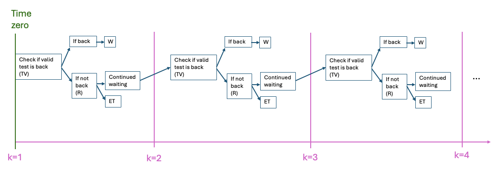
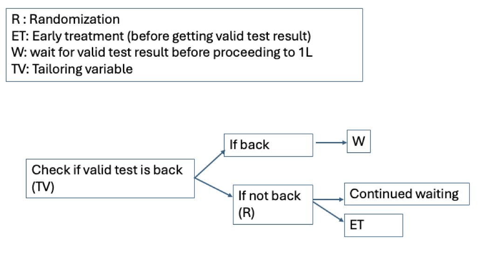

```{r include=FALSE}
#| message: false
#| warning: false

# knitr::opts_knit$set(root.dir = "./SAP")
# remotes::install_github('yihui/knitr')
# library(knitr)
library(ggplot2)
library(officer)
library(officedown)
library(flextable)
library(data.table)
library(parallel)
library(kableExtra)
library(knitr)
library(lubridate)
library(tictoc)
library(gt)

library(DiagrammeR)
library(DiagrammeRsvg)
library(rsvg)


knitr::opts_chunk$set(echo = FALSE)


ncores<-strtoi(Sys.getenv("SLURM_NTASKS")) #Pick up -ntasks or --n from the environment
```


We will try to do our project emulating Sequential Multiple Assignment Randomized Trial (SMART) design.


```{r SMART-diag, out.width='100%',  fig.cap="Figure XX: SMART diagram. The target trial I am trying to emulate. On the the first three time points are detailed out but it is supposed to continue indefinitely."}
#| eval: true

# knitr::include_graphics("./image/smart_diagram.png") #This is generated by the code block above. It's hard to include the timeline, so I will not print this.


```


```{r SMART-diag-zoom, out.width='70%',  fig.cap="Figure XX: A zoomed version of the SMART diagram, just for one time interval."}
#| eval: true

# knitr::include_graphics("./image/smart_diagram.png") #This is generated by the code block above. It's hard to include the timeline, so I will not print this.


```

