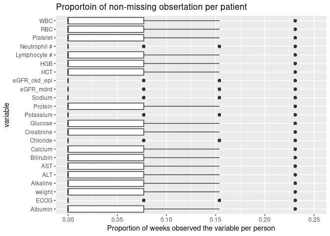
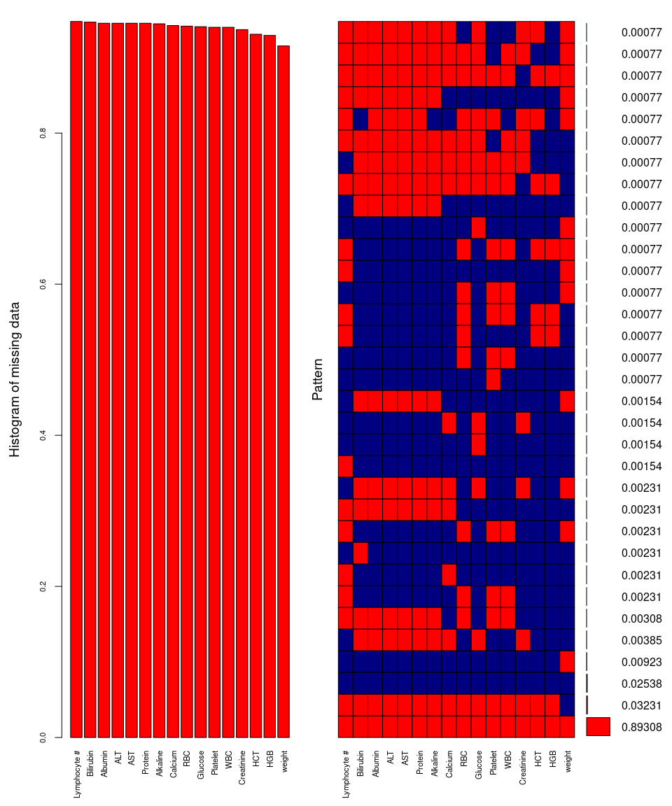
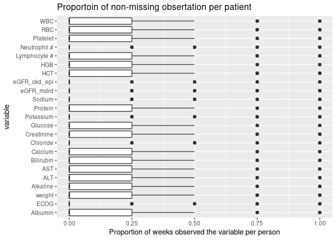

Landmark Analysis - find out patterns of missing
================
Hyejung Lee <hyejung.lee@utah.edu>
Mon May 26, 2025 04:35:00 PM

- [1 Context](#1-context)
- [2 Sketch](#2-sketch)
- [3 How I constructred the data](#sec:how-to-construct-data)
- [4 Proportion of observed values for each
  person](#4-proportion-of-observed-values-for-each-person)
  - [4.1 Weekly interval](#41-weekly-interval)
  - [4.2 Monthly interval](#42-monthly-interval)

# 1 Context

I’ve run landmark analysis without imputing covariates (weight change,
Albumin, ECOG scores). But by doing so we lost so many patients! Under
the primary inclusion criteria, the sample size decreased from 24690 to
3016, and under the secondary criteria, it decreased from 16397 to
11309.

Thus, here, we are trying to identify any auxiliary variables that may
explain patterns of missingness in the covariates. If we can find any,
then we could impute the covariates and re-do the landmark analysis with
the imputed data.

This idea is from the meeting I had with Ben and Tom on 2025/04/30.

  

# 2 Sketch

Let albumin, weight, and ECOG be variables of interest (VOIs). Since the
VOIs are longitudinal in nature, we will explore pattenrwe have
longitudinal data set, we will look at pattern of missing in two levels:

1.  Across subjects (missingness over each day), and
2.  Within subjects (missingness by person over time)

For each lab values, the time interval of data collection was chosen
with advanced diagnosis date as the day 0:

- Albumin (originally from - 6 weeks):
  - Primary inclusion criteria: $[-12 weeks, 1 week]$
  - Secondary inclusion criteria: $[-12 weeks, 4 weeks]$
- ECOG (originally from - 2 months):
  - Primary inclusion criteria: $[-4 months, 1 week]$
  - Secondary inclusion criteria: $[-4 months, 4 week]$
- Weight (originally from - 6 months):
  - Primary inclusion criteria: $[-1 year, 1 week]$
  - Secondary inclusion criteria: $[-1 year, 4 weeks]$
- All other 20 lab variables (**auxiliary** and originally was not
  considered for analysis):
  - Primary inclusion criteria: $[-12 weeks, 1 week]$
  - Secondary inclusion criteria: $[-12 weeks, 4 weeks]$

Even though ECOG and Weight variables were collected further back than
-12 weeks, I restricted them to -12 weeks when I performed analysis in
the following sections so that I can present all variables nicely.

  

# 3 How I constructred the data

First of all, I excluded 442 patients who had some data fallacy in
censoring time. We imputed censoring time according to Flatiron’s
direction but 442 people’s censored date was earlier than advanced
diagnosis date. This is false, as patients who were present at the
Flatiron’s network at the date of advanced diagnosis were able to enter
into the dataset. Thus, we used **85,130** for this analysis.

Table <a href="#tab:tbl-mock-person">3.1</a> is an example of how the
data looks like for one person, from -12 weeks back since day of
advanced diagnosis to 7 days since advanced diagnosis. Thus, each row
shows daily measurement of the variables. We have randomly chosen to
present Albumin and white blood cell (WBC) in this table but please know
that each person should have 23 columns of all VOIs and auxiliary
variables.

| AdvancedDiagnosisDate | Date | weeks since advanced diagnosis date | Albumin | WBC |
|:---|:---|:---|:---|:---|
| 2019-08-23 | 2019-05-31 | -12 | NA | NA |
| 2019-08-23 | 2019-06-01 | -12 | NA | NA |
| 2019-08-23 | 2019-06-02 | -12 | NA | NA |
| 2019-08-23 | 2019-06-03 | -12 | NA | NA |
| 2019-08-23 | 2019-06-04 | -12 | NA | NA |
| 2019-08-23 | 2019-06-05 | -12 | NA | NA |
| 2019-08-23 | 2019-06-06 | -12 | NA | NA |
| 2019-08-23 | 2019-06-07 | -11 | NA | NA |
| ⋮ | ⋮ | ⋮ | ⋮ | ⋮ |
| ⋮ | ⋮ | ⋮ | ⋮ | ⋮ |
| ⋮ | ⋮ | ⋮ | ⋮ | ⋮ |
| 2019-08-23 | 2019-08-13 | -2 | NA | NA |
| 2019-08-23 | 2019-08-14 | -2 | 37 | 7.8 |
| 2019-08-23 | 2019-08-15 | -2 | NA | NA |
| ⋮ | ⋮ | ⋮ | ⋮ | ⋮ |
| ⋮ | ⋮ | ⋮ | ⋮ | ⋮ |
| ⋮ | ⋮ | ⋮ | ⋮ | ⋮ |
| 2019-08-23 | 2019-08-21 | -1 | NA | NA |
| 2019-08-23 | 2019-08-22 | -1 | NA | NA |
| 2019-08-23 | 2019-08-23 | 0 | NA | NA |
| 2019-08-23 | 2019-08-24 | 0 | NA | NA |
| 2019-08-23 | 2019-08-25 | 0 | NA | NA |
| 2019-08-23 | 2019-08-26 | 0 | NA | NA |
| 2019-08-23 | 2019-08-27 | 0 | NA | NA |
| 2019-08-23 | 2019-08-28 | 0 | NA | NA |
| 2019-08-23 | 2019-08-29 | 0 | 36 | 5.9 |
| ⋮ | ⋮ | ⋮ | ⋮ | ⋮ |
| ⋮ | ⋮ | ⋮ | ⋮ | ⋮ |
| ⋮ | ⋮ | ⋮ | ⋮ | ⋮ |

Table 3.1: A mock data for one
patient. Only albumin and white blood cell (WBC) covariates are shown
(but in reality, we should have total 23 columns of variables consisting
of VOIs and auxiliary variables). The lab values are captured from 12
weeks prior to diagnosis date until 7 days after. For this particular
patient, two observations were captured in total, once in week -2 and
another in week 0.

When we create a weekly interval, we take average of all observed values
in the interval. Thus, each person has 13 rows. Table
<a href="#tab:tbl-mock-average">3.2</a> shows an example of this dataset
using the data in Table <a href="#tab:tbl-mock-person">3.1</a>.

| weeks since advanced diagnosis date | Albumin | WBC |
|------------------------------------:|--------:|----:|
|                                 -12 |     NaN | NaN |
|                                 -11 |     NaN | NaN |
|                                 -10 |     NaN | NaN |
|                                  -9 |     NaN | NaN |
|                                  -8 |     NaN | NaN |
|                                  -7 |     NaN | NaN |
|                                  -6 |     NaN | NaN |
|                                  -5 |     NaN | NaN |
|                                  -4 |     NaN | NaN |
|                                  -3 |     NaN | NaN |
|                                  -2 |      37 | 7.8 |
|                                  -1 |     NaN | NaN |
|                                   0 |      36 | 5.9 |

Table 3.2: A mock data for one
patient. Observation for Albumin and white blood cell (WBC) are shown.
average of all observation each week is shown. If NaN, that means there
was no observation seen in that week. This patient is the same patient
shown in the previous table.

# 4 Proportion of observed values for each person

  

## 4.1 Weekly interval

We showed an example dataset of how weekly interval looks like in
Section <a href="#sec:how-to-construct-data">3</a>. We generated data
like Table <a href="#tab:tbl-mock-person">3.1</a> for all eligible
patients (N=85130). And then we took a proportion of weeks that had any
observation during the week. There are 13 weeks total, so the
denominator used for this calculation was 13. For example, for the
patient in Table <a href="#tab:tbl-mock-person">3.1</a> will have 2/13 =
0.1538 for Albumin and WBC. We calculated this proportion for all 23
variables and showed bar plots in Figure
<a href="#fig:fig-prop-observed-per-person-weekly">4.1</a>.

Figure 4.1:
Proportion of observing the lab variable at least once in 7-day interval
per person. The axis is cut out at 0.25, but the outliers go up to 1.
The denominator used for calculating the proportion was 13, as our data
interval was -12 weeks to +1 week since the advanced diagnosis date.

Note that the 1st and 3rd quartiles of Albumin, weight, Alkaline, ALT,
AST, Bilirubin, Calcium, Creatinine, Glucose, Protein, HCT, HGB,
Lymphocyte \#, Platelet, RBC, and WBC are all the same (IQR = 0 -
0.0769) in Figure
<a href="#fig:fig-prop-observed-per-person-weekly">4.1</a>. We will call
these 16 variables ***substantially observed variables*** in this
subsection hereafter. It’s kind of bad that 3rd quartile is just 0.0769
for the substantially observed variables. Too many patients only had
1/13 =0.0769 weeks observed. In Table
<a href="#tab:tbl-prop-observed-per-person-weekly">4.1</a>, we show just
6 of these variables, that has the highest mean value from top to
bottom.

| Variable | Min. | 1st Qu. | Median |    Mean | 3rd Qu. | Max. |
|:---------|-----:|--------:|-------:|--------:|--------:|-----:|
| weight   |    0 |       0 |      0 | 0.07360 | 0.07692 |    1 |
| HGB      |    0 |       0 |      0 | 0.05222 | 0.07692 |    1 |
| HCT      |    0 |       0 |      0 | 0.05106 | 0.07692 |    1 |
| WBC      |    0 |       0 |      0 | 0.04788 | 0.07692 |    1 |
| RBC      |    0 |       0 |      0 | 0.04690 | 0.07692 |    1 |
| Platelet |    0 |       0 |      0 | 0.04636 | 0.07692 |    1 |

Table 4.1: The
top six varibles with highst mean of observing at least one value every
7 days per person.

So if a patient observed the value only one week, are all variables
observed in that week? Like, Albumin, weight, Alkaline, ALT, AST,
Bilirubin, Calcium, Creatinine, Glucose, Protein, HCT, HGB, Lymphocyte
\#, Platelet, RBC, WBC basically have similar distribution. And based on
the Table <a href="#tab:tbl-prop-observed-per-person-weekly">4.1</a>, it
seems like on average, there was only 1 week was observed. So would that
mean that at least for Albumin, weight, Alkaline, ALT, AST, Bilirubin,
Calcium, Creatinine, Glucose, Protein, HCT, HGB, Lymphocyte \#,
Platelet, RBC, WBC, if they were measured, were they measured during the
same week?

Table
<a href="#tab:tbl-identify-what-week-observation-is-made-primary">4.2</a>
shows one person in the dataset where such is not the case.

| variable | week -12 | week -11 | week -10 | week -9 | week -8 | week -7 | week -6 | week -5 | week -4 | week -3 | week -2 | week -1 | week 0 |
|:---|---:|---:|---:|---:|---:|---:|---:|---:|---:|---:|---:|---:|----|
| Albumin |  |  |  |  |  |  |  |  |  |  |  | 1 |  |
| weight | 1 |  |  |  |  |  |  | 1 | 1 | 1 | 1 |  | 1 |
| Alkaline |  |  |  |  |  |  |  |  |  |  |  | 1 |  |
| ALT |  |  |  |  |  |  |  |  |  |  |  | 1 |  |
| AST |  |  |  |  |  |  |  |  |  |  |  | 1 |  |
| Bilirubin |  |  |  |  |  |  |  |  |  |  |  | 1 |  |
| Calcium |  |  |  |  |  |  |  |  |  | 1 |  | 1 |  |
| Creatinine |  |  |  |  |  |  |  |  |  | 1 |  | 1 |  |
| Glucose |  |  |  |  |  |  |  |  |  | 1 |  | 1 |  |
| Protein |  |  |  |  |  |  |  |  |  |  |  | 1 |  |
| HCT |  |  |  |  |  |  |  |  |  |  |  | 1 |  |
| HGB |  |  |  |  |  |  |  |  |  |  |  | 1 |  |
| Lymphocyte \# |  |  |  |  |  |  |  |  |  |  |  | 1 |  |
| Platelet |  |  |  |  |  |  |  |  |  |  |  | 1 |  |
| RBC |  |  |  |  |  |  |  |  |  |  |  | 1 |  |
| WBC |  |  |  |  |  |  |  |  |  |  |  | 1 |  |

Table
4.2: One person’s data showning the weeks that each variable is
observed. All 16 variables with substantially big IQR in Figure 4.1 were
observed in this person.

Since many variables seemed like they were observed with equal
proportion, it seemed like if the variable is observed, then it is
observed in the person. Among those who had at least 1 week observed,
when does this one observation get made?

Figure <a href="#fig:fig-weekly-interval">4.2</a> shows the plot of
amount of missing across the combination of substantially observed
variables in 100 randomly selected patients (there were too many
observations and too many variables to display the whole dataset).

Figure 4.2: Plots of amount of
missing values in each variable and the amount of missing values of
substantially observed variables. 100 random patients were selected for
the display. The measurements were averaged over 7 days. Blue represents
observed and red represents missing.

    ## 
    ##  Variables sorted by number of missings: 
    ##      Variable     Count
    ##  Lymphocyte # 0.9476923
    ##     Bilirubin 0.9469231
    ##       Albumin 0.9453846
    ##           ALT 0.9453846
    ##           AST 0.9453846
    ##       Protein 0.9453846
    ##      Alkaline 0.9446154
    ##       Calcium 0.9423077
    ##           RBC 0.9415385
    ##       Glucose 0.9407692
    ##      Platelet 0.9400000
    ##           WBC 0.9400000
    ##    Creatinine 0.9369231
    ##           HCT 0.9307692
    ##           HGB 0.9292308
    ##        weight 0.9153846

  

## 4.2 Monthly interval

We saw that Since we go back to 12 weeks, let’s make it every 4 weeks.

Figure 4.3:
Proportion of observing the lab variable at least once in 30-day
interval per person. The axis is cut out at 0.25, but the outliers go up
to 1. The denominator used for calculating the proportion was 4, as our
data interval was -12 weeks to +1 week since the advanced diagnosis
date. The las tinterval is not 30 days, it’s only 7 days after advanced
diagnosis date.

| Variable   | Min. | 1st Qu. | Median |    Mean | 3rd Qu. | Max. |
|:-----------|-----:|--------:|-------:|--------:|--------:|-----:|
| weight     |    0 |       0 |      0 | 0.18393 |    0.25 |    1 |
| HGB        |    0 |       0 |      0 | 0.13158 |    0.25 |    1 |
| HCT        |    0 |       0 |      0 | 0.12868 |    0.25 |    1 |
| Creatinine |    0 |       0 |      0 | 0.12208 |    0.25 |    1 |
| WBC        |    0 |       0 |      0 | 0.12063 |    0.25 |    1 |
| Calcium    |    0 |       0 |      0 | 0.11920 |    0.25 |    1 |

Table 4.3:
The top six varibles with highst mean of observing at least one value
every 30 days per person.
