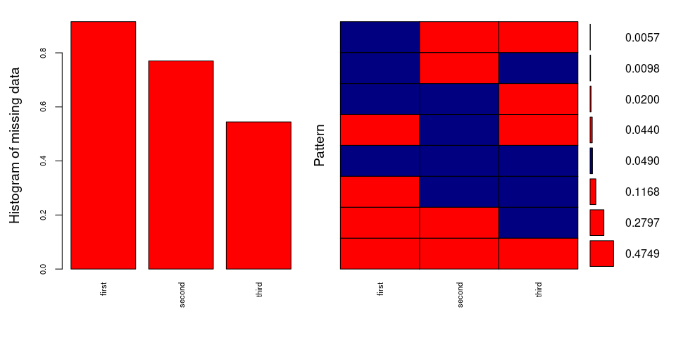
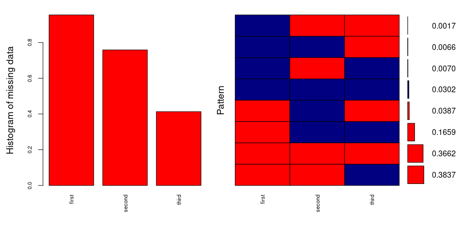
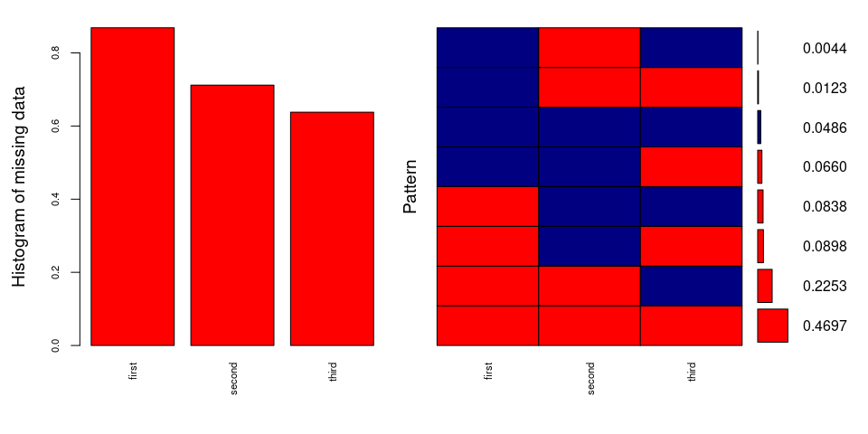
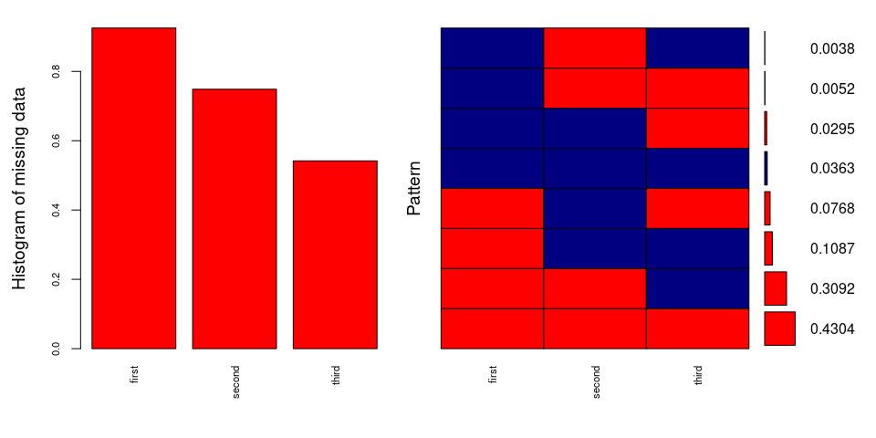
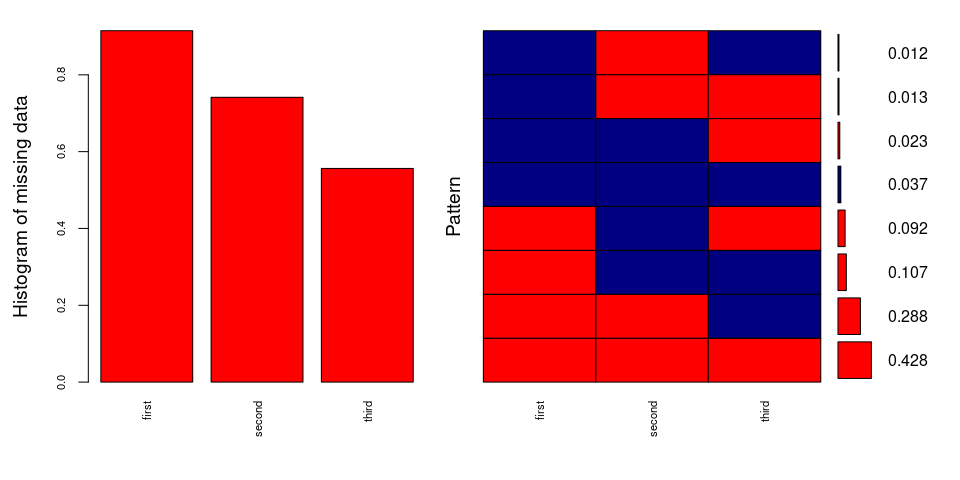
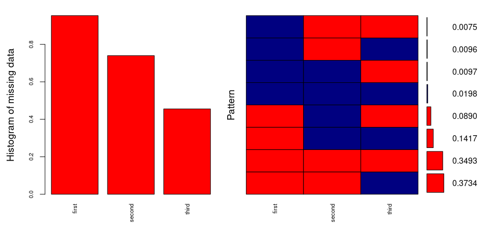
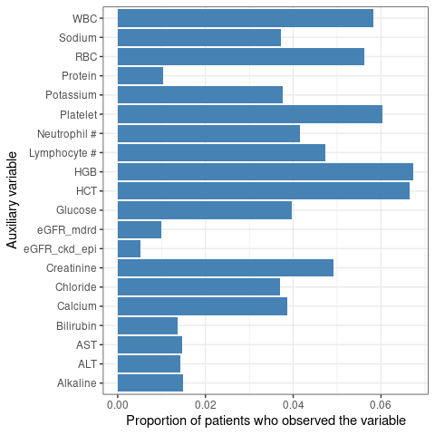

Landmark Analysis - find out patterns of missing
================
Hyejung Lee <hyejung.lee@utah.edu>
Thu Jun 05, 2025 07:13:06 PM

- [1 Context](#1-context)
- [2 Intervals for each variable](#2-intervals-for-each-variable)
- [3 Identify people who have observations in the 3
  intervals](#3-identify-people-who-have-observations-in-the-3-intervals)
- [4 Identifying from auxiliary
  variables](#4-identifying-from-auxiliary-variables)

# 1 Context

Taking Tom’s advice on 2025/06/04 where we want to do following.

We want to see if we can impute baseline values for albumin, ECOG, or
the binary “lost 10 lbs” variable using observations recorded before the
official baseline window. To do this, we’ll define a look-back window
that’s the same length as the baseline window itself, starting right
before the baseline period. For example, albumin’s baseline window is
from 6 weeks before to 1 week after diagnosis (i.e., -6 weeks to +1
week). So, we’ll look at the 6 weeks before that baseline window—that
is, from -12 weeks to -6 weeks since diagnosis—to see if there are any
available observations. If we find data in that earlier interval, we
might be able to use it to impute baseline values.

We divide each variable’s timeline into three intervals:

1.  $$2\*minimum baseline cut, minimum baseline cut - 1 day$$
2.  $$minimum baseline cut, 1 week after time0$$
3.  $$1 week after time0 + 1 day, 4 weeks after time0$$

We were initially hoping to find values in interval 2, but many patients
are missing data there. So now, we’ll also check interval 1 to see if
any values are available that might help with imputation. Interval 3 was
used for secondary inclusion criteria, so we will keep it as is.

For albumin specifically, we will also explore whether there are any
auxiliary variables within interval 2 that could assist with imputation.

  

# 2 Intervals for each variable

- Albumin (originally from - 6 weeks):
  1.  $$-12 weeks, -6 week$$
  2.  $$-12 weeks, +1 week$$
  3.  $$+1 week, +4 week$$
- ECOG (originally from - 2 months):
  1.  $$-4 months, -2 months$$
  2.  $$-2 months, +1 week$$
  3.  $$+1 week, +4 week$$
- Weight change (originally from - 6 months):
  1.  $$-12 months, -6 months$$
  2.  $$-6 months, +1 week$$
  3.  $$+1 week, +4 week$$
- All other 20 lab variables (**auxiliary** and originally was not
  considered for analysis) are going to take the same interval as
  Albumin

  

  

# 3 Identify people who have observations in the 3 intervals

Figure <a href="#fig:fig-ECOG-VIM-plot">3.1</a> shows missing patterns
in ECOG variable.

Figure 3.1: Plots of histogram
and patterns of missing ECOG values over 3 intervals. Red inidates
missing, and navy indicates observed. Intervals are printed as
‘first’,‘second’, and ‘third’. All population (N=85,572) were used.

Based on Figure <a href="#fig:fig-ECOG-VIM-plot">3.1</a>, nearly half of
the patients (47.5%) are missing ECOG observations at all time points.
When ECOG is missing in the second interval (which is our primary
interval of interest), we can’t impute values using the prior or
subsequent intervals because 48% of patients are missing ECOG entirely.
So instead, we decided to subset the cohort by applying the same
exclusion criteria used in the main analysis—except for the final
criterion that required complete observations. Figure
<a href="#fig:fig-ECOG-VIM-plot-subset">3.2</a> shows the missingness
pattern in this subset. The majority of patients have at least one ECOG
value recorded in the third interval $$+1 week, +4
weeks$$, but 37% still have no ECOG observations at all.

Figure 3.2: Plots of
histogram and patterns of missing ECOG values over 3 intervals. Red
inidates missing, and navy indicates observed. Intervals are printed as
‘first’,‘second’, and ‘third’. Only subset of population who met all
exclusion criteria used in main analysis were used (N=27, 706).

  

We also created similar plots for the binary variable indicating whether
a patient lost more than 10 lbs (Figure
<a href="#fig:fig-Weight-change-VIM-plot">3.3</a>). Again, most patients
have no recorded weight change. So, we decided to subset the cohort
again (Figure <a href="#fig:fig-Weight-change-VIM-plot-subset">3.4</a>).
Unfortunately, even after subsetting, a large proportion of patients
(43%) are still missing weight change observations.

Figure 3.3: Plots of
histogram and patterns of missing weight change variable values over 3
intervals. Red inidates missing, and navy indicates observed. Intervals
are printed as ‘first’,‘second’, and ‘third’. All population (N=85,572)
were used.

Figure 3.4:
Plots of histogram and patterns of missing weight change variable values
over 3 intervals. Red inidates missing, and navy indicates observed.
Intervals are printed as ‘first’,‘second’, and ‘third’. Only subset of
population who met all exclusion criteria used in main analysis were
used (N=27, 706).

  

Figure <a href="#fig:fig-Albumin-change-VIM-plot">3.5</a> and Figure
<a href="#fig:fig-Albumin-change-VIM-plot-subset">3.6</a> show the
missingness pattern for albumin. In the subset of patients (Figure
<a href="#fig:fig-Albumin-change-VIM-plot-subset">3.6</a>), many have at
least one measurement in the third interval $$+1 week, +4
weeks$$ (37%). However, the next most common pattern is having no
albumin measurements at all (35%).

Figure 3.5: Plots of
histogram and patterns of missing Albumin over 3 intervals. Red inidates
missing, and navy indicates observed. Intervals are printed as
‘first’,‘second’, and ‘third’. All population (N=85,572) were used.

Figure 3.6:
Plots of histogram and patterns of missing weight change variable values
over 3 intervals. Red inidates missing, and navy indicates observed.
Intervals are printed as ‘first’,‘second’, and ‘third’. Only subset of
population who met all exclusion criteria used in main analysis were
used (N=27, 706).

  

  

# 4 Identifying from auxiliary variables

Just for Albumin, we will check among the patient missing albumin in the
second interval, how many of them have observations in auxiliary
variables. Figure <a href="#fig:fig-Albumin-aux">4.1</a> shows
proportion of patients who observed the auxiliary variable during the
2nd interval among those who didn’t observe Albumin in the 2nd interval.
As in the previous section, we’ve restricted our patients to 27,706. As
can be found in Figure <a href="#fig:fig-Albumin-aux">4.1</a>, HGB
(hemoglobin) was the variable with highest proportion of patients with
observation.

Figure 4.1: Barplot showing the
proportion of patients who observed the auxiliary variable during 2nd
interval among those who are missing Albumin during the 2nd interval.

